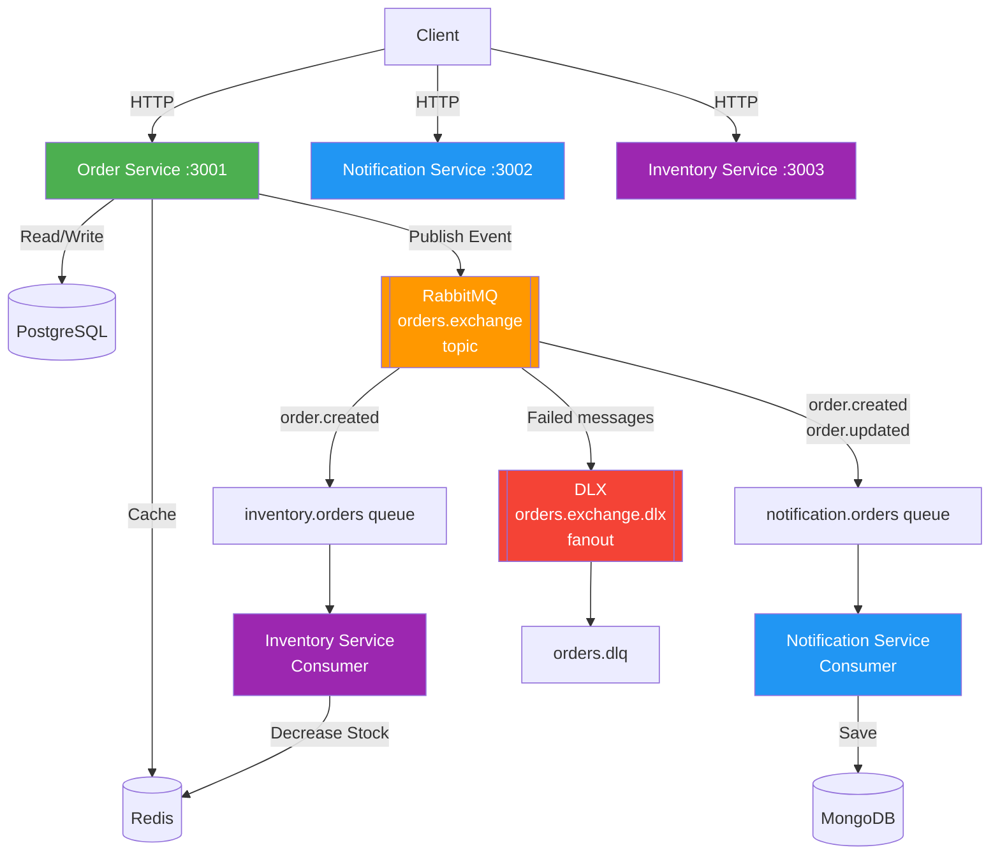
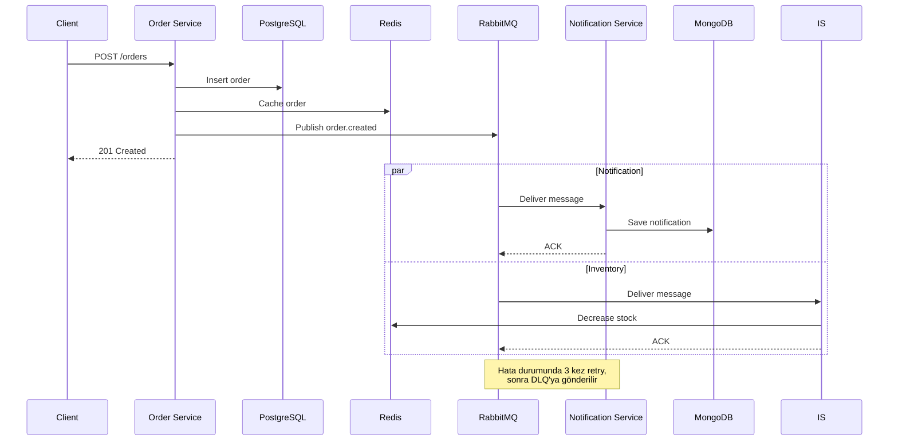

# Event-Driven E-Commerce Order System

Progressive microservices project for learning event-driven architecture.

## Architecture

### System Overview



### Event Flow



## Tech Stack

- **Runtime:** Bun
- **Framework:** Hono.dev
- **Message Broker:** RabbitMQ
- **Databases:** PostgreSQL, MongoDB, Redis, ElasticSearch
- **Monitoring:** Elastic APM + Kibana
- **Container:** Docker + Kubernetes
- **IaC:** Terraform

## Project Structure

```
services/
├── order-service/        # Order CRUD API (PostgreSQL)
├── notification-service/ # Event consumer (MongoDB)
├── inventory-service/    # Stock management (Redis)
├── search-service/       # Full-text search (ElasticSearch)
└── api-gateway/          # API Gateway + Auth
packages/
└── shared/               # Common types & utilities
infrastructure/
├── docker/
├── k8s/
└── terraform/
```

## Quick Start

```bash
# Development (with hot-reload)
docker compose -f docker-compose.dev.yml up --build

# Production
docker compose up --build
```

## API Endpoints (order-service)

| Method | Path | Description |
|--------|------|-------------|
| GET | /health | Health check |
| GET | /orders | List all orders |
| GET | /orders/:id | Get order by ID |
| POST | /orders | Create new order |
| PATCH | /orders/:id | Update order |

### Example: Create Order

```bash
curl -X POST http://localhost:3001/orders \
  -H "Content-Type: application/json" \
  -d '{
    "customerName": "John Doe",
    "customerEmail": "john@example.com",
    "items": [
      {"productId": "p1", "name": "Laptop", "quantity": 1, "price": 999.99}
    ]
  }'
```

## API Endpoints (notification-service :3002)

| Method | Path | Description |
|--------|------|-------------|
| GET | /health | Health check |
| GET | /notifications | List notifications (limit query param) |
| GET | /notifications/:orderId | Get notifications for an order |

## API Endpoints (inventory-service :3003)

| Method | Path | Description |
|--------|------|-------------|
| GET | /health | Health check |
| GET | /products | List all products |
| GET | /products/:id | Get product by ID |
| POST | /products | Create/update product |
| DELETE | /products/:id | Delete product |

### Example: Add Stock

```bash
curl -X POST http://localhost:3003/products \
  -H "Content-Type: application/json" \
  -d '{"id": "p1", "name": "Laptop", "stock": 100, "price": 999.99}'
```

## API Endpoints (search-service :3004)

| Method | Path | Description |
|--------|------|-------------|
| GET | /health | Health check |
| GET | /search?q=&status=&from=&size= | Full-text search orders |
| GET | /search/stats | Aggregated stats (status counts, revenue) |

### Example: Search

```bash
# Full-text search
curl "http://localhost:3004/search?q=laptop&status=pending"

# Get stats
curl "http://localhost:3004/search/stats"
```

## Infrastructure

### PostgreSQL
- **Port:** 5432
- **Credentials:** postgres / postgres
- **Database:** orders
- Connect: `psql -h localhost -U postgres -d orders`

### Redis
- **Port:** 6379
- Monitor: `redis-cli MONITOR`
- List keys: `redis-cli KEYS '*'`

### MongoDB
- **Port:** 27017
- **Database:** notifications

### RabbitMQ
- **Port:** 5672 (AMQP), 15672 (Management UI)
- **Credentials:** guest / guest
- **Management UI:** http://localhost:15672

### ElasticSearch
- **Port:** 9200
- Health: `curl http://localhost:9200/_cluster/health?pretty`

### Kibana
- **Port:** 5601
- **Dashboard:** http://localhost:5601

## Features

- **Caching:** Redis write-through cache on orders (5 min TTL)
- **Rate Limiting:** 100 requests/min per IP via Redis sliding window
- **Migrations:** Auto-run on startup via Drizzle ORM
- **Validation:** Zod schema validation on all inputs

## Database Migrations

```bash
cd services/order-service
bun run db:generate  # Generate migration from schema changes
bun run db:migrate   # Run migrations
bun run db:studio    # Open Drizzle Studio GUI
```

## Roadmap

| # | Proje | Konu | Durum |
|---|-------|------|-------|
| 1 | Docker + Hono.dev | Order Service CRUD, Dockerfile, docker-compose | Done |
| 2 | PostgreSQL + Redis | Drizzle ORM, caching, rate limiting | Done |
| 3 | RabbitMQ Events | Notification & Inventory service, DLX/DLQ | Done |
| 4 | ElasticSearch | Search Service, full-text search | Done |
| 5 | Monitoring | Elastic APM + Kibana | Done |
| 6 | API Gateway | Auth (Better Auth), routing, circuit breaker | Done |
| 7 | Kubernetes | K8s deployment, Helm, HPA, Ingress | Done |
| 8 | Terraform + CI/CD | IaC, GitHub Actions pipeline | Done |
