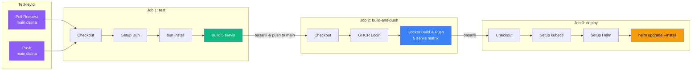
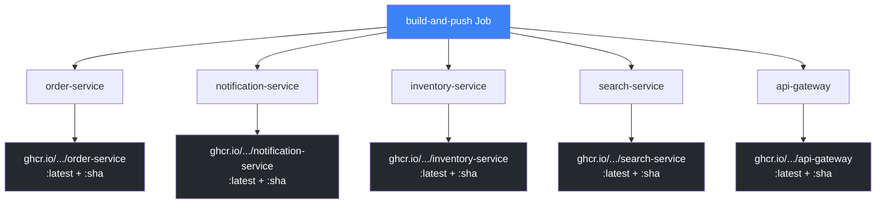
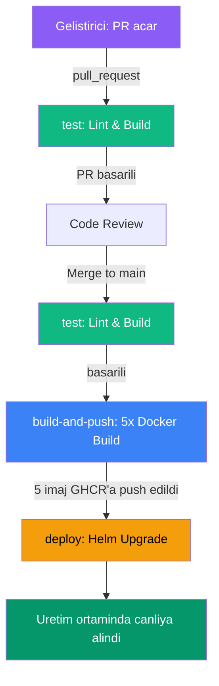

# CI/CD Pipeline

Proje, **GitHub Actions** uzerinde calisan 3 asamali bir CI/CD pipeline (surekli entegrasyon/surekli dagitim boru hatti) kullanir. Pipeline; test, Docker imaj olusturma ve Kubernetes'e deploy adimlarini otomatik olarak yurutur.

## Pipeline Genel Bakisi



## Tetikleme Kosullari

Pipeline su durumlarda otomatik olarak baslatilir:

| Tetikleyici | Calistirilan Joblar | Aciklama |
|-------------|---------------------|----------|
| `pull_request` -> `main` | Yalnizca `test` | PR acildiginda veya guncellendildiginde kod derlenir |
| `push` -> `main` | `test` -> `build-and-push` -> `deploy` | Main dalina merge edildiginde tam pipeline calisir |

```yaml
on:
  pull_request:
    branches: [main]
  push:
    branches: [main]
```

<Note>
  `build-and-push` ve `deploy` joblari yalnizca `push` event'inde ve `main` dalinda calisir. Pull request asamasinda gereksiz imaj olusturma ve deploy islemlerinden kacinilir.
</Note>

## Job 1: Lint & Build

Ilk job, tum servislerin hatasiz derlenebildigini dogrular. Bun runtime (calisma zamanini) kurar, bagimliliklari yukler ve 5 servisi derler.

```yaml
test:
  name: Lint & Build
  runs-on: ubuntu-latest
  steps:
    - uses: actions/checkout@v4

    - uses: oven-sh/setup-bun@v2
      with:
        bun-version: latest

    - name: Install dependencies
      run: bun install

    - name: Build all services
      run: |
        bun build services/order-service/src/index.ts --target=bun --outdir=/tmp/build
        bun build services/notification-service/src/index.ts --target=bun --outdir=/tmp/build
        bun build services/inventory-service/src/index.ts --target=bun --outdir=/tmp/build
        bun build services/search-service/src/index.ts --target=bun --outdir=/tmp/build
        bun build services/api-gateway/src/index.ts --target=bun --outdir=/tmp/build
```

<Steps>
  <Step title="Checkout">
    `actions/checkout@v4` ile kaynak kod indirilir.
  </Step>
  <Step title="Bun Kurulumu">
    `oven-sh/setup-bun@v2` ile en son Bun surumu kurulur. Bun, Node.js uyumlu hizli bir JavaScript runtime'dir.
  </Step>
  <Step title="Bagimlilik Yukleme">
    `bun install` ile monorepo genelindeki tum bagimliliklar yuklenir (workspaces dahil).
  </Step>
  <Step title="Servislerin Derlenmesi">
    `bun build` ile 5 servisin her biri `--target=bun` hedefi ile derlenir. Derleme hatasi varsa pipeline burada durur.
  </Step>
</Steps>

## Job 2: Build & Push Docker Images

Test jobu basarili olduktan sonra, 5 servis icin Docker imajlari olusturulur ve GitHub Container Registry'ye (GHCR) gonderilir. **Matrix strategy** (matris stratejisi) ile 5 servis paralel olarak islenir.

```yaml
build-and-push:
  name: Build & Push Docker Images
  needs: test
  if: github.event_name == 'push' && github.ref == 'refs/heads/main'
  runs-on: ubuntu-latest
  permissions:
    contents: read
    packages: write
  strategy:
    matrix:
      service:
        - order-service
        - notification-service
        - inventory-service
        - search-service
        - api-gateway
  steps:
    - uses: actions/checkout@v4

    - name: Log in to Container Registry
      uses: docker/login-action@v3
      with:
        registry: ghcr.io
        username: ${{ github.actor }}
        password: ${{ secrets.GITHUB_TOKEN }}

    - name: Build and push
      uses: docker/build-push-action@v5
      with:
        context: .
        file: services/${{ matrix.service }}/Dockerfile
        push: true
        tags: |
          ghcr.io/${{ github.repository }}/${{ matrix.service }}:latest
          ghcr.io/${{ github.repository }}/${{ matrix.service }}:${{ github.sha }}
```

### Matrix Stratejisi

Matrix strategy, ayni job tanimini farkli parametrelerle paralel olarak calistirir:



### Imaj Etiketleme Stratejisi

Her servis icin iki etiket olusturulur:

| Etiket | Ornek | Amac |
|--------|-------|------|
| `:latest` | `ghcr.io/user/repo/order-service:latest` | En guncel surum, gelistirme ortami icin |
| `:sha` | `ghcr.io/user/repo/order-service:a1b2c3d` | Commit hash'i ile eslestirilmis, rollback (geri alma) icin |

<Tip>
  `:sha` etiketi sayesinde her deploy'un hangi commit'e karsilik geldigi kesin olarak bilinir. Sorun durumunda `helm rollback` veya belirli bir SHA ile yeniden deploy yapilabilir.
</Tip>

### GHCR Kimlik Dogrulama

GitHub Container Registry'ye erisim icin `GITHUB_TOKEN` kullanilir. Bu token, GitHub Actions tarafindan otomatik olarak saglanan gecici bir erisim anahtaridir:

```yaml
permissions:
  contents: read    # Repo icerigini okuma
  packages: write   # GHCR'a imaj yazma
```

<Warning>
  GHCR'a imaj gondermek icin `packages: write` izni gereklidir. Bu izin olmadan `docker/build-push-action` adimi yetkilendirme hatasiyla basarisiz olur.
</Warning>

## Job 3: Deploy to Kubernetes

Docker imajlari basariyla GHCR'a gonderildikten sonra, Helm ile Kubernetes cluster'ina deploy yapilir:

```yaml
deploy:
  name: Deploy to Kubernetes
  needs: build-and-push
  if: github.event_name == 'push' && github.ref == 'refs/heads/main'
  runs-on: ubuntu-latest
  steps:
    - uses: actions/checkout@v4

    - name: Set up kubectl
      uses: azure/setup-kubectl@v4

    - name: Set up Helm
      uses: azure/setup-helm@v4

    - name: Deploy with Helm
      run: |
        helm upgrade --install ecommerce \
          ./infrastructure/k8s/helm/ecommerce \
          --namespace ecommerce-prod \
          --create-namespace \
          --set global.imageRegistry=ghcr.io/${{ github.repository }} \
          --set global.imageTag=${{ github.sha }} \
          --set global.namespace=ecommerce-prod
```

<Steps>
  <Step title="kubectl Kurulumu">
    `azure/setup-kubectl@v4` ile kubectl aracı runner (calistirici) uzerine kurulur.
  </Step>
  <Step title="Helm Kurulumu">
    `azure/setup-helm@v4` ile Helm CLI kurulur.
  </Step>
  <Step title="Helm Deploy">
    `helm upgrade --install` komutu iki islevi birlestirir:
    - Ilk deploy'da `install` calisir
    - Sonraki deploy'larda `upgrade` calisir

    Onemli parametreler:
    - `--namespace ecommerce-prod`: Uretim namespace'i
    - `--create-namespace`: Namespace yoksa olusturur
    - `--set global.imageTag=${{ github.sha }}`: Commit hash'ini imaj etiketi olarak kullanir
  </Step>
</Steps>

<Note>
  Deploy jobu, `ecommerce-prod` namespace'ine deploy yapar. `values.yaml` dosyasindaki varsayilan `ecommerce-dev` degeri, `--set global.namespace=ecommerce-prod` ile ezilir. Bu sayede gelistirme ve uretim ortamlari tamamen ayridir.
</Note>

## Tam Workflow Dosyasi

<CodeGroup>
```yaml .github/workflows/ci.yml
name: CI/CD Pipeline

on:
  pull_request:
    branches: [main]
  push:
    branches: [main]

env:
  REGISTRY: ghcr.io
  IMAGE_PREFIX: ${{ github.repository }}

jobs:
  test:
    name: Lint & Build
    runs-on: ubuntu-latest
    steps:
      - uses: actions/checkout@v4

      - uses: oven-sh/setup-bun@v2
        with:
          bun-version: latest

      - name: Install dependencies
        run: bun install

      - name: Build all services
        run: |
          bun build services/order-service/src/index.ts --target=bun --outdir=/tmp/build
          bun build services/notification-service/src/index.ts --target=bun --outdir=/tmp/build
          bun build services/inventory-service/src/index.ts --target=bun --outdir=/tmp/build
          bun build services/search-service/src/index.ts --target=bun --outdir=/tmp/build
          bun build services/api-gateway/src/index.ts --target=bun --outdir=/tmp/build

  build-and-push:
    name: Build & Push Docker Images
    needs: test
    if: github.event_name == 'push' && github.ref == 'refs/heads/main'
    runs-on: ubuntu-latest
    permissions:
      contents: read
      packages: write
    strategy:
      matrix:
        service:
          - order-service
          - notification-service
          - inventory-service
          - search-service
          - api-gateway
    steps:
      - uses: actions/checkout@v4

      - name: Log in to Container Registry
        uses: docker/login-action@v3
        with:
          registry: ${{ env.REGISTRY }}
          username: ${{ github.actor }}
          password: ${{ secrets.GITHUB_TOKEN }}

      - name: Build and push
        uses: docker/build-push-action@v5
        with:
          context: .
          file: services/${{ matrix.service }}/Dockerfile
          push: true
          tags: |
            ${{ env.REGISTRY }}/${{ env.IMAGE_PREFIX }}/${{ matrix.service }}:latest
            ${{ env.REGISTRY }}/${{ env.IMAGE_PREFIX }}/${{ matrix.service }}:${{ github.sha }}

  deploy:
    name: Deploy to Kubernetes
    needs: build-and-push
    if: github.event_name == 'push' && github.ref == 'refs/heads/main'
    runs-on: ubuntu-latest
    steps:
      - uses: actions/checkout@v4

      - name: Set up kubectl
        uses: azure/setup-kubectl@v4

      - name: Set up Helm
        uses: azure/setup-helm@v4

      - name: Deploy with Helm
        run: |
          helm upgrade --install ecommerce \
            ./infrastructure/k8s/helm/ecommerce \
            --namespace ecommerce-prod \
            --create-namespace \
            --set global.imageRegistry=${{ env.REGISTRY }}/${{ env.IMAGE_PREFIX }} \
            --set global.imageTag=${{ github.sha }} \
            --set global.namespace=ecommerce-prod
```
</CodeGroup>

## Pipeline Ozet Tablosu

| Job | Tetikleyici | Surec | Cikti |
|-----|-------------|-------|-------|
| **test** | PR + Push (main) | Bun install -> 5 servis build | Derleme basarisi/hatasi |
| **build-and-push** | Yalnizca Push (main) | 5x paralel Docker build -> GHCR push | 5 imaj (:latest + :sha) |
| **deploy** | Yalnizca Push (main) | kubectl + Helm setup -> helm upgrade | K8s deploy (ecommerce-prod) |



<Warning>
  Mevcut yapilandirmada Kubernetes cluster baglanti bilgileri (kubeconfig) tanimlanmamistir. Uretim ortaminda `deploy` jobuna cluster erisim bilgileri eklenmelidir. Bu genellikle GitHub Secrets uzerinden saglanan bir kubeconfig veya bir cloud provider'in kimlik dogrulama adimi ile yapilir.
</Warning>
