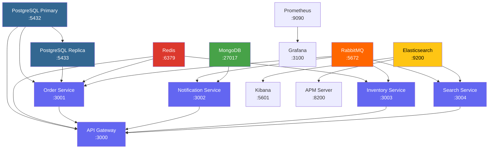

# Docker Compose Altyapisi

Proje, **14 konteyner** iceren kapsamli bir Docker Compose yapilandirmasi ile calisir. Tum servisler tek bir `docker-compose.yml` dosyasiyla ayaga kalkar ve healthcheck (saglik kontrolu) mekanizmalariyla birbirine baglidir.

<Note>
  Tum konteynerler `restart: unless-stopped` politikasi ile calisir. Bu sayede beklenmedik bir cokme durumunda konteynerler otomatik olarak yeniden baslatilir.
</Note>

## Konteyner Haritasi

### Uygulama Servisleri

<CardGroup cols={2}>
  <Card title="API Gateway" icon="shield-halved">
    **Port:** 3000
    Tum isteklerin girdigi merkezi gecit. Better Auth ile kimlik dogrulama, rate limiting (hiz sinirlamasi) ve circuit breaker (devre kesici) iceriri.

    **Bagimliliklar:** PostgreSQL, Redis, tum diger servisler
  </Card>
  <Card title="Order Service" icon="cart-shopping">
    **Port:** 3001
    Siparis olusturma, Saga pattern orkestrasyonu ve read/write splitting (okuma-yazma ayristirmasi) islemlerini yonetir.

    **Bagimliliklar:** PostgreSQL Primary + Replica, Redis, RabbitMQ
  </Card>
  <Card title="Notification Service" icon="bell">
    **Port:** 3002
    RabbitMQ uzerinden gelen eventleri dinleyerek bildirimleri MongoDB'ye kaydeder.

    **Bagimliliklar:** RabbitMQ, MongoDB
  </Card>
  <Card title="Inventory Service" icon="warehouse">
    **Port:** 3003
    Stok yonetimi ve Saga pattern icerisindeki stok kontrol/rezervasyon adimlarini yurutur.

    **Bagimliliklar:** RabbitMQ, Redis
  </Card>
  <Card title="Search Service" icon="magnifying-glass">
    **Port:** 3004
    Elasticsearch uzerinde urun arama ve indeksleme islemlerini gerceklestirir.

    **Bagimliliklar:** RabbitMQ, Elasticsearch
  </Card>
</CardGroup>

### Veritabanlari ve Mesaj Kuyrugu

<CardGroup cols={3}>
  <Card title="PostgreSQL Primary" icon="database">
    **Port:** 5432
    `postgres:17-alpine` -- WAL replication (Write-Ahead Log replikasyonu) etkin, ana yazma veritabani.
  </Card>
  <Card title="PostgreSQL Replica" icon="clone">
    **Port:** 5433
    `postgres:17-alpine` -- Streaming replication (akim replikasyonu) ile salt okunur kopya.
  </Card>
  <Card title="Redis" icon="bolt">
    **Port:** 6379
    `redis:7-alpine` -- Onbellek ve oturum yonetimi.
  </Card>
  <Card title="MongoDB" icon="leaf">
    **Port:** 27017
    `mongo:7` -- Bildirim verilerinin depolanmasi.
  </Card>
  <Card title="RabbitMQ" icon="envelope">
    **Portlar:** 5672, 15672
    `rabbitmq:3-management-alpine` -- Topic exchange ile event dagitimi. Yonetim paneli 15672 portunda.
  </Card>
  <Card title="Elasticsearch" icon="searchengin">
    **Port:** 9200
    `elasticsearch:8.17.0` -- Tek dugum (single-node), guvenlik devre disi. Urun arama motoru.
  </Card>
</CardGroup>

### Izleme ve Gozlemlenebilirlik

<CardGroup cols={2}>
  <Card title="Kibana" icon="chart-pie">
    **Port:** 5601
    `kibana:8.17.0` -- Elasticsearch ve APM verilerinin gorsellestirilmesi.
  </Card>
  <Card title="APM Server" icon="tower-broadcast">
    **Port:** 8200
    `apm-server:8.17.0` -- Dagitik izleme (distributed tracing) verilerini toplar.
  </Card>
  <Card title="Prometheus" icon="chart-bar">
    **Port:** 9090
    `prom/prometheus:v2.51.0` -- Metrik toplama, 7 gun saklama suresi.
  </Card>
  <Card title="Grafana" icon="chart-line">
    **Port:** 3100
    `grafana/grafana:11.0.0` -- Otomatik provizyon edilmis panolar. Giris: `admin/admin`.
  </Card>
</CardGroup>

## Konteyner Bagimliliklari

Asagidaki diyagram, konteynerlerin hangi sirada basladigini ve birbirlerine olan bagimliligini gosterir:



## Ortam Degiskenleri

<Tabs>
  <Tab title="Uygulama Servisleri">
    Tum uygulama servisleri su ortak degiskenleri kullanir:

    | Degisken | Aciklama | Ornek |
    |----------|----------|-------|
    | `PORT` | Servisin dinledigi port | `3000` |
    | `NODE_ENV` | Calisma ortami | `production` |
    | `APM_SERVER_URL` | Elastic APM sunucu adresi | `http://apm-server:8200` |
    | `APM_SERVICE_NAME` | APM'de gorunecek servis adi | `api-gateway` |

    **Servise ozel degiskenler:**

    | Degisken | Kullanan Servisler |
    |----------|-------------------|
    | `DATABASE_URL` | api-gateway, order-service |
    | `DATABASE_REPLICA_URL` | order-service |
    | `REDIS_URL` | api-gateway, order-service, inventory-service |
    | `RABBITMQ_URL` | order, notification, inventory, search |
    | `MONGODB_URL` | notification-service |
    | `ELASTICSEARCH_URL` | search-service |
    | `AUTH_SECRET` | api-gateway |
    | `GITHUB_CLIENT_ID` / `GITHUB_CLIENT_SECRET` | api-gateway |
    | `GOOGLE_CLIENT_ID` / `GOOGLE_CLIENT_SECRET` | api-gateway |
  </Tab>
  <Tab title="Altyapi Servisleri">
    | Konteyner | Degisken | Deger |
    |-----------|----------|-------|
    | PostgreSQL | `POSTGRES_USER` | `postgres` |
    | PostgreSQL | `POSTGRES_PASSWORD` | `postgres` |
    | PostgreSQL | `POSTGRES_DB` | `orders` |
    | PostgreSQL Replica | `PGUSER` | `replicator` |
    | PostgreSQL Replica | `PGPASSWORD` | `replicator_pass` |
    | RabbitMQ | `RABBITMQ_DEFAULT_USER` | `guest` |
    | RabbitMQ | `RABBITMQ_DEFAULT_PASS` | `guest` |
    | Elasticsearch | `discovery.type` | `single-node` |
    | Elasticsearch | `xpack.security.enabled` | `false` |
    | Elasticsearch | `ES_JAVA_OPTS` | `-Xms512m -Xmx512m` |
    | Grafana | `GF_SECURITY_ADMIN_USER` | `admin` |
    | Grafana | `GF_SECURITY_ADMIN_PASSWORD` | `admin` |
  </Tab>
</Tabs>

## Volume (Kalici Depolama) Yapisi

Docker Compose, verilerin konteyner yeniden baslatiklarinda kaybolmamasini saglamak icin **named volume** (adlandirilmis birim) kullanir:

| Volume Adi | Konteyner | Mount Yolu |
|------------|-----------|------------|
| `postgres_data` | PostgreSQL Primary | `/var/lib/postgresql/data` |
| `postgres_replica_data` | PostgreSQL Replica | `/var/lib/postgresql/data` |
| `redis_data` | Redis | `/data` |
| `mongo_data` | MongoDB | `/data/db` |
| `rabbitmq_data` | RabbitMQ | `/var/lib/rabbitmq` |
| `es_data` | Elasticsearch | `/usr/share/elasticsearch/data` |
| `prometheus_data` | Prometheus | `/prometheus` |
| `grafana_data` | Grafana | `/var/lib/grafana` |

Bunlara ek olarak, bind mount (baglama noktasi) ile yapilandirma dosyalari da konteynerlere aktarilir:

```
./infrastructure/docker/postgres/init-replication.sh  -> PostgreSQL init script
./infrastructure/docker/postgres/start-replica.sh     -> Replica baslatma scripti
./infrastructure/docker/prometheus/prometheus.yml      -> Prometheus yapilandirmasi
./infrastructure/docker/grafana/provisioning/          -> Grafana veri kaynaklari
./infrastructure/docker/grafana/dashboards/            -> Grafana panolari
```

## Healthcheck (Saglik Kontrolu) Yapisi

Her konteyner icin ozel saglik kontrolu tanimlanmistir:

<CodeGroup>
```yaml Uygulama Servisleri (Bun)
healthcheck:
  test: ["CMD", "bun", "-e", "fetch('http://localhost:PORT/health').then(r => r.ok ? process.exit(0) : process.exit(1))"]
  interval: 10s
  timeout: 5s
  retries: 3
  start_period: 10s
```

```yaml PostgreSQL
healthcheck:
  test: ["CMD-SHELL", "pg_isready -U postgres"]
  interval: 5s
  timeout: 3s
  retries: 5
```

```yaml Redis
healthcheck:
  test: ["CMD", "redis-cli", "ping"]
  interval: 5s
  timeout: 3s
  retries: 5
```

```yaml MongoDB
healthcheck:
  test: ["CMD", "mongosh", "--eval", "db.adminCommand('ping')"]
  interval: 5s
  timeout: 3s
  retries: 5
```

```yaml RabbitMQ
healthcheck:
  test: ["CMD", "rabbitmq-diagnostics", "-q", "ping"]
  interval: 10s
  timeout: 5s
  retries: 5
  start_period: 15s
```

```yaml Elasticsearch
healthcheck:
  test: ["CMD-SHELL", "curl -f http://localhost:9200/_cluster/health || exit 1"]
  interval: 10s
  timeout: 5s
  retries: 10
  start_period: 30s
```
</CodeGroup>

<Tip>
  Bagimliliklarda `condition: service_healthy` kullanilarak, bir konteyner ancak bagimli oldugu servis saglikli duruma gectiginde baslatilir. Bu, baslangic sirasinda olusabilecek baglanti hatalarini onler.
</Tip>

## PostgreSQL Replikasyon Yapisi

PostgreSQL Primary, WAL (Write-Ahead Log) replikasyonu icin ozel parametrelerle baslatilir:

```yaml
command: >
  postgres
  -c wal_level=replica
  -c max_wal_senders=3
  -c max_replication_slots=1
  -c hot_standby=on
```

| Parametre | Aciklama |
|-----------|----------|
| `wal_level=replica` | WAL kayitlarinin replikasyon icin yeterli detayda tutulmasini saglar |
| `max_wal_senders=3` | Ayni anda en fazla 3 replikasyon baglantisina izin verir |
| `max_replication_slots=1` | Bir adet replikasyon slotu olusturulabilir |
| `hot_standby=on` | Replica sunucunun okuma sorgularini kabul etmesini saglar |

<Warning>
  PostgreSQL Replica, ozel bir `start-replica.sh` scripti ile baslatilir. Bu script, Primary sunucudan `pg_basebackup` ile veri kopyalar ve streaming replication (akim replikasyonu) baslatir. Replica sunucusunun saglikli duruma gecmesi Primary'ye gore daha uzun surer (`start_period: 15s`, `retries: 10`).
</Warning>

## Yapilandirma: Gelistirme ve Uretim

<Tabs>
  <Tab title="Gelistirme (Development)">
    Mevcut `docker-compose.yml` gelistirme ortamina yonelik yapilandirilmistir:

    - Tum portlar host makineye aciktir (debugging icin)
    - Elasticsearch guvenlik devre disi (`xpack.security.enabled=false`)
    - RabbitMQ varsayilan kimlik bilgileri (`guest/guest`)
    - PostgreSQL basit sifre (`postgres/postgres`)
    - Grafana anonim erisim mumkun (`admin/admin`)
    - APM Server RUM (Real User Monitoring) etkin

    ```bash
    # Tum servisleri baslatma
    docker compose up -d

    # Logları takip etme
    docker compose logs -f

    # Belirli bir servisi yeniden baslatma
    docker compose restart order-service
    ```
  </Tab>
  <Tab title="Uretim (Production)">
    Uretim ortami icin su degisiklikler uygulanmalidir:

    - Guclu sifreler ve `.env` dosyasi kullanin
    - Gereksiz portlari kapatın (yalnizca API Gateway disariya acik)
    - Elasticsearch guvenligini etkinlestirin
    - Grafana icin guclu kimlik bilgileri belirleyin
    - Resource limit (kaynak siniri) tanimlayin
    - TLS/SSL sertifikalari ekleyin

    ```yaml
    # docker-compose.prod.yml ornegi
    services:
      api-gateway:
        ports:
          - "3000:3000"  # Yalnizca gateway disariya acik
        environment:
          - AUTH_SECRET=${AUTH_SECRET}  # .env dosyasindan
          - NODE_ENV=production

      postgres:
        environment:
          POSTGRES_PASSWORD: ${POSTGRES_PASSWORD}  # Guclu sifre
        ports: []  # Disari port acma

      elasticsearch:
        environment:
          - xpack.security.enabled=true
    ```

    <Warning>
      Uretim ortaminda `guest/guest` gibi varsayilan kimlik bilgilerini **kesinlikle** degistirin. Tum hassas degerler `.env` dosyasi veya secret manager (gizlilik yoneticisi) uzerinden saglanmalidir.
    </Warning>
  </Tab>
</Tabs>

## Sik Kullanilan Komutlar

| Komut | Aciklama |
|-------|----------|
| `docker compose up -d` | Tum servisleri arka planda baslatir |
| `docker compose up -d --build` | Imajlari yeniden olusturup baslatir |
| `docker compose down` | Tum servisleri durdurur (volume'lar korunur) |
| `docker compose down -v` | Servisleri durdurur ve volume'lari siler |
| `docker compose logs -f [servis]` | Belirli bir servisin loglarini canli takip eder |
| `docker compose ps` | Calisan konteynerlerin durumunu listeler |
| `docker compose restart [servis]` | Belirli bir servisi yeniden baslatir |
| `docker compose exec postgres psql -U postgres` | PostgreSQL'e baglanir |
| `docker compose exec redis redis-cli` | Redis CLI'a baglanir |
| `docker compose exec mongo mongosh` | MongoDB shell'e baglanir |

<Tip>
  Tum servislerin saglik durumunu hizlica kontrol etmek icin `docker compose ps` komutunu kullanin. `healthy` durumunda olmayan konteynerlerin loglarini `docker compose logs [servis-adi]` ile inceleyin.
</Tip>
