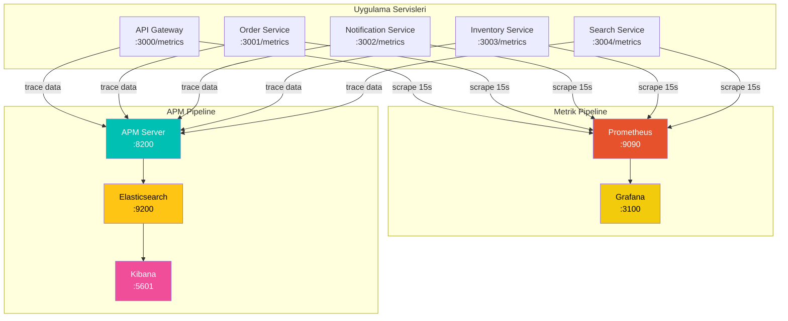
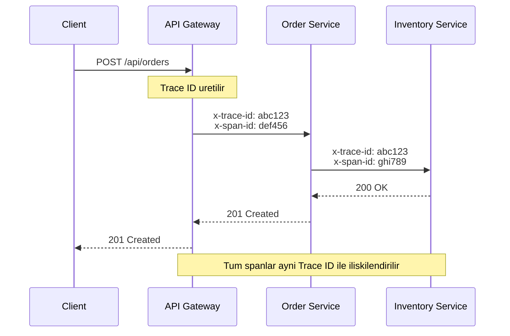

# Izleme ve Gozlemlenebilirlik

Proje, **uc temel gozlemlenebilirlik sutununu** (three pillars of observability) destekler: metrikler, izler (traces) ve loglar. Bu yapida Prometheus + Grafana metrik toplama ve gorselestirme, Elastic APM dagitik izleme (distributed tracing) ve yapilandirilmis JSON loglama birlikte calisir.



## Prometheus Metrikleri

### Scrape Yapilandirmasi

Prometheus, her 15 saniyede bir tum servislerin `/metrics` endpoint'inden (uc noktasindan) metrik toplar:

```yaml
# infrastructure/docker/prometheus/prometheus.yml
global:
  scrape_interval: 15s
  evaluation_interval: 15s

scrape_configs:
  - job_name: "api-gateway"
    static_configs:
      - targets: ["api-gateway:3000"]

  - job_name: "order-service"
    static_configs:
      - targets: ["order-service:3001"]

  - job_name: "notification-service"
    static_configs:
      - targets: ["notification-service:3002"]

  - job_name: "inventory-service"
    static_configs:
      - targets: ["inventory-service:3003"]

  - job_name: "search-service"
    static_configs:
      - targets: ["search-service:3004"]
```

| Parametre | Deger | Aciklama |
|-----------|-------|----------|
| `scrape_interval` | 15s | Metrik toplama sikligi |
| `evaluation_interval` | 15s | Alarm kurallarinin degerlendirilme sikligi |
| `storage.tsdb.retention.time` | 7d | Metrik verilerinin saklanma suresi |

### Metrik Turleri

`packages/shared/src/metrics.ts` dosyasinda tanimlanan metrikler:

<CardGroup cols={2}>
  <Card title="http_requests_total" icon="arrow-up-right-dots">
    **Tur:** Counter (Sayac)

    Toplam HTTP istek sayisi. Yalnizca artar, hic azalmaz. Servise gore etiketlenir.
  </Card>
  <Card title="http_errors_total" icon="triangle-exclamation">
    **Tur:** Counter (Sayac)

    4xx ve 5xx durum kodlu toplam hata sayisi. Hata oranini hesaplamak icin `http_requests_total` ile birlikte kullanilir.
  </Card>
  <Card title="process_uptime_seconds" icon="clock">
    **Tur:** Gauge (Gosterge)

    Servisin calisma suresi (saniye). Yeniden baslatmalari tespit etmek icin kullanilir.
  </Card>
  <Card title="http_request_duration_ms" icon="stopwatch">
    **Tur:** Summary (Ozet)

    HTTP istek suresi (milisaniye). `method`, `path` ve `status` etiketleriyle agregasyonlu (toplanmis) ortalama degerler sunar.
  </Card>
  <Card title="http_request_count" icon="hashtag">
    **Tur:** Counter (Sayac)

    `method`, `path` ve `status` bazinda istek sayisi. Hangi endpoint'in ne kadar trafik aldigini gosterir.
  </Card>
</CardGroup>

### Metrik Middleware (Ara Yazilim) Kodu

Asagidaki middleware, her HTTP isteginin suresini olcer ve metrikleri biriktirir:

```typescript
// packages/shared/src/metrics.ts
interface MetricEntry {
  method: string;
  path: string;
  status: number;
  duration: number;
}

const metrics: MetricEntry[] = [];
let requestCount = 0;
let errorCount = 0;
const startTime = Date.now();

export function metricsMiddleware() {
  return async (c: Context, next: Next) => {
    const start = performance.now();
    await next();
    const duration = performance.now() - start;

    requestCount++;
    if (c.res.status >= 400) errorCount++;

    metrics.push({
      method: c.req.method,
      path: c.req.path,
      status: c.res.status,
      duration,
    });

    // Bellekte yalnizca son 1000 kaydi tut
    if (metrics.length > 1000) metrics.splice(0, metrics.length - 1000);
  };
}
```

`getPrometheusMetrics()` fonksiyonu, biriken verileri Prometheus exposition format'inda (sunum biciminde) doner:

```typescript
export function getPrometheusMetrics(serviceName: string): string {
  const uptime = (Date.now() - startTime) / 1000;

  // method+path+status bazinda agregasyon
  const buckets = new Map<string, { count: number; totalDuration: number }>();
  for (const m of metrics) {
    const key = `${m.method}|${m.path}|${m.status}`;
    const existing = buckets.get(key) || { count: 0, totalDuration: 0 };
    existing.count++;
    existing.totalDuration += m.duration;
    buckets.set(key, existing);
  }

  const lines: string[] = [
    `# HELP http_requests_total Total HTTP requests`,
    `# TYPE http_requests_total counter`,
    `http_requests_total{service="${serviceName}"} ${requestCount}`,
    // ... diger metrikler
  ];

  return lines.join("\n") + "\n";
}
```

<Note>
  Metrikler bellekte tutulur ve yalnizca son 1000 kayit saklanir. Bu, bellek tuketimini sinirlarken yeterli istatistik dogrulugu saglar. Prometheus zaten verileri kendi TSDB'sinde (zaman serisi veritabani) kalici olarak depolar.
</Note>

### Ornek Prometheus Ciktisi

Bir servisin `/metrics` endpoint'inden donen veri ornegi:

```
# HELP http_requests_total Total HTTP requests
# TYPE http_requests_total counter
http_requests_total{service="order-service"} 1523

# HELP http_errors_total Total HTTP errors (4xx+5xx)
# TYPE http_errors_total counter
http_errors_total{service="order-service"} 12

# HELP process_uptime_seconds Process uptime
# TYPE process_uptime_seconds gauge
process_uptime_seconds{service="order-service"} 3847.2

# HELP http_request_duration_ms HTTP request duration
# TYPE http_request_duration_ms summary
http_request_duration_ms{service="order-service",method="POST",path="/orders",status="201"} 45.32
http_request_count{service="order-service",method="POST",path="/orders",status="201"} 892
http_request_duration_ms{service="order-service",method="GET",path="/orders",status="200"} 12.18
http_request_count{service="order-service",method="GET",path="/orders",status="200"} 631
```

## Grafana Panolari

Grafana, Docker Compose basladiginda otomatik olarak yapilandirilir (auto-provisioning). Iki veri kaynagi ve hazir panolar onceden tanimlanmistir.

### Otomatik Provizyon Yapisi

```
infrastructure/docker/grafana/
├── provisioning/
│   ├── datasources/
│   │   └── datasources.yml    # Prometheus + Elasticsearch veri kaynaklari
│   └── dashboards/
│       └── dashboards.yml     # Pano yukleme yapilandirmasi
└── dashboards/
    └── services.json          # Hazir servis panosu
```

### Veri Kaynaklari

<CodeGroup>
```yaml datasources.yml
apiVersion: 1

datasources:
  - name: Prometheus
    type: prometheus
    access: proxy
    url: http://prometheus:9090
    isDefault: true
    editable: true

  - name: Elasticsearch
    type: elasticsearch
    access: proxy
    url: http://elasticsearch:9200
    database: "orders"
    editable: true
    jsonData:
      timeField: "createdAt"
```

```yaml dashboards.yml
apiVersion: 1

providers:
  - name: "default"
    orgId: 1
    folder: ""
    type: file
    disableDeletion: false
    editable: true
    options:
      path: /var/lib/grafana/dashboards
      foldersFromFilesStructure: false
```
</CodeGroup>

### Grafana'ya Erisim

<Steps>
  <Step title="Tarayici ile Erisim">
    Grafana arayuzune `http://localhost:3100` adresinden erisin.
  </Step>
  <Step title="Giris Yapma">
    Varsayilan kimlik bilgileri:
    - **Kullanici adi:** `admin`
    - **Sifre:** `admin`
  </Step>
  <Step title="Panolari Goruntuleme">
    Sol menuden **Dashboards** bolumune gidin. `services.json` dosyasindan otomatik yuklenmis panolar burada goruntulenir.
  </Step>
</Steps>

<Tip>
  Grafana'da yeni panolar olusturmak icin faydali PromQL sorgu ornekleri:

  - **Istek hizi:** `rate(http_requests_total[5m])`
  - **Hata orani:** `rate(http_errors_total[5m]) / rate(http_requests_total[5m]) * 100`
  - **Servis uptime:** `process_uptime_seconds`
  - **Endpoint bazinda ortalama yanit suresi:** `http_request_duration_ms`
</Tip>

## Elastic APM - Dagitik Izleme

Elastic APM (Application Performance Monitoring), servisler arasi istekleri uctan uca izler. Her istek bir Trace ID (iz kimlik numarasi) ve Span ID (aralik kimlik numarasi) ile etiketlenir.

### Trace Yayilimi (Propagation)



### APM Middleware Kodu

```typescript
// packages/shared/src/apm.ts
const APM_SERVER_URL = process.env.APM_SERVER_URL;
const SERVICE_NAME = process.env.APM_SERVICE_NAME || "unknown";

interface ApmTransaction {
  traceId: string;
  spanId: string;
  service: string;
  method: string;
  path: string;
  statusCode: number;
  duration: number;
  timestamp: string;
}

export function apmMiddleware() {
  return async (c: Context, next: Next) => {
    // Gelen trace ID'yi al veya yeni olustur
    const traceId = c.req.header("x-trace-id") || generateId() + generateId();
    const spanId = generateId();
    const start = performance.now();

    // Trace bilgisini yanita ve context'e ekle
    c.header("x-trace-id", traceId);
    c.header("x-span-id", spanId);
    c.set("traceId", traceId);
    c.set("spanId", spanId);

    await next();

    const duration = performance.now() - start;

    // APM Server'a gonder (fire and forget - at ve unut)
    sendToApm({
      traceId, spanId, service: SERVICE_NAME,
      method: c.req.method, path: c.req.path,
      statusCode: c.res.status, duration,
      timestamp: new Date().toISOString(),
    });
  };
}
```

### Servisler Arasi Trace Yayilimi

Bir servis baska bir servise istek gonderirken `getTraceHeaders()` yardimci fonksiyonu kullanilir:

```typescript
// packages/shared/src/apm.ts
export function getTraceHeaders(c: Context): Record<string, string> {
  return {
    "x-trace-id": c.get("traceId") || "",
    "x-span-id": c.get("spanId") || "",
  };
}

// Kullanim ornegi (api-gateway'den order-service'e istek)
const response = await fetch("http://order-service:3001/orders", {
  method: "POST",
  headers: {
    "Content-Type": "application/json",
    ...getTraceHeaders(c),  // Trace bilgisini aktar
  },
  body: JSON.stringify(orderData),
});
```

### APM Veri Akisi

APM Server, toplanan trace verilerini Elasticsearch'e gonderir. Veriler Kibana uzerinden gorsellestirilir:

| Bilesen | Adres | Rol |
|---------|-------|-----|
| APM Server | `http://localhost:8200` | Trace verilerini toplar |
| Elasticsearch | `http://localhost:9200` | Verileri indeksler ve depolar |
| Kibana | `http://localhost:5601` | APM UI ile gorsellestirir |

<Note>
  APM Server `apm-server.rum.enabled=true` ayari ile RUM (Real User Monitoring - Gercek Kullanici Izleme) destegi de saglar. Bu ozellik, tarayici tarafindaki performans verilerinin de toplanmasina olanak tanir.
</Note>

### APM Server'a Veri Gonderimi

APM Server'a veri NDJSON (Newline Delimited JSON) formatinda gonderilir:

```typescript
async function sendToApm(transaction: ApmTransaction): Promise<void> {
  if (!APM_SERVER_URL) return;

  try {
    await fetch(`${APM_SERVER_URL}/intake/v2/events`, {
      method: "POST",
      headers: { "Content-Type": "application/x-ndjson" },
      body: [
        JSON.stringify({
          metadata: {
            service: {
              name: SERVICE_NAME,
              environment: process.env.NODE_ENV || "development"
            },
          },
        }),
        JSON.stringify({
          transaction: {
            id: transaction.spanId,
            trace_id: transaction.traceId,
            name: `${transaction.method} ${transaction.path}`,
            type: "request",
            duration: transaction.duration,
            result: `HTTP ${transaction.statusCode}`,
            // ...
          },
        }),
        "",
      ].join("\n"),
    });
  } catch {
    // APM hatasi uygulamayi kirmamali
  }
}
```

<Warning>
  `sendToApm()` fonksiyonu "fire and forget" (at ve unut) prensibine gore calisir. APM Server'a ulasamamak uygulamayi etkilemez; hata sessizce yutulur. Bu, gozlemlenebilirlik katmaninin uygulama performansini olumsuz etkilememesini garantiler.
</Warning>

## Yapilandirilmis Loglama

Tum servisler, JSON formatinda yapilandirilmis log (structured logging) uretir. Bu, log toplama ve arama araclarinda (Elasticsearch, Kibana) filtreleme ve analiz yapmayi kolaylastirir.

### Logger Kodu

```typescript
// packages/shared/src/logger.ts
interface LogEntry {
  timestamp: string;
  level: LogLevel;       // "debug" | "info" | "warn" | "error"
  service: string;       // APM_SERVICE_NAME ortam degiskeninden
  message: string;
  traceId?: string;      // APM trace baglantisi
  spanId?: string;
  [key: string]: unknown; // Ek meta veriler
}

function log(level: LogLevel, message: string, meta?: Record<string, unknown>) {
  const entry: LogEntry = {
    timestamp: new Date().toISOString(),
    level,
    service: SERVICE_NAME,
    message,
    ...meta,
  };
  const output = JSON.stringify(entry);

  if (level === "error") {
    console.error(output);
  } else if (level === "warn") {
    console.warn(output);
  } else {
    console.log(output);
  }
}

export const logger = {
  debug: (msg: string, meta?) => log("debug", msg, meta),
  info:  (msg: string, meta?) => log("info", msg, meta),
  warn:  (msg: string, meta?) => log("warn", msg, meta),
  error: (msg: string, meta?) => log("error", msg, meta),
};
```

### Ornek Log Ciktisi

```json
{
  "timestamp": "2026-03-03T10:15:32.456Z",
  "level": "info",
  "service": "order-service",
  "message": "Siparis olusturuldu",
  "orderId": "ord_abc123",
  "traceId": "a1b2c3d4e5f6g7h8",
  "userId": "usr_xyz789"
}
```

<Tip>
  Log kayitlarina `traceId` ekleyerek bir istegin tum log satirlarini tek bir Trace ID ile filtreleyebilirsiniz. Bu, sorun giderme sirasinda isteklerin servisler arasindaki yolculugunu adim adim izlemeyi mumkun kilar.
</Tip>

## Gozlemlenebilirlik Ozet Tablosu

| Katman | Arac | Amac | Erisim |
|--------|------|------|--------|
| Metrikler | Prometheus | Sayisal verilerin toplanmasi | `http://localhost:9090` |
| Gorselestirme | Grafana | Panolar ve grafikler | `http://localhost:3100` |
| Dagitik Izleme | Elastic APM | Istek izleme (request tracing) | `http://localhost:8200` |
| Log Arama | Kibana | Log ve APM verisi gorselestirme | `http://localhost:5601` |
| Veri Deposu | Elasticsearch | APM verileri ve loglar | `http://localhost:9200` |
