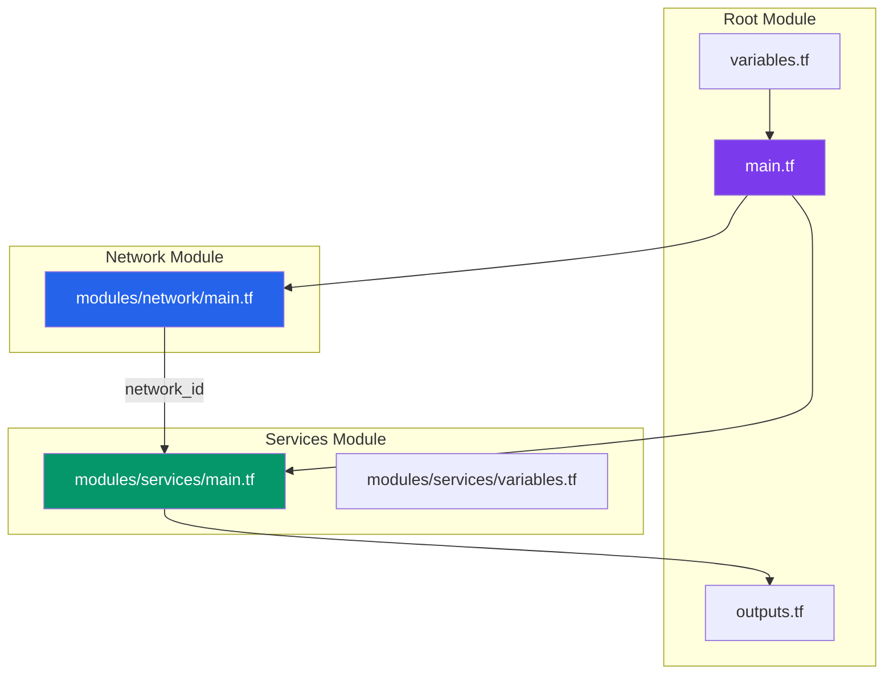

# Terraform ile Altyapi Yonetimi

Proje, Infrastructure as Code (Kod Olarak Altyapi) yaklasimini benimseyerek Docker altyapisini Terraform ile yonetir. `kreuzwerker/docker` provider'i (saglayici) kullanilarak Docker konteynerleri, ag yapilari ve volume'lar deklaratif (bildirimsel) olarak tanimlanir.

<Note>
  Terraform yapilandirmasi, Docker Compose'a alternatif olarak altyapi servislerini (PostgreSQL, Redis, MongoDB, RabbitMQ, Elasticsearch) kod ile yonetmek icin kullanilir. Uygulama servisleri (api-gateway, order-service vb.) bu yapilandirmanin disindadir.
</Note>

## Modul Yapisi

```
infrastructure/terraform/
├── main.tf              # Ana yapilandirma, provider ve modul tanimlari
├── variables.tf         # Giris degiskenleri (input variables)
├── outputs.tf           # Cikis degerleri (output values)
└── modules/
    ├── network/
    │   └── main.tf      # Docker bridge network tanimlari
    └── services/
        ├── main.tf      # Altyapi konteyner tanimlari
        └── variables.tf # Modul degiskenleri
```



## Ana Yapilandirma (main.tf)

Root module (kok modul), provider tanimini ve iki alt modulu icerir:

```hcl
terraform {
  required_version = ">= 1.0"

  required_providers {
    docker = {
      source  = "kreuzwerker/docker"
      version = "~> 3.0"
    }
  }
}

provider "docker" {
  host = "unix:///var/run/docker.sock"
}

module "network" {
  source       = "./modules/network"
  network_name = var.network_name
}

module "services" {
  source       = "./modules/services"
  network_id   = module.network.network_id
  network_name = var.network_name
  environment  = var.environment
  image_tag    = var.image_tag
}
```

<Tip>
  Docker provider, yerel Docker daemon'a `unix:///var/run/docker.sock` soketi uzerinden baglanir. Uzak bir Docker host'u icin TCP adresi (`tcp://remote-host:2376`) kullanilabilir.
</Tip>

## Network Modulu

`modules/network/main.tf` dosyasi, tum konteynerlerin iletisim kurabilecegi bir Docker bridge network (kopru agi) olusturur:

```hcl
variable "network_name" {
  type = string
}

resource "docker_network" "ecommerce" {
  name   = var.network_name
  driver = "bridge"
}

output "network_id" {
  value = docker_network.ecommerce.id
}

output "network_name" {
  value = docker_network.ecommerce.name
}
```

Bu modul iki output (cikis degeri) saglar:
- **`network_id`**: Services modulune gecirilerek konteynerlerin ayni aga baglanmasi saglanir
- **`network_name`**: Ag adinin diger modullerde referans edilmesi icin kullanilir

## Services Modulu

`modules/services/main.tf`, 5 altyapi servisinin Docker konteynerlerini ve imajlarini tanimlar:

<Tabs>
  <Tab title="Veritabanlari">
    ```hcl
    # PostgreSQL
    resource "docker_image" "postgres" {
      name = "postgres:17-alpine"
    }

    resource "docker_container" "postgres" {
      name  = "ecommerce-postgres-${var.environment}"
      image = docker_image.postgres.image_id

      ports {
        internal = 5432
        external = 5432
      }

      env = [
        "POSTGRES_USER=postgres",
        "POSTGRES_PASSWORD=postgres",
        "POSTGRES_DB=orders",
      ]

      networks_advanced {
        name = var.network_name
      }

      volumes {
        volume_name    = "postgres_data_${var.environment}"
        container_path = "/var/lib/postgresql/data"
      }
    }

    # Redis
    resource "docker_container" "redis" {
      name  = "ecommerce-redis-${var.environment}"
      image = docker_image.redis.image_id

      ports {
        internal = 6379
        external = 6379
      }

      networks_advanced {
        name = var.network_name
      }
    }

    # MongoDB
    resource "docker_container" "mongo" {
      name  = "ecommerce-mongo-${var.environment}"
      image = docker_image.mongo.image_id

      ports {
        internal = 27017
        external = 27017
      }

      networks_advanced {
        name = var.network_name
      }
    }
    ```
  </Tab>
  <Tab title="Mesajlasma ve Arama">
    ```hcl
    # RabbitMQ
    resource "docker_image" "rabbitmq" {
      name = "rabbitmq:3-management-alpine"
    }

    resource "docker_container" "rabbitmq" {
      name  = "ecommerce-rabbitmq-${var.environment}"
      image = docker_image.rabbitmq.image_id

      ports {
        internal = 5672
        external = 5672
      }

      ports {
        internal = 15672
        external = 15672
      }

      env = [
        "RABBITMQ_DEFAULT_USER=guest",
        "RABBITMQ_DEFAULT_PASS=guest",
      ]

      networks_advanced {
        name = var.network_name
      }
    }

    # Elasticsearch
    resource "docker_image" "elasticsearch" {
      name = "docker.elastic.co/elasticsearch/elasticsearch:8.17.0"
    }

    resource "docker_container" "elasticsearch" {
      name  = "ecommerce-elasticsearch-${var.environment}"
      image = docker_image.elasticsearch.image_id

      ports {
        internal = 9200
        external = 9200
      }

      env = [
        "discovery.type=single-node",
        "xpack.security.enabled=false",
        "ES_JAVA_OPTS=-Xms512m -Xmx512m",
      ]

      networks_advanced {
        name = var.network_name
      }

      volumes {
        volume_name    = "es_data_${var.environment}"
        container_path = "/usr/share/elasticsearch/data"
      }
    }
    ```
  </Tab>
</Tabs>

<Tip>
  Konteyner isimleri `ecommerce-[servis]-${var.environment}` seklinde olusturulur. Bu sayede ayni makinede farkli ortamlar (dev, staging, test) es zamanli olarak calisabilir.
</Tip>

## Degiskenler ve Cikislar

### Giris Degiskenleri (variables.tf)

```hcl
variable "environment" {
  description = "Deployment environment"
  type        = string
  default     = "dev"
}

variable "network_name" {
  description = "Docker network name"
  type        = string
  default     = "ecommerce-network"
}

variable "image_tag" {
  description = "Docker image tag"
  type        = string
  default     = "latest"
}
```

| Degisken | Tip | Varsayilan | Aciklama |
|----------|-----|-----------|----------|
| `environment` | string | `dev` | Dagitim ortami (dev, staging, prod) |
| `network_name` | string | `ecommerce-network` | Docker network adi |
| `image_tag` | string | `latest` | Docker imaj etiketi |

### Cikis Degerleri (outputs.tf)

```hcl
output "network_name" {
  value = module.network.network_name
}

output "gateway_url" {
  value = "http://localhost:3000"
}

output "rabbitmq_ui" {
  value = "http://localhost:15672"
}

output "kibana_url" {
  value = "http://localhost:5601"
}
```

`terraform apply` tamamlandiktan sonra bu cikis degerleri terminalde goruntulenir ve servis adreslerine hizli erisim saglar.

## IaC Is Akisi

<Steps>
  <Step title="Terraform Baslatma (init)">
    Terraform provider'larini ve modulleri indirir. Proje dizininde bir kez calistirilmasi yeterlidir:

    ```bash
    cd infrastructure/terraform
    terraform init
    ```

    Bu komut `kreuzwerker/docker` provider'ini indirir ve `.terraform` dizinini olusturur.
  </Step>
  <Step title="Plan Olusturma (plan)">
    Yapilacak degisiklikleri onizleme (dry-run). Gercek bir degisiklik yapmadan ne olusturulacagini, degistirilecegini veya silinecegini gosterir:

    ```bash
    terraform plan -var="environment=dev"
    ```

    Ornek cikti:
    ```
    Plan: 10 to add, 0 to change, 0 to destroy.
    ```
  </Step>
  <Step title="Degisiklikleri Uygulama (apply)">
    Planlanan degisiklikleri gerceklestirir. Onay istendikten sonra (`yes` girdisi ile) kaynaklar olusturulur:

    ```bash
    terraform apply -var="environment=dev"
    ```

    <Warning>
      `terraform apply` gercek kaynaklar olusturur. Uretim ortaminda bu komutu calistirmadan once mutlaka `plan` ciktisini inceleyin.
    </Warning>
  </Step>
  <Step title="Durumu Inceleme (state)">
    Mevcut altyapi durumunu kontrol edin:

    ```bash
    # Tum kaynaklari listele
    terraform state list

    # Belirli bir kaynagin detaylarini gor
    terraform state show docker_container.postgres
    ```
  </Step>
  <Step title="Kaynaklari Yok Etme (destroy)">
    Tum Terraform ile olusturulan kaynaklari kaldirir:

    ```bash
    terraform destroy -var="environment=dev"
    ```

    <Warning>
      `terraform destroy` tum konteynerleri ve volume'lari siler. Veriler kalici olarak kaybolur. Bu komutu dikkatli kullanin.
    </Warning>
  </Step>
</Steps>

## Farkli Ortamlar Icin Kullanim

Terraform degiskenleri sayesinde ayni yapilandirma farkli ortamlar icin kullanilabilir:

<CodeGroup>
```bash Gelistirme
terraform apply \
  -var="environment=dev" \
  -var="network_name=ecommerce-dev-network"
```

```bash Staging
terraform apply \
  -var="environment=staging" \
  -var="network_name=ecommerce-staging-network"
```

```bash Uretim
terraform apply \
  -var="environment=prod" \
  -var="network_name=ecommerce-prod-network" \
  -var="image_tag=v1.2.3"
```
</CodeGroup>

<Note>
  Her ortam kendi Docker network'unu ve volume adlandirmasini kullanir (ornegin `postgres_data_dev`, `postgres_data_prod`). Bu, ortamlarin birbirinden tamamen izole olmalarini saglar.
</Note>

## Docker Compose ve Terraform Karsilastirmasi

| Ozellik | Docker Compose | Terraform |
|---------|---------------|-----------|
| **Amac** | Coklu konteyner uygulamalarini tanimlama | Altyapi kaynaklarini deklaratif yonetme |
| **State (Durum)** | Yok (her seferinde yeniden hesaplar) | `terraform.tfstate` dosyasinda saklanir |
| **Plan** | Yok | `terraform plan` ile onizleme |
| **Coklu Ortam** | Ayri dosya veya override gerekir | Degiskenlerle cozulur |
| **Rollback** | Manuel | `terraform state` ile yonetilebilir |
| **Provider Ekosistemi** | Yalnizca Docker | AWS, GCP, Azure, Kubernetes ve dahasi |

<Tip>
  Bu projede Docker Compose tam gelistirme ortami icin (14 konteyner), Terraform ise altyapi servislerinin IaC ile yonetimi icin kullanilir. Ikisi birbirinin yerine degil, tamamlayicisidir.
</Tip>
