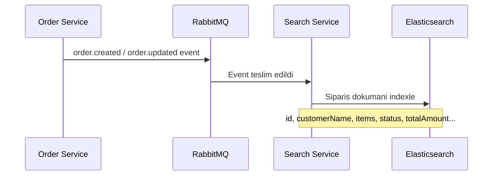

# Arama API'si

Arama servisi (Search Service), Elasticsearch uzerinde siparis verilerinin tam metin aramasini (full-text search) ve istatistiksel analizlerini saglar. Siparis olaylari RabbitMQ uzerinden dinlenerek Elasticsearch index'ine (dizinine) otomatik olarak yazilir.

<Note>
  Tum arama endpoint'leri kimlik dogrulama gerektirir. Isteklerinize gecerli bir session cookie (oturum cerezi) eklemeniz gerekmektedir.
</Note>

## Veri Akisi



## Siparis Ara

Siparisler uzerinde tam metin arama yapar. Bulanik eslestirme (fuzzy matching) destegi ile kucuk yazim hatalarina karsi toleranslidir.

**`GET /api/search`**

### Sorgu Parametreleri

| Parametre | Tip | Varsayilan | Aciklama |
| --- | --- | --- | --- |
| `q` | `string` | - | Arama sorgusu. Musteri adi, email veya urun adinda aranir. |
| `status` | `string` | - | Siparis durumuna gore filtre (`pending`, `confirmed`, `shipped` vb.) |
| `from` | `number` | `0` | Sayfalama baslangic noktasi (kac sonuc atlanacak) |
| `size` | `number` | `20` | Sayfa basina sonuc sayisi |

<CodeGroup>
```bash cURL
# Tam metin arama
curl "http://localhost:3000/api/search?q=laptop" \
  -b cookies.txt

# Durum filtresi ile arama
curl "http://localhost:3000/api/search?q=ahmet&status=pending" \
  -b cookies.txt

# Sayfalama ile arama (2. sayfa, sayfa basi 10 sonuc)
curl "http://localhost:3000/api/search?q=laptop&from=10&size=10" \
  -b cookies.txt

# Yalnizca durum filtresi (arama sorgusu olmadan)
curl "http://localhost:3000/api/search?status=shipped" \
  -b cookies.txt

# Tum siparisleri listele (filtre olmadan)
curl "http://localhost:3000/api/search" \
  -b cookies.txt
```

```typescript fetch
// Tam metin arama
const response = await fetch(
  "http://localhost:3000/api/search?q=laptop",
  { credentials: "include" }
);

// Durum filtresi ile arama
const response2 = await fetch(
  "http://localhost:3000/api/search?q=ahmet&status=pending",
  { credentials: "include" }
);

// Sayfalama ile arama
const response3 = await fetch(
  "http://localhost:3000/api/search?q=laptop&from=10&size=10",
  { credentials: "include" }
);
const data = await response3.json();
```
</CodeGroup>

### Basarili Yanit

```json
{
  "success": true,
  "data": {
    "total": 42,
    "hits": [
      {
        "id": "550e8400-e29b-41d4-a716-446655440000",
        "customerName": "Ahmet Yilmaz",
        "customerEmail": "ahmet@ornek.com",
        "items": [
          {
            "productId": "laptop-001",
            "name": "Gaming Laptop",
            "quantity": 1,
            "price": 15000
          }
        ],
        "totalAmount": 15000,
        "status": "pending",
        "createdAt": "2026-03-03T10:00:00.000Z",
        "updatedAt": "2026-03-03T10:00:00.000Z"
      }
    ]
  }
}
```

### Yanit Alanlari

| Alan | Tip | Aciklama |
| --- | --- | --- |
| `total` | `number` | Filtrelere uyan toplam sonuc sayisi |
| `hits` | `Order[]` | Mevcut sayfadaki siparis sonuclari |

## Arama Mekanizmasi

### Aranan Alanlar

`q` parametresi ile girilen sorgu, Elasticsearch'un `multi_match` sorgusu ile asagidaki alanlarda aranir:

| Alan | Elasticsearch Tipi | Aciklama |
| --- | --- | --- |
| `customerName` | `text` | Musteri adi (tam metin arama destegi) |
| `customerEmail` | `keyword` | Musteri email adresi (tam eslestirme) |
| `items.name` | `text` (nested) | Siparis kalemlerinin urun adlari |

### Bulanik Eslestirme (Fuzzy Matching)

Arama motoru `fuzziness: "AUTO"` ayari ile calisir. Bu sayede kucuk yazim hatalarini tolere eder:

| Sorgu | Eslesen Sonuclar |
| --- | --- |
| `laptop` | "Gaming Laptop", "Laptop Stand" |
| `laptpo` | "Gaming Laptop" (1 harf hatasi tolere edilir) |
| `ahmet` | "Ahmet Yilmaz", "Ahmet Demir" |

<Tip>
  `q` parametresi gonderilmezse, `status` filtresi tek basina kullanilabilir. Her iki parametre de gonderilmezse `match_all` sorgusu calistirilir ve tum siparisler dondurulur.
</Tip>

### Siralama

Sonuclar varsayilan olarak `createdAt` alanina gore en yeniden en eskiye (descending) siralanir.

### Sayfalama

Sayfalama, `from` ve `size` parametreleri ile kontrol edilir:

| Sayfa | `from` | `size` | Aciklama |
| --- | --- | --- | --- |
| 1. sayfa | `0` | `20` | Ilk 20 sonuc |
| 2. sayfa | `20` | `20` | 21-40 arasi sonuclar |
| 3. sayfa | `40` | `20` | 41-60 arasi sonuclar |

<Warning>
  Cok buyuk `from` degerleri Elasticsearch'ta performans sorunlarina yol acabilir. Derin sayfalama (deep pagination) icin `from + size` toplaminin 10.000'i asmamasi onerilir.
</Warning>

## Istatistikler

Siparis verilerinin toplu istatistiklerini (aggregation) dondurur. Dashboard'lar (gosterge panelleri) ve raporlar icin kullanilir.

**`GET /api/search/stats`**

<CodeGroup>
```bash cURL
curl http://localhost:3000/api/search/stats \
  -b cookies.txt
```

```typescript fetch
const response = await fetch("http://localhost:3000/api/search/stats", {
  credentials: "include",
});
const data = await response.json();
```
</CodeGroup>

### Basarili Yanit

```json
{
  "success": true,
  "data": {
    "status_counts": {
      "doc_count_error_upper_bound": 0,
      "sum_other_doc_count": 0,
      "buckets": [
        { "key": "pending", "doc_count": 25 },
        { "key": "confirmed", "doc_count": 15 },
        { "key": "shipped", "doc_count": 8 },
        { "key": "delivered", "doc_count": 42 },
        { "key": "cancelled", "doc_count": 3 }
      ]
    },
    "total_revenue": {
      "value": 1250000.00
    },
    "avg_order_value": {
      "value": 13440.86
    },
    "orders_over_time": {
      "buckets": [
        {
          "key_as_string": "2026-03-01T00:00:00.000Z",
          "key": 1740787200000,
          "doc_count": 12
        },
        {
          "key_as_string": "2026-03-02T00:00:00.000Z",
          "key": 1740873600000,
          "doc_count": 18
        },
        {
          "key_as_string": "2026-03-03T00:00:00.000Z",
          "key": 1740960000000,
          "doc_count": 7
        }
      ]
    }
  }
}
```

### Istatistik Alanlari

| Aggregation | Tip | Aciklama |
| --- | --- | --- |
| `status_counts` | `terms` | Her siparis durumu icin siparis sayisi |
| `total_revenue` | `sum` | Tum siparislerin toplam geliri (`totalAmount` toplami) |
| `avg_order_value` | `avg` | Ortalama siparis degeri |
| `orders_over_time` | `date_histogram` | Gunluk siparis sayisi dagilimi |

<Tip>
  `orders_over_time` aggregation'i gunluk (`calendar_interval: "day"`) periyotlarla siparis dagilimini gosterir. Bu veri, Grafana dashboard'larinda zaman serisi grafigi olarak gorsellestirilmeye uygundur.
</Tip>

## Elasticsearch Index Yapisi

Siparis verileri asagidaki mapping (haritalama) ile indexlenir:

```json
{
  "mappings": {
    "properties": {
      "id":            { "type": "keyword" },
      "customerName":  { "type": "text" },
      "customerEmail": { "type": "keyword" },
      "items": {
        "type": "nested",
        "properties": {
          "productId": { "type": "keyword" },
          "name":      { "type": "text" },
          "quantity":  { "type": "integer" },
          "price":     { "type": "float" }
        }
      },
      "totalAmount": { "type": "float" },
      "status":      { "type": "keyword" },
      "createdAt":   { "type": "date" },
      "updatedAt":   { "type": "date" }
    }
  }
}
```

### Alan Tipi Aciklamalari

| Elasticsearch Tipi | Aciklama |
| --- | --- |
| `keyword` | Tam eslestirme. Filtreleme ve siralama icin optimize edilmistir. Analiz edilmez (tokenize edilmez). |
| `text` | Tam metin arama. Analiz edilir, tokenize edilir ve bulanik eslestirme destekler. |
| `nested` | Ic ice nesne dizisi. Her eleman bagimsiz olarak sorgulanabilir. |
| `integer` / `float` | Sayisal alanlar. Aralik sorgulari ve aggregation'lar icin kullanilir. |
| `date` | Tarih alani. ISO 8601 formatinda saklanir. Zaman bazli sorgular ve histogram aggregation'lari destekler. |
