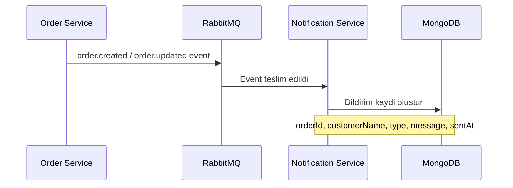

# Bildirim API'si

Bildirim servisi (Notification Service), siparis olaylarini dinleyerek otomatik bildirim kayitlari olusturur. Bildirimler MongoDB veritabaninda saklanir ve bu API uzerinden sorgulanabilir.

<Note>
  Bildirimler manuel olarak olusturulmaz. Siparis olusturuldiginda veya guncellendiginde RabbitMQ uzerinden yayinlanan event'ler (olaylar) bildirim servisi tarafindan tuketilir ve otomatik olarak MongoDB'ye kaydedilir.
</Note>

## Bildirim Olusturma Akisi



## Tum Bildirimleri Listele

Sistemdeki bildirimleri `sentAt` (gonderilme zamani) alanina gore en yeniden en eskiye sirali olarak getirir.

**`GET /api/notifications`**

### Sorgu Parametreleri

| Parametre | Tip | Varsayilan | Aciklama |
| --- | --- | --- | --- |
| `limit` | `number` | `50` | Getirilecek maksimum bildirim sayisi |

<CodeGroup>
```bash cURL
# Varsayilan limit (50 bildirim)
curl http://localhost:3000/api/notifications \
  -b cookies.txt

# Ozel limit (son 10 bildirim)
curl "http://localhost:3000/api/notifications?limit=10" \
  -b cookies.txt
```

```typescript fetch
// Varsayilan limit (50 bildirim)
const response = await fetch("http://localhost:3000/api/notifications", {
  credentials: "include",
});

// Ozel limit (son 10 bildirim)
const response2 = await fetch(
  "http://localhost:3000/api/notifications?limit=10",
  { credentials: "include" }
);
const data = await response2.json();
```
</CodeGroup>

### Basarili Yanit

```json
{
  "success": true,
  "data": [
    {
      "_id": "65f1a2b3c4d5e6f7a8b9c0d1",
      "orderId": "550e8400-e29b-41d4-a716-446655440000",
      "customerName": "Ahmet Yilmaz",
      "customerEmail": "ahmet@ornek.com",
      "type": "order.created",
      "message": "Order 550e8400-e29b-41d4-a716-446655440000 - order.created: pending",
      "sentAt": "2026-03-03T10:00:00.000Z"
    },
    {
      "_id": "65f1a2b3c4d5e6f7a8b9c0d2",
      "orderId": "550e8400-e29b-41d4-a716-446655440000",
      "customerName": "Ahmet Yilmaz",
      "customerEmail": "ahmet@ornek.com",
      "type": "order.updated",
      "message": "Order 550e8400-e29b-41d4-a716-446655440000 - order.updated: shipped",
      "sentAt": "2026-03-03T12:30:00.000Z"
    }
  ]
}
```

## Siparise Ait Bildirimleri Getir

Belirli bir siparise ait tum bildirimleri getirir, en yeniden en eskiye sirali olarak.

**`GET /api/notifications/:orderId`**

<CodeGroup>
```bash cURL
curl http://localhost:3000/api/notifications/550e8400-e29b-41d4-a716-446655440000 \
  -b cookies.txt
```

```typescript fetch
const response = await fetch(
  "http://localhost:3000/api/notifications/550e8400-e29b-41d4-a716-446655440000",
  { credentials: "include" }
);
const data = await response.json();
```
</CodeGroup>

### Yol Parametreleri

| Parametre | Tip | Aciklama |
| --- | --- | --- |
| `orderId` | `string (UUID)` | Siparisin benzersiz kimlik numarasi |

### Basarili Yanit

```json
{
  "success": true,
  "data": [
    {
      "_id": "65f1a2b3c4d5e6f7a8b9c0d1",
      "orderId": "550e8400-e29b-41d4-a716-446655440000",
      "customerName": "Ahmet Yilmaz",
      "customerEmail": "ahmet@ornek.com",
      "type": "order.created",
      "message": "Order 550e8400-e29b-41d4-a716-446655440000 - order.created: pending",
      "sentAt": "2026-03-03T10:00:00.000Z"
    },
    {
      "_id": "65f1a2b3c4d5e6f7a8b9c0d2",
      "orderId": "550e8400-e29b-41d4-a716-446655440000",
      "customerName": "Ahmet Yilmaz",
      "customerEmail": "ahmet@ornek.com",
      "type": "order.updated",
      "message": "Order 550e8400-e29b-41d4-a716-446655440000 - order.updated: shipped",
      "sentAt": "2026-03-03T12:30:00.000Z"
    }
  ]
}
```

<Tip>
  Belirli bir siparisin gecmisini takip etmek icin `orderId` ile sorgulama yapin. Bu sayede siparisin olusturulmasindan teslim edilmesine kadar tum bildirim kayitlarini gorebilirsiniz.
</Tip>

## Bildirim Veri Yapisi

Her bildirim kaydi asagidaki alanlari icerir:

| Alan | Tip | Aciklama |
| --- | --- | --- |
| `_id` | `ObjectId` | MongoDB tarafindan otomatik atanan benzersiz kimlik |
| `orderId` | `string (UUID)` | Ilgili siparisin kimlik numarasi |
| `customerName` | `string` | Musteri adi |
| `customerEmail` | `string` | Musteri email adresi |
| `type` | `string` | Olay tipi: `order.created` veya `order.updated` |
| `message` | `string` | Okunabilir bildirim mesaji |
| `sentAt` | `Date (ISO 8601)` | Bildirimin olusturulma zamani |

## Olay Tipleri

| Olay Tipi | Tetiklenme Kosulu | Mesaj Formati |
| --- | --- | --- |
| `order.created` | Yeni siparis olusturuldugunda | `Order {id} - order.created: {status}` |
| `order.updated` | Siparis guncellendigi zaman | `Order {id} - order.updated: {status}` |

## Hata Yonetimi ve DLQ

Bildirim servisi, mesaj isleme sirasinda olusan hatalari Dead Letter Queue (Olu Mektup Kuyrugu) mekanizmasi ile yonetir:

<Steps>
  <Step title="Ilk Deneme">
    RabbitMQ'dan alinan mesaj islenir. Basarisiz olursa yeniden denenir.
  </Step>
  <Step title="Yeniden Deneme (3 Deneme)">
    Mesaj basliklarindaki `x-retry-count` degeri arttirilarak mesaj tekrar kuyruga gonderilir. En fazla 3 deneme yapilir.
  </Step>
  <Step title="Dead Letter Queue">
    3 deneme sonrasinda hala basarisiz olan mesajlar DLQ'ya (olu mektup kuyruguna) tasinir. Bu mesajlar manuel inceleme ve mudahale gerektirir.
  </Step>
</Steps>

<Warning>
  Bildirim API'si yalnizca okuma (read-only) endpoint'leri sunar. Bildirim olusturma, guncelleme veya silme islemi bu API uzerinden yapilamaz. Bildirimler yalnizca siparis event'leri ile otomatik olusturulur.
</Warning>
