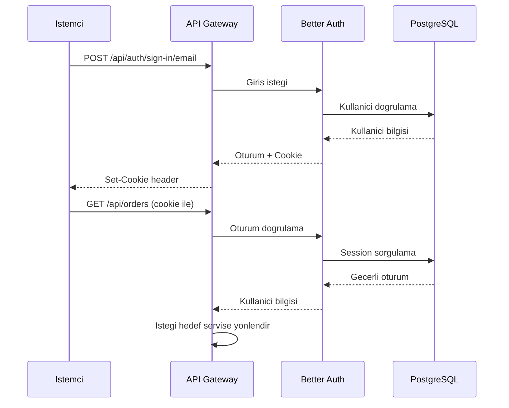

# Kimlik Dogrulama

Kimlik dogrulama islemleri, Better Auth kutuphanesi tarafindan yonetilir. Email/sifre ile kayit ve giris, GitHub ve Google OAuth (Acik Yetkilendirme) ile sosyal giris desteklenir.

<Note>
  `/api/auth/**` yollari herkese aciktir ve session cookie (oturum cerezi) gerektirmez. Diger tum API yollari icin gecerli bir oturum gereklidir.
</Note>

## Oturum Yonetimi

Better Auth, oturum bilgilerini HTTP cookie (cerez) uzerinden yonetir.

| Parametre | Deger |
| --- | --- |
| Oturum suresi | 7 gun |
| Otomatik yenileme | Gunluk (24 saatte bir) |
| Depolama | PostgreSQL |
| Tasinma yontemi | Session cookie (oturum cerezi) |

<Warning>
  Tum kimlik dogrulama isteklerinde cookie'lerin gonderilmesi gerekir. `curl` ile test ederken `-c` (cookie yazma) ve `-b` (cookie okuma) bayraklarini kullanin. Tarayici tabanli istemcilerde `credentials: "include"` ayarini unutmayin.
</Warning>

## Kayit Olma

Yeni bir kullanici hesabi olusturur.

**`POST /api/auth/sign-up/email`**

### Istek Govdesi

| Alan | Tip | Gerekli | Aciklama |
| --- | --- | --- | --- |
| `name` | `string` | Evet | Kullanicinin tam adi |
| `email` | `string` | Evet | Gecerli bir email adresi |
| `password` | `string` | Evet | Kullanici sifresi |

<CodeGroup>
```bash cURL
curl -X POST http://localhost:3000/api/auth/sign-up/email \
  -H "Content-Type: application/json" \
  -c cookies.txt \
  -d '{
    "name": "Ahmet Yilmaz",
    "email": "ahmet@ornek.com",
    "password": "guvenli-sifre-123"
  }'
```

```typescript fetch
const response = await fetch("http://localhost:3000/api/auth/sign-up/email", {
  method: "POST",
  headers: { "Content-Type": "application/json" },
  credentials: "include",
  body: JSON.stringify({
    name: "Ahmet Yilmaz",
    email: "ahmet@ornek.com",
    password: "guvenli-sifre-123",
  }),
});
```
</CodeGroup>

### Basarili Yanit

```json
{
  "user": {
    "id": "abc123",
    "name": "Ahmet Yilmaz",
    "email": "ahmet@ornek.com",
    "createdAt": "2026-03-03T10:00:00.000Z",
    "updatedAt": "2026-03-03T10:00:00.000Z"
  },
  "session": {
    "id": "session-id",
    "userId": "abc123",
    "expiresAt": "2026-03-10T10:00:00.000Z"
  }
}
```

## Giris Yapma

Mevcut bir hesapla oturum acar.

**`POST /api/auth/sign-in/email`**

### Istek Govdesi

| Alan | Tip | Gerekli | Aciklama |
| --- | --- | --- | --- |
| `email` | `string` | Evet | Kayitli email adresi |
| `password` | `string` | Evet | Kullanici sifresi |

<CodeGroup>
```bash cURL
curl -X POST http://localhost:3000/api/auth/sign-in/email \
  -H "Content-Type: application/json" \
  -c cookies.txt \
  -d '{
    "email": "ahmet@ornek.com",
    "password": "guvenli-sifre-123"
  }'
```

```typescript fetch
const response = await fetch("http://localhost:3000/api/auth/sign-in/email", {
  method: "POST",
  headers: { "Content-Type": "application/json" },
  credentials: "include",
  body: JSON.stringify({
    email: "ahmet@ornek.com",
    password: "guvenli-sifre-123",
  }),
});
```
</CodeGroup>

### Basarili Yanit

```json
{
  "user": {
    "id": "abc123",
    "name": "Ahmet Yilmaz",
    "email": "ahmet@ornek.com"
  },
  "session": {
    "id": "session-id",
    "userId": "abc123",
    "expiresAt": "2026-03-10T10:00:00.000Z"
  }
}
```

## Oturumu Kapatma

Mevcut oturumu sonlandirir ve session cookie'yi gecersiz kilar.

**`POST /api/auth/sign-out`**

<CodeGroup>
```bash cURL
curl -X POST http://localhost:3000/api/auth/sign-out \
  -b cookies.txt \
  -c cookies.txt
```

```typescript fetch
const response = await fetch("http://localhost:3000/api/auth/sign-out", {
  method: "POST",
  credentials: "include",
});
```
</CodeGroup>

## Oturum Sorgulama

Mevcut oturumun gecerli olup olmadigini kontrol eder ve kullanici bilgilerini dondurur.

**`GET /api/auth/session`**

<CodeGroup>
```bash cURL
curl http://localhost:3000/api/auth/session \
  -b cookies.txt
```

```typescript fetch
const response = await fetch("http://localhost:3000/api/auth/session", {
  credentials: "include",
});
const data = await response.json();
```
</CodeGroup>

### Basarili Yanit (Gecerli Oturum)

```json
{
  "user": {
    "id": "abc123",
    "name": "Ahmet Yilmaz",
    "email": "ahmet@ornek.com",
    "createdAt": "2026-03-03T10:00:00.000Z",
    "updatedAt": "2026-03-03T10:00:00.000Z"
  },
  "session": {
    "id": "session-id",
    "userId": "abc123",
    "expiresAt": "2026-03-10T10:00:00.000Z"
  }
}
```

### Yanit (Gecersiz veya Suresi Dolmus Oturum)

```json
null
```

## Sosyal Giris

GitHub ve Google OAuth saglayicilari ile giris yapilabilir. Bu yollar tarayici yonlendirmesi (redirect) ile calisir.

### GitHub ile Giris

**`GET /api/auth/sign-in/social?provider=github`**

<CodeGroup>
```bash cURL
# Tarayicida dogrudan asagidaki URL'yi acin:
# http://localhost:3000/api/auth/sign-in/social?provider=github

# veya programatik olarak yonlendirme URL'sini alin:
curl -v "http://localhost:3000/api/auth/sign-in/social?provider=github"
```

```html Tarayici
<a href="http://localhost:3000/api/auth/sign-in/social?provider=github">
  GitHub ile Giris Yap
</a>
```
</CodeGroup>

### Google ile Giris

**`GET /api/auth/sign-in/social?provider=google`**

<CodeGroup>
```bash cURL
# Tarayicida dogrudan asagidaki URL'yi acin:
# http://localhost:3000/api/auth/sign-in/social?provider=google

# veya programatik olarak yonlendirme URL'sini alin:
curl -v "http://localhost:3000/api/auth/sign-in/social?provider=google"
```

```html Tarayici
<a href="http://localhost:3000/api/auth/sign-in/social?provider=google">
  Google ile Giris Yap
</a>
```
</CodeGroup>

### Sosyal Giris Akisi

<Steps>
  <Step title="Yonlendirme">
    Kullanici `/api/auth/sign-in/social?provider=github` adresine yonlendirilir.
  </Step>
  <Step title="OAuth Saglayicisi">
    Better Auth, kullaniciyi GitHub veya Google'in yetkilendirme sayfasina yonlendirir.
  </Step>
  <Step title="Yetkilendirme">
    Kullanici, uygulamaya erisim izni verir.
  </Step>
  <Step title="Geri Donus">
    OAuth saglayicisi, kullaniciyi callback URL'sine yonlendirir. Better Auth oturumu olusturur ve session cookie atar.
  </Step>
</Steps>

<Tip>
  Sosyal giris saglayicilarini etkinlestirmek icin asagidaki ortam degiskenlerini ayarlamaniz gerekmektedir:

  **GitHub icin:**
  - `GITHUB_CLIENT_ID` - GitHub OAuth App'in Client ID degeri
  - `GITHUB_CLIENT_SECRET` - GitHub OAuth App'in Client Secret degeri

  **Google icin:**
  - `GOOGLE_CLIENT_ID` - Google Cloud Console'dan alinan Client ID
  - `GOOGLE_CLIENT_SECRET` - Google Cloud Console'dan alinan Client Secret

  Bu degiskenler ayarlanmadigi surece ilgili sosyal giris saglayicisi devre disi kalir.
</Tip>

## Kimlik Dogrulama Akisi Ozeti


