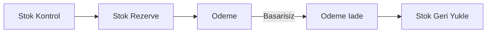
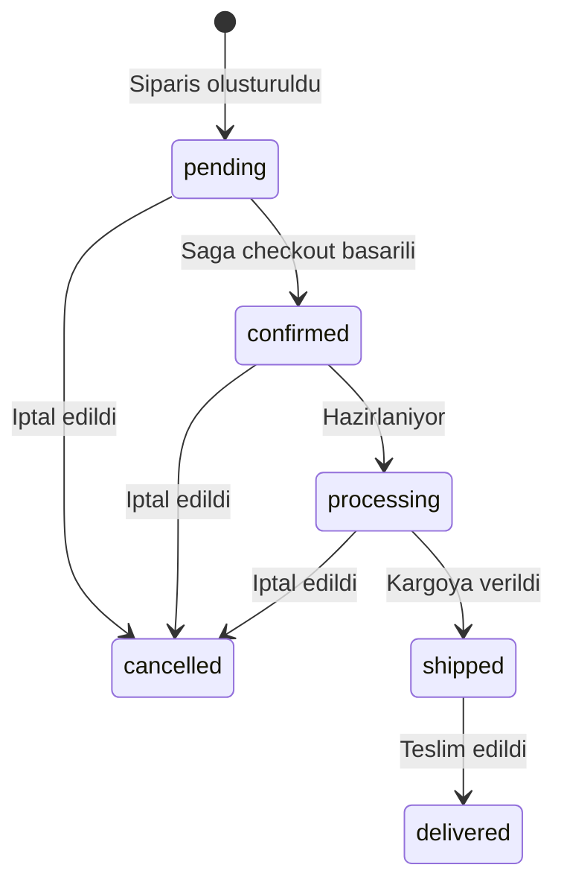

# Siparis API'si

Siparis servisi, e-ticaret platformunun temel is mantigini yonetir. Siparisler PostgreSQL veritabaninda saklanir, Redis ile onbelleklenir ve RabbitMQ uzerinden diger servislere event (olay) olarak yayinlanir.

<Note>
  Tum siparis endpoint'leri kimlik dogrulama gerektirir. Isteklerinize gecerli bir session cookie (oturum cerezi) eklemeniz gerekmektedir.
</Note>

## Tum Siparisleri Listele

Sistemdeki tum siparisleri getirir. Sonuclar oncelikle Redis cache'inden (onbelleginden) sunulur.

**`GET /api/orders`**

<CodeGroup>
```bash cURL
curl http://localhost:3000/api/orders \
  -b cookies.txt
```

```typescript fetch
const response = await fetch("http://localhost:3000/api/orders", {
  credentials: "include",
});
const data = await response.json();
```
</CodeGroup>

### Basarili Yanit

```json
{
  "success": true,
  "data": [
    {
      "id": "550e8400-e29b-41d4-a716-446655440000",
      "customerName": "Ahmet Yilmaz",
      "customerEmail": "ahmet@ornek.com",
      "items": [
        {
          "productId": "laptop-001",
          "name": "Gaming Laptop",
          "quantity": 1,
          "price": 15000
        }
      ],
      "totalAmount": "15000.00",
      "status": "pending",
      "createdAt": "2026-03-03T10:00:00.000Z",
      "updatedAt": "2026-03-03T10:00:00.000Z"
    }
  ]
}
```

## Siparis Detayi Getir

Belirli bir siparisi UUID'si ile getirir.

**`GET /api/orders/:id`**

<CodeGroup>
```bash cURL
curl http://localhost:3000/api/orders/550e8400-e29b-41d4-a716-446655440000 \
  -b cookies.txt
```

```typescript fetch
const response = await fetch(
  "http://localhost:3000/api/orders/550e8400-e29b-41d4-a716-446655440000",
  { credentials: "include" }
);
const data = await response.json();
```
</CodeGroup>

### Yol Parametreleri

| Parametre | Tip | Aciklama |
| --- | --- | --- |
| `id` | `string (UUID)` | Siparisin benzersiz kimlik numarasi |

### Hata Yaniti (404)

```json
{
  "success": false,
  "error": "Order not found"
}
```

## Siparis Olustur

Yeni bir siparis olusturur. Siparis `pending` (beklemede) durumunda baslar. Olusturulan siparis RabbitMQ'ya `order.created` event'i olarak yayinlanir.

**`POST /api/orders`**

<CodeGroup>
```bash cURL
curl -X POST http://localhost:3000/api/orders \
  -H "Content-Type: application/json" \
  -b cookies.txt \
  -d '{
    "customerName": "Ahmet Yilmaz",
    "customerEmail": "ahmet@ornek.com",
    "items": [
      {
        "productId": "laptop-001",
        "name": "Gaming Laptop",
        "quantity": 1,
        "price": 15000
      },
      {
        "productId": "mouse-001",
        "name": "Kablosuz Mouse",
        "quantity": 2,
        "price": 350
      }
    ]
  }'
```

```typescript fetch
const response = await fetch("http://localhost:3000/api/orders", {
  method: "POST",
  headers: { "Content-Type": "application/json" },
  credentials: "include",
  body: JSON.stringify({
    customerName: "Ahmet Yilmaz",
    customerEmail: "ahmet@ornek.com",
    items: [
      {
        productId: "laptop-001",
        name: "Gaming Laptop",
        quantity: 1,
        price: 15000,
      },
      {
        productId: "mouse-001",
        name: "Kablosuz Mouse",
        quantity: 2,
        price: 350,
      },
    ],
  }),
});
const data = await response.json();
```
</CodeGroup>

### Istek Govdesi

| Alan | Tip | Gerekli | Aciklama |
| --- | --- | --- | --- |
| `customerName` | `string` | Evet | Musteri adi (en az 1 karakter) |
| `customerEmail` | `string` | Evet | Gecerli bir email adresi |
| `items` | `OrderItem[]` | Evet | Siparis kalemleri (en az 1 kalem) |

### OrderItem Yapisi

| Alan | Tip | Gerekli | Aciklama |
| --- | --- | --- | --- |
| `productId` | `string` | Evet | Urun kimlik numarasi (en az 1 karakter) |
| `name` | `string` | Evet | Urun adi (en az 1 karakter) |
| `quantity` | `integer` | Evet | Adet (pozitif tam sayi) |
| `price` | `number` | Evet | Birim fiyat (pozitif sayi) |

### Basarili Yanit (201)

```json
{
  "success": true,
  "data": {
    "id": "550e8400-e29b-41d4-a716-446655440000",
    "customerName": "Ahmet Yilmaz",
    "customerEmail": "ahmet@ornek.com",
    "items": [
      {
        "productId": "laptop-001",
        "name": "Gaming Laptop",
        "quantity": 1,
        "price": 15000
      },
      {
        "productId": "mouse-001",
        "name": "Kablosuz Mouse",
        "quantity": 2,
        "price": 350
      }
    ],
    "totalAmount": "15700.00",
    "status": "pending",
    "createdAt": "2026-03-03T10:00:00.000Z",
    "updatedAt": "2026-03-03T10:00:00.000Z"
  }
}
```

<Note>
  `totalAmount` alani otomatik olarak hesaplanir: her kalemin `price * quantity` degerleri toplanir. Bu alani istek govdesinde gondermenize gerek yoktur.
</Note>

### Validasyon Hatasi (400)

```json
{
  "success": false,
  "error": "String must contain at least 1 character(s), Invalid email"
}
```

## Saga Checkout (Saga Tabanli Satin Alma)

Saga Pattern (Saga Kalibini) kullanarak siparis olusturur. Bu endpoint, stok kontrolu, stok rezervasyonu ve odeme islemini sirali olarak calistirir. Herhangi bir adim basarisiz olursa tum onceki adimlar otomatik olarak geri alinir (compensating transaction).

**`POST /api/orders/checkout`**

<CodeGroup>
```bash cURL
curl -X POST http://localhost:3000/api/orders/checkout \
  -H "Content-Type: application/json" \
  -b cookies.txt \
  -d '{
    "customerName": "Ahmet Yilmaz",
    "customerEmail": "ahmet@ornek.com",
    "items": [
      {
        "productId": "laptop-001",
        "name": "Gaming Laptop",
        "quantity": 1,
        "price": 15000
      }
    ]
  }'
```

```typescript fetch
const response = await fetch("http://localhost:3000/api/orders/checkout", {
  method: "POST",
  headers: { "Content-Type": "application/json" },
  credentials: "include",
  body: JSON.stringify({
    customerName: "Ahmet Yilmaz",
    customerEmail: "ahmet@ornek.com",
    items: [
      {
        productId: "laptop-001",
        name: "Gaming Laptop",
        quantity: 1,
        price: 15000,
      },
    ],
  }),
});
const data = await response.json();
```
</CodeGroup>

### Saga Adimlari

<Steps>
  <Step title="Stok Kontrolu">
    Her urun icin envanter servisinden stok durumu sorgulanir. Yetersiz stok varsa saga basarisiz olur.
  </Step>
  <Step title="Stok Rezervasyonu">
    Yeterli stok varsa, her urun icin istenen miktar kadar stok dusurulerek rezerve edilir.
  </Step>
  <Step title="Odeme Islemi">
    Toplam tutar uzerinden odeme islemi gerceklestirilir. (Simule edilmis odeme sistemi, %90 basari orani)
  </Step>
  <Step title="Siparis Onaylama">
    Tum adimlar basarili olursa siparis `confirmed` (onaylanmis) durumunda olusturulur ve event yayinlanir.
  </Step>
</Steps>

### Basarili Yanit (201)

```json
{
  "success": true,
  "data": {
    "id": "550e8400-e29b-41d4-a716-446655440000",
    "customerName": "Ahmet Yilmaz",
    "customerEmail": "ahmet@ornek.com",
    "items": [
      {
        "productId": "laptop-001",
        "name": "Gaming Laptop",
        "quantity": 1,
        "price": 15000
      }
    ],
    "totalAmount": "15000.00",
    "status": "confirmed",
    "createdAt": "2026-03-03T10:00:00.000Z",
    "updatedAt": "2026-03-03T10:00:00.000Z",
    "paymentId": "a1b2c3d4-e5f6-7890-abcd-ef1234567890"
  }
}
```

### Saga Basarisizlik Yaniti (422)

Saga herhangi bir adimda basarisiz olursa, tamamlanan adimlar ters sirada telafi edilir ve hata doner:

<Tabs>
  <Tab title="Yetersiz Stok">
    ```json
    {
      "success": false,
      "error": "Insufficient stock for laptop-001 (need 5, have 2)"
    }
    ```
  </Tab>
  <Tab title="Odeme Basarisizligi">
    ```json
    {
      "success": false,
      "error": "Payment failed"
    }
    ```
  </Tab>
</Tabs>

<Warning>
  Checkout endpoint'i `POST /api/orders`'dan farkli olarak stok durumunu dogrular ve odeme isler. Basit siparis olusturma stok kontrolu yapmaz; saga checkout kullanmaniz onerilir.
</Warning>

### Telafi Mekanizmasi

Saga basarisiz oldugunda telafi (compensation) islemleri ters sirada uygulanir:



## Siparis Guncelle

Mevcut bir siparisin bilgilerini gunceller. Guncelleme sonrasinda `order.updated` event'i yayinlanir.

**`PATCH /api/orders/:id`**

<CodeGroup>
```bash cURL
curl -X PATCH http://localhost:3000/api/orders/550e8400-e29b-41d4-a716-446655440000 \
  -H "Content-Type: application/json" \
  -b cookies.txt \
  -d '{
    "status": "shipped"
  }'
```

```typescript fetch
const response = await fetch(
  "http://localhost:3000/api/orders/550e8400-e29b-41d4-a716-446655440000",
  {
    method: "PATCH",
    headers: { "Content-Type": "application/json" },
    credentials: "include",
    body: JSON.stringify({
      status: "shipped",
    }),
  }
);
const data = await response.json();
```
</CodeGroup>

### Istek Govdesi

Tum alanlar istege baglidir. Yalnizca gonderilen alanlar guncellenir.

| Alan | Tip | Gerekli | Aciklama |
| --- | --- | --- | --- |
| `customerName` | `string` | Hayir | Yeni musteri adi (en az 1 karakter) |
| `customerEmail` | `string` | Hayir | Yeni email adresi (gecerli email) |
| `status` | `OrderStatus` | Hayir | Yeni siparis durumu |

### Basarili Yanit

```json
{
  "success": true,
  "data": {
    "id": "550e8400-e29b-41d4-a716-446655440000",
    "customerName": "Ahmet Yilmaz",
    "customerEmail": "ahmet@ornek.com",
    "items": [ ... ],
    "totalAmount": "15000.00",
    "status": "shipped",
    "createdAt": "2026-03-03T10:00:00.000Z",
    "updatedAt": "2026-03-03T12:30:00.000Z"
  }
}
```

## Siparis Durumlari

Siparis durumu (OrderStatus) asagidaki degerlerden birini alabilir:

| Durum | Aciklama |
| --- | --- |
| `pending` | Siparis olusturuldu, henuz islenmedi |
| `confirmed` | Saga checkout basarili, odeme alindi |
| `processing` | Siparis hazirlaniyor |
| `shipped` | Siparis kargoya verildi |
| `delivered` | Siparis teslim edildi |
| `cancelled` | Siparis iptal edildi |

### Durum Akis Diyagrami



## Validasyon Kurallari

Siparis istek govdeleri Zod kutuphanesi ile dogrulanir.

### Siparis Olusturma Semasi

```typescript
const orderItemSchema = z.object({
  productId: z.string().min(1),    // Bos olamaz
  name: z.string().min(1),          // Bos olamaz
  quantity: z.number().int().positive(), // Pozitif tam sayi
  price: z.number().positive(),     // Pozitif sayi
});

const createOrderSchema = z.object({
  customerName: z.string().min(1),  // Bos olamaz
  customerEmail: z.string().email(), // Gecerli email
  items: z.array(orderItemSchema).min(1), // En az 1 kalem
});
```

### Siparis Guncelleme Semasi

```typescript
const updateOrderSchema = z.object({
  customerName: z.string().min(1).optional(),
  customerEmail: z.string().email().optional(),
  status: z.enum([
    "pending", "confirmed", "processing",
    "shipped", "delivered", "cancelled"
  ]).optional(),
});
```

<Tip>
  Siparis olusturuldiginda veya guncellendiginde RabbitMQ uzerinden event yayinlanir. Bu event'ler bildirim servisi, arama servisi ve envanter servisi tarafindan tuketilir. Boylece servisler arasi iletisim asenkron (esitliksiz) olarak saglanir.
</Tip>
