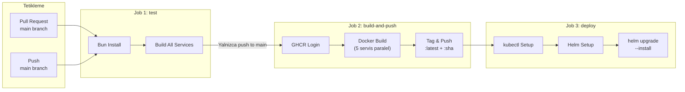
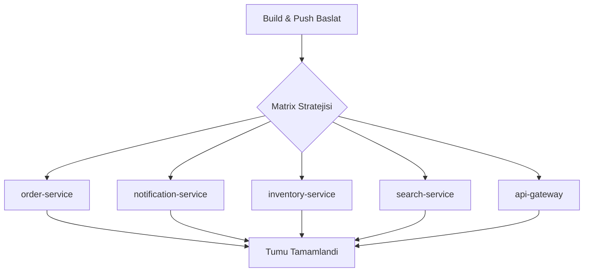
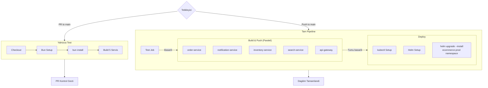

# CI/CD Pipeline

Proje, GitHub Actions uzerinde calisan 3 asamali bir CI/CD pipeline (surekli entegrasyon ve dagitim hatti) kullanmaktadir. Pipeline, kod degisikliklerinin test edilmesinden Kubernetes ortamina dagitilmasina kadar tum sureci otomatlestirmektedir.

## Pipeline Genel Bakis



## Tetikleme Kosullari

Pipeline asagidaki durumlarda tetiklenir:

| Tetikleyici | Kapsam | Calisan Job'lar |
|-------------|--------|-----------------|
| Pull Request | `main` branch'e acilan PR'lar | Yalnizca `test` |
| Push | `main` branch'e yapilan push'lar | `test` + `build-and-push` + `deploy` |

```yaml
on:
  pull_request:
    branches: [main]
  push:
    branches: [main]
```

<Note>
  Pull request'lerde yalnizca test asamasi calisir. Docker build ve Kubernetes deploy islemleri yalnizca `main` branch'e yapilan push islemlerinde tetiklenir.
</Note>

## Job 1: Lint & Build

Ilk asama, tum servislerin derlenebildigini dogrular.

```yaml
test:
  name: Lint & Build
  runs-on: ubuntu-latest
  steps:
    - uses: actions/checkout@v4

    - uses: oven-sh/setup-bun@v2
      with:
        bun-version: latest

    - name: Install dependencies
      run: bun install

    - name: Build all services
      run: |
        bun build services/order-service/src/index.ts --target=bun --outdir=/tmp/build
        bun build services/notification-service/src/index.ts --target=bun --outdir=/tmp/build
        bun build services/inventory-service/src/index.ts --target=bun --outdir=/tmp/build
        bun build services/search-service/src/index.ts --target=bun --outdir=/tmp/build
        bun build services/api-gateway/src/index.ts --target=bun --outdir=/tmp/build
```

### Bu Asamada Yapilanlar

<Steps>
  <Step title="Kod Checkout">
    Depo icerigi `actions/checkout@v4` ile runner'a (calistirici) cekilir.
  </Step>
  <Step title="Bun Kurulumu">
    `oven-sh/setup-bun@v2` action'i ile Bun'in en son surumu kurulur.
  </Step>
  <Step title="Bagimliliklarin Yuklenmesi">
    `bun install` komutu ile tum workspace bagimliliklari yuklenir.
  </Step>
  <Step title="Servislerin Derlenmesi">
    Her servisin `index.ts` giris noktasi `bun build` ile derlenir. Bu adim TypeScript hatalari ve eksik bagimliliklari yakalar.
  </Step>
</Steps>

## Job 2: Build & Push Docker Images

Ikinci asama, her servis icin Docker imaji olusturur ve GitHub Container Registry'ye (GHCR) gonderir.

```yaml
build-and-push:
  name: Build & Push Docker Images
  needs: test
  if: github.event_name == 'push' && github.ref == 'refs/heads/main'
  runs-on: ubuntu-latest
  permissions:
    contents: read
    packages: write
  strategy:
    matrix:
      service:
        - order-service
        - notification-service
        - inventory-service
        - search-service
        - api-gateway
  steps:
    - uses: actions/checkout@v4

    - name: Log in to Container Registry
      uses: docker/login-action@v3
      with:
        registry: ghcr.io
        username: ${{ github.actor }}
        password: ${{ secrets.GITHUB_TOKEN }}

    - name: Build and push
      uses: docker/build-push-action@v5
      with:
        context: .
        file: services/${{ matrix.service }}/Dockerfile
        push: true
        tags: |
          ghcr.io/${{ github.repository }}/${{ matrix.service }}:latest
          ghcr.io/${{ github.repository }}/${{ matrix.service }}:${{ github.sha }}
```

### Matrix Stratejisi

5 servis **paralel olarak** build edilir. Bu sayede toplam build suresi buyuk olcude kisalir:



### Imaj Etiketleme

Her servis icin iki etiket (tag) olusturulur:

| Etiket | Ornek | Amac |
|--------|-------|------|
| `latest` | `ghcr.io/user/repo/order-service:latest` | En son surum |
| `sha` | `ghcr.io/user/repo/order-service:abc123def` | Belirli commit'e sabitlenmis surum |

<Tip>
  Uretim ortaminda her zaman commit SHA etiketi kullanin. `latest` etiketi gelistirme ve test ortamlari icindir. SHA etiketi, hangi kod surumunun calistigini kesin olarak belirlemenizi saglar.
</Tip>

### Gerekli Izinler

```yaml
permissions:
  contents: read     # Depo icerigini okuma
  packages: write    # GHCR'ye imaj yazma
```

`GITHUB_TOKEN` otomatik olarak saglanir, ek bir secret tanimlamaya gerek yoktur.

## Job 3: Deploy to Kubernetes

Ucuncu asama, Helm ile Kubernetes ortamina dagitim yapar.

```yaml
deploy:
  name: Deploy to Kubernetes
  needs: build-and-push
  if: github.event_name == 'push' && github.ref == 'refs/heads/main'
  runs-on: ubuntu-latest
  steps:
    - uses: actions/checkout@v4

    - name: Set up kubectl
      uses: azure/setup-kubectl@v4

    - name: Set up Helm
      uses: azure/setup-helm@v4

    - name: Deploy with Helm
      run: |
        helm upgrade --install ecommerce \
          ./infrastructure/k8s/helm/ecommerce \
          --namespace ecommerce-prod \
          --create-namespace \
          --set global.imageRegistry=ghcr.io/${{ github.repository }} \
          --set global.imageTag=${{ github.sha }} \
          --set global.namespace=ecommerce-prod
```

### Deploy Adimlari Detayi

<Steps>
  <Step title="kubectl Kurulumu">
    `azure/setup-kubectl@v4` action'i ile `kubectl` CLI araci kurulur.
  </Step>
  <Step title="Helm Kurulumu">
    `azure/setup-helm@v4` action'i ile Helm paket yoneticisi kurulur.
  </Step>
  <Step title="Helm Upgrade/Install">
    `helm upgrade --install` komutu ile:
    - Release yoksa olusturulur (`install`)
    - Release varsa guncellenir (`upgrade`)
    - Image tag olarak commit SHA kullanilir
    - Namespace yoksa otomatik olusturulur (`--create-namespace`)
  </Step>
</Steps>

<Note>
  Deploy asamasinda Kubernetes cluster'a erisim icin `kubeconfig` yapilandirilmis olmalidir. Bu genellikle cloud provider'in (bulut saglayicisi) setup action'i ile saglanir (ornegin `aws-actions/configure-aws-credentials` veya `azure/login`).
</Note>

## Gerekli Secrets

Pipeline'in dogru calismasi icin asagidaki GitHub secrets (gizli degerler) tanimlanmalidir:

| Secret | Otomatik | Aciklama |
|--------|----------|----------|
| `GITHUB_TOKEN` | Evet | GitHub tarafindan otomatik saglanir. GHCR erisimi icin kullanilir |
| Kubeconfig | Hayir | Kubernetes cluster erisimi icin gerekli. Cloud provider'a gore degisir |

### GitHub Secrets Tanimlama

Repository settings (depo ayarlari) sayfasindan:

1. **Settings** > **Secrets and variables** > **Actions** sayfasina gidin
2. **New repository secret** butonuna tiklayin
3. Secret adini ve degerini girin

<Warning>
  Secret degerleri bir kez tanimlandiktan sonra GitHub arayuzunden okunamaz, yalnizca guncellenebilir veya silinebilir. Degerleri guvenli bir yerde de saklayin.
</Warning>

## Tam Pipeline Kodu

Asagida `.github/workflows/ci.yml` dosyasinin tam icerigi bulunmaktadir:

```yaml .github/workflows/ci.yml
name: CI/CD Pipeline

on:
  pull_request:
    branches: [main]
  push:
    branches: [main]

env:
  REGISTRY: ghcr.io
  IMAGE_PREFIX: ${{ github.repository }}

jobs:
  test:
    name: Lint & Build
    runs-on: ubuntu-latest
    steps:
      - uses: actions/checkout@v4

      - uses: oven-sh/setup-bun@v2
        with:
          bun-version: latest

      - name: Install dependencies
        run: bun install

      - name: Build all services
        run: |
          bun build services/order-service/src/index.ts --target=bun --outdir=/tmp/build
          bun build services/notification-service/src/index.ts --target=bun --outdir=/tmp/build
          bun build services/inventory-service/src/index.ts --target=bun --outdir=/tmp/build
          bun build services/search-service/src/index.ts --target=bun --outdir=/tmp/build
          bun build services/api-gateway/src/index.ts --target=bun --outdir=/tmp/build

  build-and-push:
    name: Build & Push Docker Images
    needs: test
    if: github.event_name == 'push' && github.ref == 'refs/heads/main'
    runs-on: ubuntu-latest
    permissions:
      contents: read
      packages: write
    strategy:
      matrix:
        service:
          - order-service
          - notification-service
          - inventory-service
          - search-service
          - api-gateway
    steps:
      - uses: actions/checkout@v4

      - name: Log in to Container Registry
        uses: docker/login-action@v3
        with:
          registry: ${{ env.REGISTRY }}
          username: ${{ github.actor }}
          password: ${{ secrets.GITHUB_TOKEN }}

      - name: Build and push
        uses: docker/build-push-action@v5
        with:
          context: .
          file: services/${{ matrix.service }}/Dockerfile
          push: true
          tags: |
            ${{ env.REGISTRY }}/${{ env.IMAGE_PREFIX }}/${{ matrix.service }}:latest
            ${{ env.REGISTRY }}/${{ env.IMAGE_PREFIX }}/${{ matrix.service }}:${{ github.sha }}

  deploy:
    name: Deploy to Kubernetes
    needs: build-and-push
    if: github.event_name == 'push' && github.ref == 'refs/heads/main'
    runs-on: ubuntu-latest
    steps:
      - uses: actions/checkout@v4

      - name: Set up kubectl
        uses: azure/setup-kubectl@v4

      - name: Set up Helm
        uses: azure/setup-helm@v4

      - name: Deploy with Helm
        run: |
          helm upgrade --install ecommerce \
            ./infrastructure/k8s/helm/ecommerce \
            --namespace ecommerce-prod \
            --create-namespace \
            --set global.imageRegistry=${{ env.REGISTRY }}/${{ env.IMAGE_PREFIX }} \
            --set global.imageTag=${{ github.sha }} \
            --set global.namespace=ecommerce-prod
```

## Pipeline Akis Diyagrami

Tum pipeline'in baslatma kosullari ve job bagimliliklari ile detayli akisi:



## Sorun Giderme

<AccordionGroup>
  <Accordion title="Build asamasinda 'permission denied' hatasi">
    GHCR'ye push yetkisi icin `permissions` blogunun dogru tanimlandigindan emin olun:

    ```yaml
    permissions:
      contents: read
      packages: write
    ```

    Ayrica repository settings'te **Actions** > **General** > **Workflow permissions** altinda "Read and write permissions" secili olmalidir.
  </Accordion>

  <Accordion title="Deploy asamasinda kubeconfig hatasi">
    Kubernetes cluster'a erisim icin uygun credentials (kimlik bilgileri) yapilandirilmalidir. Cloud provider'a gore farkli action'lar kullanilir:

    ```yaml
    # AWS EKS ornegi
    - uses: aws-actions/configure-aws-credentials@v4
      with:
        aws-access-key-id: ${{ secrets.AWS_ACCESS_KEY_ID }}
        aws-secret-access-key: ${{ secrets.AWS_SECRET_ACCESS_KEY }}
        aws-region: eu-west-1

    - run: aws eks update-kubeconfig --name ecommerce-cluster
    ```
  </Accordion>

  <Accordion title="Matrix build'de bir servis basarisiz oluyor">
    Matrix stratejisinde bir servisin basarisiz olmasi tum job'u basarisiz kilar. Basarisiz servisi belirlemek icin:

    1. GitHub Actions sayfasinda basarisiz workflow run'a tiklayin
    2. Sol panelden basarisiz matrix job'u secin
    3. Hata loglarini inceleyin

    Ozellikle Dockerfile'daki `COPY` komutlarinin dogru yollari referans ettiginden emin olun.
  </Accordion>
</AccordionGroup>
