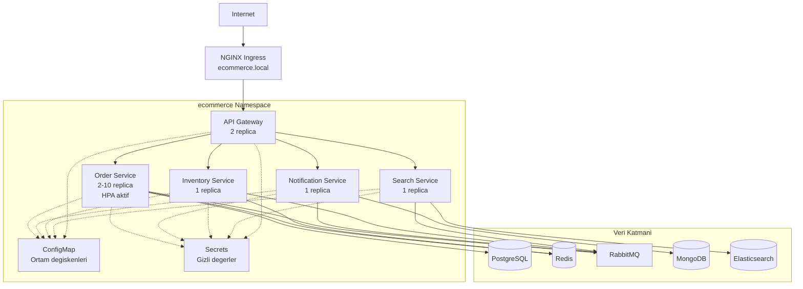
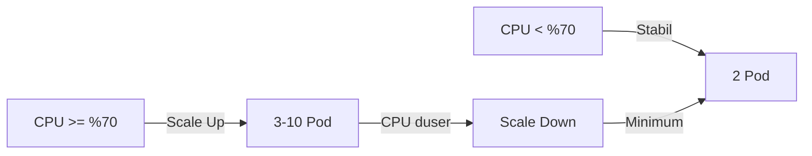
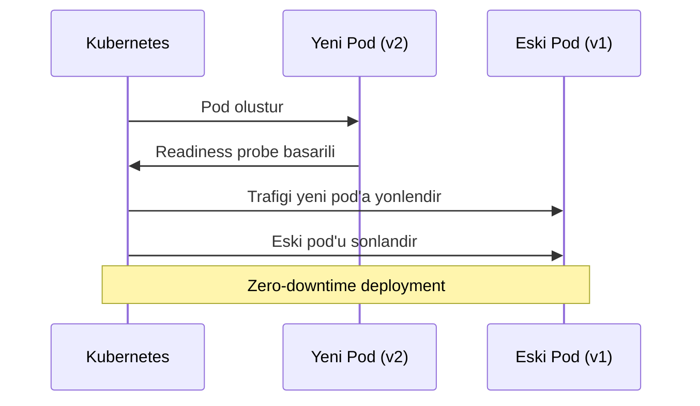

# Kubernetes Deployment

Bu rehber, event-driven e-ticaret projesinin Kubernetes (K8s) ortamina Helm chart kullanilarak nasil dagitilacagini aciklar.

## Mimari Genel Bakis



## Helm Chart Yapisi

Helm chart dosyalari `infrastructure/k8s/helm/ecommerce/` dizininde bulunmaktadir:

```
ecommerce/
├── Chart.yaml          # Chart meta verisi (ad, surum, aciklama)
├── values.yaml         # Varsayilan yapilandirma degerleri
└── templates/
    ├── _helpers.tpl    # Template yardimci fonksiyonlari
    ├── configmap.yaml  # Ortam degiskenleri
    ├── secrets.yaml    # Gizli degerler (base64)
    ├── deployment.yaml # Deployment ve Service tanimlari
    ├── hpa.yaml        # HorizontalPodAutoscaler
    └── ingress.yaml    # Ingress yapilandirmasi
```

## Dagitim Komutlari

<Steps>
  <Step title="Namespace Olusturun">
    Servislerin calisacagi Kubernetes namespace'ini (isim alani) olusturun:

    ```bash
    kubectl create namespace ecommerce-dev
    ```
  </Step>

  <Step title="Helm Chart'i Yukleyin">
    Ilk dagitim icin `helm install` komutunu kullanin:

    ```bash
    helm install ecommerce ./infrastructure/k8s/helm/ecommerce \
      --namespace ecommerce-dev \
      --create-namespace
    ```

    <Tip>
      `--create-namespace` bayragi, namespace yoksa otomatik olarak olusturur. Ayri bir `kubectl create namespace` adimina gerek kalmaz.
    </Tip>
  </Step>

  <Step title="Dagitimi Dogrulayin">
    Tum pod'larin calisir durumda oldugunu kontrol edin:

    ```bash
    # Pod durumlarini kontrol et
    kubectl get pods -n ecommerce-dev

    # Deployment durumlarini kontrol et
    kubectl get deployments -n ecommerce-dev

    # Servisleri listele
    kubectl get svc -n ecommerce-dev
    ```
  </Step>

  <Step title="Guncelleme (Upgrade)">
    Yapilandirma veya imaj degisikliklerinde `helm upgrade` kullanin:

    ```bash
    helm upgrade ecommerce ./infrastructure/k8s/helm/ecommerce \
      --namespace ecommerce-dev \
      --set global.imageTag=v1.2.0
    ```
  </Step>
</Steps>

## Yapilandirma Degerleri

### Varsayilan Degerler (values.yaml)

```yaml infrastructure/k8s/helm/ecommerce/values.yaml
global:
  imageRegistry: ecommerce
  imageTag: latest
  namespace: ecommerce-dev

services:
  apiGateway:
    replicas: 2
    port: 3000
    resources:
      requests: { cpu: 100m, memory: 128Mi }
      limits: { cpu: 500m, memory: 256Mi }

  orderService:
    replicas: 2
    port: 3001
    hpa:
      enabled: true
      minReplicas: 2
      maxReplicas: 10
      cpuUtilization: 70
    resources:
      requests: { cpu: 100m, memory: 128Mi }
      limits: { cpu: 500m, memory: 256Mi }

  notificationService:
    replicas: 1
    port: 3002
    resources:
      requests: { cpu: 50m, memory: 128Mi }
      limits: { cpu: 250m, memory: 256Mi }

  inventoryService:
    replicas: 1
    port: 3003
    resources:
      requests: { cpu: 50m, memory: 128Mi }
      limits: { cpu: 250m, memory: 256Mi }

  searchService:
    replicas: 1
    port: 3004
    resources:
      requests: { cpu: 50m, memory: 128Mi }
      limits: { cpu: 250m, memory: 256Mi }

ingress:
  enabled: true
  host: ecommerce.local
  className: nginx
```

### Degerleri Override Etme

<CodeGroup>
```bash Komut Satiri ile
helm upgrade ecommerce ./infrastructure/k8s/helm/ecommerce \
  --namespace ecommerce-dev \
  --set services.orderService.replicas=4 \
  --set global.imageTag=abc123
```

```bash Dosya ile
helm upgrade ecommerce ./infrastructure/k8s/helm/ecommerce \
  --namespace ecommerce-dev \
  -f custom-values.yaml
```

```yaml custom-values.yaml
global:
  imageRegistry: ghcr.io/kullanici/event-driven-project
  imageTag: v2.0.0
  namespace: ecommerce-prod

services:
  orderService:
    replicas: 4
    hpa:
      maxReplicas: 20
```
</CodeGroup>

## HPA (Horizontal Pod Autoscaler)

HPA, CPU kullanimi (utilization) esik degerine gore pod sayisini otomatik olarak artirip azaltir. Projede yalnizca order-service icin aktif edilmistir.

```yaml infrastructure/k8s/helm/ecommerce/templates/hpa.yaml
{{- if .Values.services.orderService.hpa.enabled }}
apiVersion: autoscaling/v2
kind: HorizontalPodAutoscaler
metadata:
  name: order-service-hpa
  namespace: {{ .Values.global.namespace }}
spec:
  scaleTargetRef:
    apiVersion: apps/v1
    kind: Deployment
    name: order-service
  minReplicas: {{ .Values.services.orderService.hpa.minReplicas }}
  maxReplicas: {{ .Values.services.orderService.hpa.maxReplicas }}
  metrics:
    - type: Resource
      resource:
        name: cpu
        target:
          type: Utilization
          averageUtilization: {{ .Values.services.orderService.hpa.cpuUtilization }}
{{- end }}
```

### HPA Davranisi

| Parametre | Deger | Aciklama |
|-----------|-------|----------|
| `minReplicas` | 2 | Minimum pod sayisi |
| `maxReplicas` | 10 | Maksimum pod sayisi |
| `cpuUtilization` | %70 | Olcekleme esik degeri |



### HPA Durumunu Izleme

```bash
# HPA durumunu kontrol et
kubectl get hpa -n ecommerce-dev

# Detayli bilgi
kubectl describe hpa order-service-hpa -n ecommerce-dev
```

## Ingress Yapilandirmasi

NGINX Ingress Controller (giris denetleyicisi) ile dis erisim saglanir:

```yaml infrastructure/k8s/helm/ecommerce/templates/ingress.yaml
apiVersion: networking.k8s.io/v1
kind: Ingress
metadata:
  name: ecommerce-ingress
  namespace: {{ .Values.global.namespace }}
  annotations:
    nginx.ingress.kubernetes.io/rewrite-target: /
spec:
  ingressClassName: {{ .Values.ingress.className }}
  rules:
    - host: {{ .Values.ingress.host }}
      http:
        paths:
          - path: /
            pathType: Prefix
            backend:
              service:
                name: api-gateway
                port:
                  number: {{ .Values.services.apiGateway.port }}
```

### Yerel Ortamda Ingress Testi

Yerel gelistirme icin `/etc/hosts` dosyasina asagidaki satiri ekleyin:

```bash
# /etc/hosts
127.0.0.1 ecommerce.local
```

Ardindan NGINX Ingress Controller'in kurulu oldugundan emin olun:

```bash
# NGINX Ingress Controller kur
kubectl apply -f https://raw.githubusercontent.com/kubernetes/ingress-nginx/controller-v1.10.0/deploy/static/provider/cloud/deploy.yaml

# Dogrula
kubectl get pods -n ingress-nginx
```

## Rolling Update Stratejisi

Deployment template'i varsayilan olarak RollingUpdate (kademeli guncelleme) stratejisi kullanir. Bu strateji ile:

- Yeni pod'lar baslatilir ve readiness probe (hazirlik sondasi) gecene kadar beklenir
- Eski pod'lar kademeli olarak sonlandirilir
- Herhangi bir anda en az bir pod istek kabul etmeye devam eder



### Probe Yapilandirmasi

Her servis icin liveness (yasam) ve readiness (hazirlik) probe'lari tanimlanmistir:

```yaml
livenessProbe:
  httpGet:
    path: /health
    port: {{ $svc.port }}
  initialDelaySeconds: 15    # Ilk kontrol oncesi bekleme
  periodSeconds: 15           # Kontrol araligi

readinessProbe:
  httpGet:
    path: /health
    port: {{ $svc.port }}
  initialDelaySeconds: 5     # Ilk kontrol oncesi bekleme
  periodSeconds: 5            # Kontrol araligi
```

| Probe | Amac | Basarisiz Olursa |
|-------|------|------------------|
| `livenessProbe` | Pod'un canli olup olmadigini kontrol eder | Pod yeniden baslatilir |
| `readinessProbe` | Pod'un trafik almaya hazir olup olmadigini kontrol eder | Trafik yonlendirilmez |

## Kubernetes'te Izleme

### Pod Loglarini Izleme

```bash
# Belirli bir pod'un loglarini izle
kubectl logs -f deployment/order-service -n ecommerce-dev

# Tum pod'larin loglarini izle
kubectl logs -f -l app=order-service -n ecommerce-dev --all-containers
```

### Kaynak Kullanimi

```bash
# Pod kaynak kullanimi
kubectl top pods -n ecommerce-dev

# Node kaynak kullanimi
kubectl top nodes
```

### Sorun Giderme

<CodeGroup>
```bash Pod Durumlarini Kontrol Et
kubectl get pods -n ecommerce-dev -o wide
```

```bash Basarisiz Pod Detaylari
kubectl describe pod <pod-adi> -n ecommerce-dev
```

```bash Onceki Pod Loglari
kubectl logs <pod-adi> -n ecommerce-dev --previous
```

```bash Pod'a Baglan
kubectl exec -it <pod-adi> -n ecommerce-dev -- sh
```
</CodeGroup>

## Namespace Yonetimi

Farkli ortamlar icin ayri namespace'ler kullanin:

```bash
# Gelistirme ortami
helm install ecommerce-dev ./infrastructure/k8s/helm/ecommerce \
  --namespace ecommerce-dev --create-namespace \
  --set global.namespace=ecommerce-dev

# Staging ortami
helm install ecommerce-staging ./infrastructure/k8s/helm/ecommerce \
  --namespace ecommerce-staging --create-namespace \
  --set global.namespace=ecommerce-staging \
  --set global.imageTag=rc-v1.0.0

# Uretim ortami
helm install ecommerce-prod ./infrastructure/k8s/helm/ecommerce \
  --namespace ecommerce-prod --create-namespace \
  --set global.namespace=ecommerce-prod \
  --set global.imageTag=v1.0.0 \
  --set services.orderService.hpa.maxReplicas=20
```

## Temizlik

```bash
# Helm release'i kaldir
helm uninstall ecommerce -n ecommerce-dev

# Namespace'i sil (tum kaynaklari dahil)
kubectl delete namespace ecommerce-dev
```

<Warning>
  `kubectl delete namespace` komutu o namespace icindeki **tum** kaynaklari kalici olarak siler. Uretim ortaminda bu komutu calistirmadan once iki kez dusunun.
</Warning>
