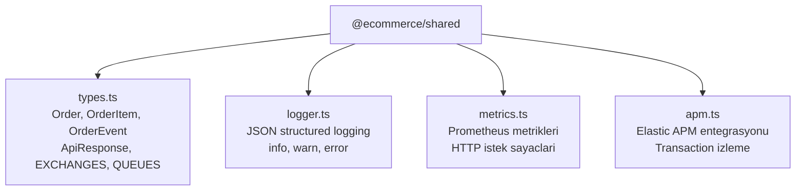
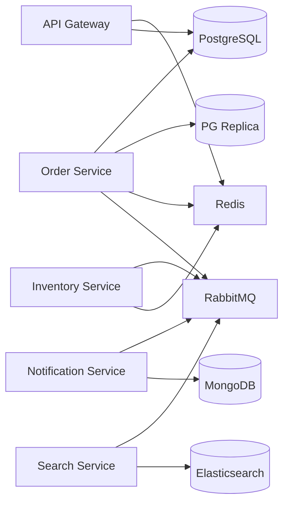

# Proje Yapisi

Bu proje **Bun workspaces** (calisma alanlari) ile yonetilen bir monorepo (tek depo) mimarisine sahiptir. Tum mikro servisler ve paylasilan paketler ayni depoda bulunur.

## Dizin Agaci

```
event-driven-project/
├── package.json                          # Root workspace tanimi
├── bun.lock                              # Bun kilit dosyasi
├── docker-compose.yml                    # Tum servis ve altyapi tanimlari
├── tests/
│   └── e2e.ts                            # Uctan uca test dosyasi (17 test)
├── packages/
│   └── shared/
│       ├── package.json
│       └── src/
│           ├── types.ts                  # Ortak tip tanimlari (Order, Event, vb.)
│           ├── logger.ts                 # JSON formatli gunluk kaydedici
│           ├── metrics.ts                # Prometheus metrik yardimcilari
│           ├── apm.ts                    # Elastic APM entegrasyonu
│           └── __tests__/
│               └── logger.test.ts        # Logger birim testleri (3 test)
├── services/
│   ├── api-gateway/
│   │   ├── Dockerfile
│   │   ├── package.json
│   │   └── src/
│   │       ├── index.ts                  # Uygulama giris noktasi
│   │       ├── auth.ts                   # Better Auth yapilandirmasi
│   │       ├── routes.ts                 # Rota tanimlari
│   │       ├── proxy.ts                  # Servis proxy mantigi
│   │       ├── openapi.ts                # Swagger/OpenAPI dokumantasyonu
│   │       ├── middleware/
│   │       │   └── circuit-breaker.ts    # Devre kesici mekanizmasi
│   │       └── __tests__/
│   │           └── circuit-breaker.test.ts  # Circuit breaker testleri (5 test)
│   ├── order-service/
│   │   ├── Dockerfile
│   │   ├── package.json
│   │   └── src/
│   │       ├── index.ts                  # Uygulama giris noktasi
│   │       ├── routes.ts                 # CRUD siparis rotalari
│   │       ├── store.ts                  # Veri erisim katmani
│   │       ├── cache.ts                  # Redis onbellek mantigi
│   │       ├── validation.ts             # Zod dogrulama semalari
│   │       ├── db/
│   │       │   └── schema.ts             # Drizzle ORM sema tanimi
│   │       ├── saga/
│   │       │   └── order-saga.ts         # Saga pattern uygulamasi
│   │       ├── events/
│   │       │   └── publisher.ts          # RabbitMQ event yayinci
│   │       ├── middleware/
│   │       │   └── ...                   # Servis middleware'leri
│   │       └── __tests__/
│   │           └── validation.test.ts    # Validation testleri (10 test)
│   ├── notification-service/
│   │   ├── Dockerfile
│   │   ├── package.json
│   │   └── src/
│   │       ├── index.ts                  # Uygulama giris noktasi
│   │       ├── routes.ts                 # Bildirim sorgulama rotalari
│   │       ├── consumer.ts               # RabbitMQ event tuketicisi
│   │       └── db.ts                     # MongoDB baglanti ve islemler
│   ├── inventory-service/
│   │   ├── Dockerfile
│   │   ├── package.json
│   │   └── src/
│   │       ├── index.ts                  # Uygulama giris noktasi
│   │       ├── routes.ts                 # Stok yonetimi rotalari
│   │       └── db.ts                     # Redis veri islemleri
│   └── search-service/
│       ├── Dockerfile
│       ├── package.json
│       └── src/
│           ├── index.ts                  # Uygulama giris noktasi
│           ├── routes.ts                 # Arama rotalari
│           ├── elastic.ts                # Elasticsearch istemci islemleri
│           └── consumer.ts               # RabbitMQ event tuketicisi
├── infrastructure/
│   ├── docker/
│   │   ├── postgres/
│   │   │   ├── init-replication.sh       # Primary replication baslangic betigi
│   │   │   └── start-replica.sh          # Replica baslangic betigi
│   │   ├── prometheus/
│   │   │   └── prometheus.yml            # Prometheus yapilandirmasi
│   │   └── grafana/
│   │       ├── provisioning/             # Veri kaynaklari ve pano tanimlari
│   │       └── dashboards/               # JSON pano dosyalari
│   ├── k8s/
│   │   └── helm/
│   │       └── ecommerce/
│   │           ├── Chart.yaml            # Helm chart meta verisi
│   │           ├── values.yaml           # Varsayilan yapilandirma degerleri
│   │           └── templates/
│   │               ├── _helpers.tpl       # Template yardimci fonksiyonlari
│   │               ├── configmap.yaml     # Ortam degiskenleri
│   │               ├── secrets.yaml       # Gizli degerler
│   │               ├── deployment.yaml    # Deployment ve Service tanimlari
│   │               ├── hpa.yaml           # Otomatik olcekleme
│   │               └── ingress.yaml       # Dis erisim yapilandirmasi
│   └── terraform/
│       ├── main.tf                       # Terraform ana yapilandirmasi
│       ├── variables.tf                  # Degisken tanimlari
│       ├── outputs.tf                    # Cikti tanimlari
│       └── modules/
│           ├── network/                  # Docker ag modulu
│           └── services/                 # Servis container modulleri
└── .github/
    └── workflows/
        └── ci.yml                        # CI/CD pipeline tanimi
```

## Monorepo Yapilandirmasi

Root (kok) `package.json` dosyasi workspace'leri (calisma alanlarini) tanimlar:

```json package.json
{
  "name": "event-driven-project",
  "private": true,
  "scripts": {
    "test": "bun test --recursive",
    "test:unit": "bun test --recursive services/*/src/__tests__ packages/*/src/__tests__",
    "test:e2e": "bun run tests/e2e.ts"
  },
  "workspaces": [
    "services/*",
    "packages/*"
  ]
}
```

Bu yapilandirma sayesinde:

- `bun install` komutu tum workspace bagimliliklerini tek seferde yukler
- `workspace:*` protokolu ile paketler arasi referans saglanir
- `bun test --recursive` tum workspace'lerdeki testleri calistirir

## Paket Organizasyonu

### Paylasilan Paket: `@ecommerce/shared`

Tum servislerin ortak kullandigi modulleri icerir:



Servislerde kullanim ornegi:

```typescript
import { logger, type Order, EXCHANGES, ROUTING_KEYS } from "@ecommerce/shared";
```

### Servis Bagimlilik Haritasi

Her servis farkli altyapi bilesenlerine bagimlidir:



## Dosya Isimlendirme Kurallari

| Dosya Turu | Kural | Ornek |
|------------|-------|-------|
| Kaynak dosyalari | kebab-case (kucuk harf, tire ile) | `circuit-breaker.ts`, `order-saga.ts` |
| Test dosyalari | `*.test.ts` son eki | `validation.test.ts` |
| Sema dosyalari | `schema.ts` | `db/schema.ts` |
| Giris noktasi | `index.ts` | `src/index.ts` |
| Rota tanimlari | `routes.ts` | `src/routes.ts` |
| Veritabani islemleri | `db.ts` veya `store.ts` | `src/db.ts`, `src/store.ts` |
| Tuketiciler | `consumer.ts` | `src/consumer.ts` |
| Docker tanimlari | `Dockerfile` | `services/order-service/Dockerfile` |
| Helm template'leri | `*.yaml` | `templates/deployment.yaml` |

## Anahtar Dizinler

<CardGroup cols={2}>
  <Card title="packages/shared/src/" icon="share-nodes">
    Tum servislerin ortaklasa kullandigi tip tanimlari, logger, metrik ve APM modulleri. `@ecommerce/shared` olarak referans edilir.
  </Card>
  <Card title="services/*/src/" icon="microchip">
    Her mikro servisin kaynak kodu. Her serviste `index.ts` giris noktasi, `routes.ts` rota tanimlari ve servise ozel moduller bulunur.
  </Card>
  <Card title="infrastructure/docker/" icon="docker">
    Docker ile ilgili yapilandirma dosyalari. PostgreSQL replication betikleri, Prometheus yapilandirmasi ve Grafana panolari.
  </Card>
  <Card title="infrastructure/k8s/" icon="dharmachakra">
    Kubernetes deployment tanimlari. Helm chart ile tum servislerin K8s ortamina dagitimi yapilir.
  </Card>
  <Card title="infrastructure/terraform/" icon="cloud">
    Terraform ile altyapi olarak kod (Infrastructure as Code) tanimlari. Docker provider ile yerel container yonetimi.
  </Card>
  <Card title=".github/workflows/" icon="github">
    GitHub Actions CI/CD pipeline tanimlari. Test, build, push ve deploy adimlari.
  </Card>
</CardGroup>

## Teknoloji Yigini Ozeti

| Katman | Teknoloji | Aciklama |
|--------|-----------|----------|
| Runtime | Bun | JavaScript/TypeScript calisma zamani |
| Framework | Hono | Hafif ve hizli web framework'u |
| ORM | Drizzle ORM | TypeScript-first PostgreSQL ORM |
| Kimlik Dogrulama | Better Auth | E-posta/sifre + GitHub + Google OAuth |
| Mesaj Kuyrugu | RabbitMQ | Topic exchange, DLQ (Dead Letter Queue) ile 3 yeniden deneme |
| Onbellek | Redis (ioredis) | Siparis cache ve stok verisi |
| Belge Veritabani | MongoDB | Bildirim kayitlari |
| Arama | Elasticsearch | Tam metin arama |
| Izleme | Prometheus + Grafana | Metrik toplama ve gorsellestirme |
| APM | Elastic APM | Uygulama performans izleme |
| Container | Docker + Docker Compose | Konteyner yonetimi |
| Orkestrasyon | Kubernetes + Helm | Uretim ortami dagitimi |
| IaC | Terraform | Altyapi olarak kod |
| CI/CD | GitHub Actions | Surekli entegrasyon ve dagitim |
