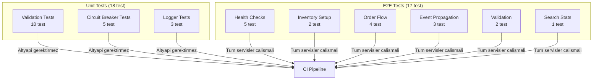
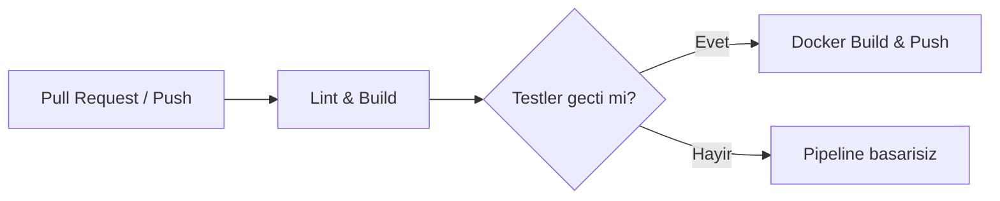

# Test Stratejisi

Proje iki katmanli bir test stratejisi kullanmaktadir: unit tests (birim testler) ve E2E tests (uctan uca testler). Tum testler **bun:test** test framework'u (test cercevesi) ile yazilmistir.

## Test Katmanlari



## Test Komutlari

<CodeGroup>
```bash Tum Testleri Calistir
bun test --recursive
```

```bash Yalnizca Unit Testler
bun run test:unit
```

```bash Yalnizca E2E Testler
bun run test:e2e
```

```bash Belirli Bir Servisin Testleri
bun test services/order-service/src/__tests__/
```

```bash Tek Bir Test Dosyasi
bun test services/order-service/src/__tests__/validation.test.ts
```
</CodeGroup>

## Unit Tests (Birim Testler)

Unit testler herhangi bir dis bagimliligi (veritabani, mesaj kuyrugu vb.) gerektirmeden calisir. Toplamda **3 test dosyasinda 18 test** bulunmaktadir.

### 1. Validation Tests (Dogrulama Testleri)

**Dosya:** `services/order-service/src/__tests__/validation.test.ts`
**Test Sayisi:** 10

Siparis olusturma ve guncelleme isteklerinin Zod semasi ile dogrulanmasini test eder.

<Tabs>
  <Tab title="createOrderSchema (6 test)">
    | Test | Aciklama |
    |------|----------|
    | Gecerli girdi kabul edilir | Tam ve dogru siparis verisi |
    | Bos musteri adi reddedilir | `customerName: ""` |
    | Gecersiz e-posta reddedilir | `customerEmail: "not-an-email"` |
    | Bos urun listesi reddedilir | `items: []` |
    | Negatif miktar reddedilir | `quantity: -1` |
    | Sifir fiyat reddedilir | `price: 0` |
  </Tab>

  <Tab title="updateOrderSchema (4 test)">
    | Test | Aciklama |
    |------|----------|
    | Gecerli durum guncellemesi kabul edilir | `status: "confirmed"` |
    | Kismi guncelleme kabul edilir | Yalnizca `customerName` |
    | Gecersiz durum reddedilir | `status: "invalid"` |
    | Bos nesne kabul edilir | `{}` (hicbir alan guncellenmez) |
  </Tab>
</Tabs>

### 2. Circuit Breaker Tests (Devre Kesici Testleri)

**Dosya:** `services/api-gateway/src/__tests__/circuit-breaker.test.ts`
**Test Sayisi:** 5

API Gateway'deki circuit breaker (devre kesici) mekanizmasini test eder. 5 ardisik hatada devre acilir, 30 saniye sonra half-open (yari acik) duruma gecer.

| Test | Aciklama |
|------|----------|
| Baslangic durumu `closed` (kapali) | Yeni olusturulan breaker kapali olmali |
| Basarili cagri sonrasi `closed` kalir | Basarili islemde durum degismez |
| 5 hatadan sonra `open` (acik) duruma gecer | Esik degeri (threshold) asildiginda devre acilir |
| Acik durumdayken cagrilar reddedilir | `OPEN` hatasi firlatilir |
| Basarili cagri ile `closed` durumuna doner | Half-open durumda basarili cagri devreyi kapatir |

### 3. Logger Tests (Gunluk Kaydi Testleri)

**Dosya:** `packages/shared/src/__tests__/logger.test.ts`
**Test Sayisi:** 3

Paylasilan logger (gunluk kaydedici) modulunun JSON formatinda dogru cikti urettigini dogrular.

| Test | Aciklama |
|------|----------|
| `info` dogru alanlari icerir | `level`, `message`, `timestamp` ve ek alanlar |
| `error` stderr'e yazar | `console.error` cagrilir |
| `warn` console.warn kullanir | `console.warn` cagrilir |

## E2E Tests (Uctan Uca Testler)

E2E testler **tum servislerin calisir durumda** olmasini gerektirir. Toplamda **17 test** icermektedir. Test dosyasi: `tests/e2e.ts`

<Warning>
  E2E testleri calistirmadan once `docker compose up -d` ile tum altyapi ve uygulama servislerinin calisir durumda oldugunu dogrulayin.
</Warning>

### Test Kategorileri

<Tabs>
  <Tab title="Health Checks (5 test)">
    Tum servislerin `/health` endpoint'ine istek gonderir ve `200 OK` yaniti ile `status: "ok"` degerini dogrular.

    - Order Service (`:3001/health`)
    - Notification Service (`:3002/health`)
    - Inventory Service (`:3003/health`)
    - Search Service (`:3004/health`)
    - API Gateway (`:3000/health`)
  </Tab>

  <Tab title="Inventory Setup (2 test)">
    Test senaryolari icin envanter verisi hazirlar.

    - **Urun stok olusturma:** `POST /products` ile test urunu olusturur (`stock: 50`, `price: 1299.99`)
    - **Urun dogrulama:** `GET /products/e2e-p1` ile urunun var oldugunu ve stok miktarini dogrular
  </Tab>

  <Tab title="Order Flow (4 test)">
    Tam siparis yasam dongusu:

    1. **Siparis olustur:** `POST /orders` -- yeni siparis, `status: "pending"`, `totalAmount: 2599.98`
    2. **Siparis getir:** `GET /orders/:id` -- olusturulan siparisi ID ile sorgula
    3. **Siparis listele:** `GET /orders` -- siparis listesinde yeni siparisi dogrula
    4. **Durum guncelle:** `PATCH /orders/:id` -- durumu `confirmed` olarak guncelle
  </Tab>

  <Tab title="Event Propagation (3 test)">
    RabbitMQ uzerinden event-driven (olay gudumlü) iletisimi test eder. Siparis olusturulduktan 2 saniye sonra:

    - **Bildirim kontrolu:** `GET /notifications/:orderId` -- en az 1 bildirim olusturuldugunu dogrular
    - **Stok azalmasi:** `GET /products/e2e-p1` -- stok 50'den 48'e dustugunu dogrular (2 adet siparis)
    - **Arama indeksleme:** `GET /search?q=E2E` -- siparisis Elasticsearch'te indekslendigini dogrular

    <Note>
      Event propagation (olay yayilimi) testleri 2 saniyelik bir bekleme suresi icerir. Bu sure, RabbitMQ consumer'larinin (tuketiciler) mesajlari islemesi icin gereklidir.
    </Note>
  </Tab>

  <Tab title="Validation (2 test)">
    Gecersiz isteklerin dogru sekilde reddedildigini test eder:

    - **Gecersiz siparis:** Bos musteri adi, gecersiz e-posta, bos urun listesi -- `400 Bad Request`
    - **Olmayan siparis:** Gecersiz UUID ile sorgu -- `404 Not Found`
  </Tab>

  <Tab title="Search Stats (1 test)">
    Elasticsearch aggregation (toplama) sonuclarini dogrular:

    - **Arama istatistikleri:** `GET /search/stats` -- basarili yanit ve aggregation verisi
  </Tab>
</Tabs>

### E2E Test Ciktisi Ornegi

```
=== Health Checks ===
  ✓ order-service is healthy
  ✓ notification-service is healthy
  ✓ inventory-service is healthy
  ✓ search-service is healthy
  ✓ api-gateway is healthy

=== Inventory Setup ===
  ✓ create product stock
  ✓ verify product exists

=== Order Flow (Direct) ===
  ✓ create order
  ✓ get order by id
  ✓ list orders includes new order
  ✓ update order status

=== Event Propagation (wait 2s for consumers) ===
  ✓ notification was created for order
  ✓ stock was decreased
  ✓ order is searchable in ElasticSearch

=== Validation ===
  ✓ rejects invalid order (missing items)
  ✓ returns 404 for non-existent order

=== Search Stats ===
  ✓ search stats return aggregations

========================================
Results: 17 passed, 0 failed
========================================
```

## CI Pipeline'da Testler

CI/CD pipeline'inda (surekli entegrasyon hattinda) testler otomatik olarak calisir:



<Tip>
  Unit testler her pull request ve push isleminde calisir. E2E testleri yerel ortaminizda `bun run test:e2e` komutu ile calismalisiniz, cunku tam altyapi gerektirir.
</Tip>

## Test Yazma Kurallari

Yeni test yazarken asagidaki kurallara uyun:

1. **Test dosya konumu:** `services/<servis-adi>/src/__tests__/` veya `packages/<paket-adi>/src/__tests__/`
2. **Dosya isimlendirme:** `*.test.ts` uzantisi kullanin
3. **Import:** `import { describe, test, expect } from "bun:test"` kullanin
4. **Gruplama:** Ilgili testleri `describe` bloklari icerisinde gruplayin
5. **Bagimsizlik:** Her test diger testlerden bagimsiz calisabilmeli
