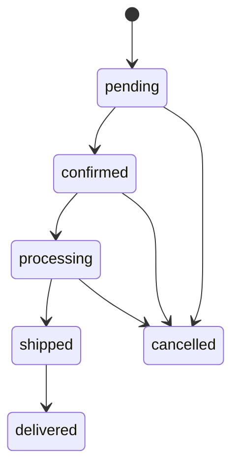
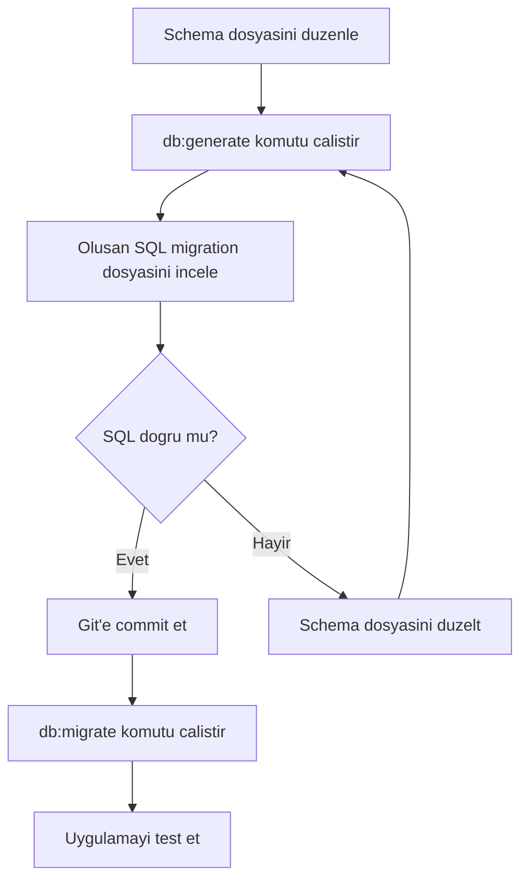
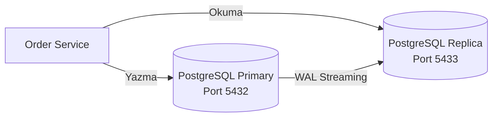

# Veritabani Migration Yonetimi

Bu proje veritabani islemleri icin **Drizzle ORM** kullanmaktadir. Drizzle ORM, TypeScript-first (TypeScript oncelikli) bir ORM olup tip-guvenli sorgular ve schema-first (sema oncelikli) migration destegi saglar.

## Sema Tanimi

Order Service'in (siparis servisi) veritabani semasi `services/order-service/src/db/schema.ts` dosyasinda tanimlanmistir:

```typescript services/order-service/src/db/schema.ts
import { pgTable, uuid, varchar, numeric, jsonb, timestamp } from "drizzle-orm/pg-core";

export const orders = pgTable("orders", {
  id: uuid("id").primaryKey().defaultRandom(),
  customerName: varchar("customer_name", { length: 255 }).notNull(),
  customerEmail: varchar("customer_email", { length: 255 }).notNull(),
  items: jsonb("items").notNull().$type<
    { productId: string; name: string; quantity: number; price: number }[]
  >(),
  totalAmount: numeric("total_amount", { precision: 12, scale: 2 }).notNull(),
  status: varchar("status", { length: 50 }).notNull().default("pending"),
  createdAt: timestamp("created_at", { withTimezone: true }).notNull().defaultNow(),
  updatedAt: timestamp("updated_at", { withTimezone: true }).notNull().defaultNow(),
});
```

### Sema Alanlari Aciklamasi

| Alan | Tip | Aciklama |
|------|-----|----------|
| `id` | UUID | Otomatik olusturulan benzersiz kimlik |
| `customerName` | VARCHAR(255) | Musteri adi |
| `customerEmail` | VARCHAR(255) | Musteri e-posta adresi |
| `items` | JSONB | Siparis kalemleri (urun listesi) |
| `totalAmount` | NUMERIC(12,2) | Toplam tutar (12 basamak, 2 ondalik) |
| `status` | VARCHAR(50) | Siparis durumu, varsayilan: `pending` |
| `createdAt` | TIMESTAMP WITH TZ | Olusturulma tarihi (timezone / saat dilimi dahil) |
| `updatedAt` | TIMESTAMP WITH TZ | Guncellenme tarihi (timezone / saat dilimi dahil) |

### Siparis Durumlari

Bir sipariste gecerli durum gecisleri sunlardir:



Gecerli durum degerleri: `pending`, `confirmed`, `processing`, `shipped`, `delivered`, `cancelled`

## Migration Komutlari

Drizzle Kit ile migration islemleri order-service dizininde yapilir.

<Steps>
  <Step title="Migration Dosyasi Olusturun">
    Sema degisikliklerinden sonra migration (goc) dosyasi uretmek icin:

    ```bash
    cd services/order-service
    bun run db:generate
    ```

    Bu komut `drizzle/` klasorunde SQL migration dosyalari olusturur. Olusan dosyalar surum kontrolune (Git) eklenmeli ve incelenmelidir.
  </Step>

  <Step title="Migration'lari Uygulayinca">
    Olusan migration dosyalarini veritabanina uygulamak icin:

    ```bash
    cd services/order-service
    bun run db:migrate
    ```

    Bu komut henuz uygulanmamis tum migration'lari sirasiyla calistirir.
  </Step>

  <Step title="Dogrudan Sema Yansitma (Gelistirme Ortami)">
    Gelistirme ortaminda migration dosyasi olusturmadan semayi dogrudan veritabanina yansitmak icin `push` komutu kullanilabilir:

    ```bash
    cd services/order-service
    bunx drizzle-kit push
    ```

    <Warning>
      `push` komutu yalnizca gelistirme ortami icindir. Uretim ortaminda **her zaman** `generate` + `migrate` adimlari kullanilmalidir. `push` komutu mevcut verileri kaybetmenize neden olabilir.
    </Warning>
  </Step>
</Steps>

## Drizzle Studio

Drizzle Studio, veritabani icerigini gorsel olarak incelemenizi saglayan bir web arayuzudur:

```bash
cd services/order-service
bun run db:studio
```

Bu komut `https://local.drizzle.studio` adresinde bir arayuz acar. Bu arayuzde sunlari yapabilirsiniz:

- Tablo iceriklerini goruntuleyebilirsiniz
- Kayitlari filtreleyip siralayabilirsiniz
- Dogrudan SQL sorgulari calistirabilirsiniz
- Veri ekleyip duzenleyebilirsiniz

<Tip>
  Drizzle Studio, ozellikle hata ayiklama (debugging) sirasinda veritabanindaki verileri hizlica kontrol etmek icin oldukca faydalidir.
</Tip>

## Sema Degisikligi Is Akisi

Veritabani semasinda bir degisiklik yapmaniz gerektiginde asagidaki is akisini izleyin:



### Adim Adim Ornek: Yeni Alan Ekleme

Siparis tablosuna bir `notes` (notlar) alani eklemek istediginizi varsayalim:

<Steps>
  <Step title="Sema Dosyasini Duzenleyin">
    ```typescript services/order-service/src/db/schema.ts
    export const orders = pgTable("orders", {
      // ... mevcut alanlar
      notes: varchar("notes", { length: 1000 }), // yeni alan, opsiyonel
    });
    ```
  </Step>

  <Step title="Migration Dosyasi Olusturun">
    ```bash
    cd services/order-service
    bun run db:generate
    ```

    Cikti:
    ```
    [✓] Your SQL migration file ➜ drizzle/0001_add_notes_column.sql
    ```
  </Step>

  <Step title="Olusan SQL'i Inceleyin">
    ```sql drizzle/0001_add_notes_column.sql
    ALTER TABLE "orders" ADD COLUMN "notes" varchar(1000);
    ```
  </Step>

  <Step title="Migration'i Uygulayinca">
    ```bash
    bun run db:migrate
    ```
  </Step>

  <Step title="Degisikligi Commit Edin">
    ```bash
    git add services/order-service/src/db/schema.ts drizzle/
    git commit -m "feat: add notes column to orders table"
    ```
  </Step>
</Steps>

## Read/Write Splitting ile Calismak

Order Service, PostgreSQL streaming replication (akim tabanlı coglama) yapisini kullanmaktadir. Yapilandirma:

- **Primary (ana sunucu):** `DATABASE_URL` -- Tum yazma islemleri (`INSERT`, `UPDATE`, `DELETE`)
- **Replica (kopya sunucu):** `DATABASE_REPLICA_URL` -- Okuma islemleri (`SELECT`)



<Note>
  Migration'lar yalnizca primary sunucuya (`DATABASE_URL`) uygulanir. Replica sunucu WAL (Write-Ahead Log) streaming replication ile otomatik olarak guncellenir.
</Note>

## Diger Veritabanlari

| Servis | Veritabani | Aciklama |
|--------|-----------|----------|
| Order Service | PostgreSQL + Drizzle ORM | Iliskisel veri, migration destegi |
| Notification Service | MongoDB | Bildirim kayitlari, sema-siz (schemaless) yapi |
| Inventory Service | Redis | Anahtar-deger (key-value) stok verisi |
| Search Service | Elasticsearch | Tam metin arama (full-text search) indeksleri |

MongoDB ve Redis sema-siz yapilar oldugundan bu servisler icin migration sureci gerekmez. Elasticsearch indeks eslestirmeleri (mappings) uygulama baslatildiginda otomatik olarak olusturulur.
