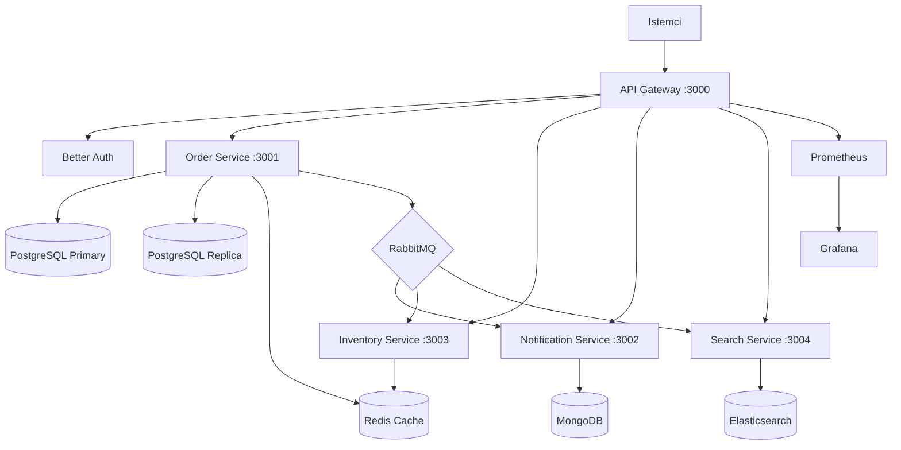

# Event-Driven E-Commerce Platform

Bu proje, modern mikroservis mimarisi ile olusturulmus kapsamli bir e-ticaret platformudur. Event-Driven Architecture (Olaya Dayali Mimari) prensiplerini benimseyerek, gevrek baglanmis (loosely coupled) ve yuksek olceklenebilir (highly scalable) bir sistem tasarlanmistir.

<CardGroup cols={2}>
  <Card title="5 Mikroservis" icon="cubes">
    API Gateway, Order, Notification, Inventory ve Search servisleri
  </Card>
  <Card title="Event-Driven" icon="bolt">
    RabbitMQ topic exchange ile asenkron mesajlasma
  </Card>
  <Card title="Saga Pattern" icon="arrows-spin">
    Dagitik islem yonetimi: stok kontrol, rezervasyon, odeme
  </Card>
  <Card title="Full Observability" icon="chart-line">
    Prometheus, Grafana, APM ve yapilandirilmis loglama
  </Card>
</CardGroup>

## Sistem Mimarisi

## Temel Ozellikler

- **Mikroservis Mimarisi**: Her servis bagimsiz veritabani ve deploy sureci
- **Event-Driven Communication**: RabbitMQ topic exchange ile asenkron iletisim
- **Saga Pattern**: Dagitik islemler icin telafi mekanizmali (compensating) saga orkestrasyonu
- **Circuit Breaker (Devre Kesici)**: Basarisiz servis cagrilarinda otomatik devre kesme
- **Dead Letter Queue (Olum Mektup Kuyrugu)**: 3 deneme sonrasi basarisiz mesajlarin yonetimi
- **Write-Through Cache**: Redis ile 5 dakika TTL'li onbellekleme stratejisi
- **Read/Write Splitting**: PostgreSQL primary/replica ile okuma-yazma ayristirmasi
- **Rate Limiting**: Gateway (200 req/dk) ve servis (100 req/dk) duzeyinde hiz sinirlamasi
- **Full-Stack Monitoring**: Prometheus metrikleri, Grafana panolari, Elastic APM
- **CI/CD Pipeline**: GitHub Actions ile otomatik test, build ve deploy
