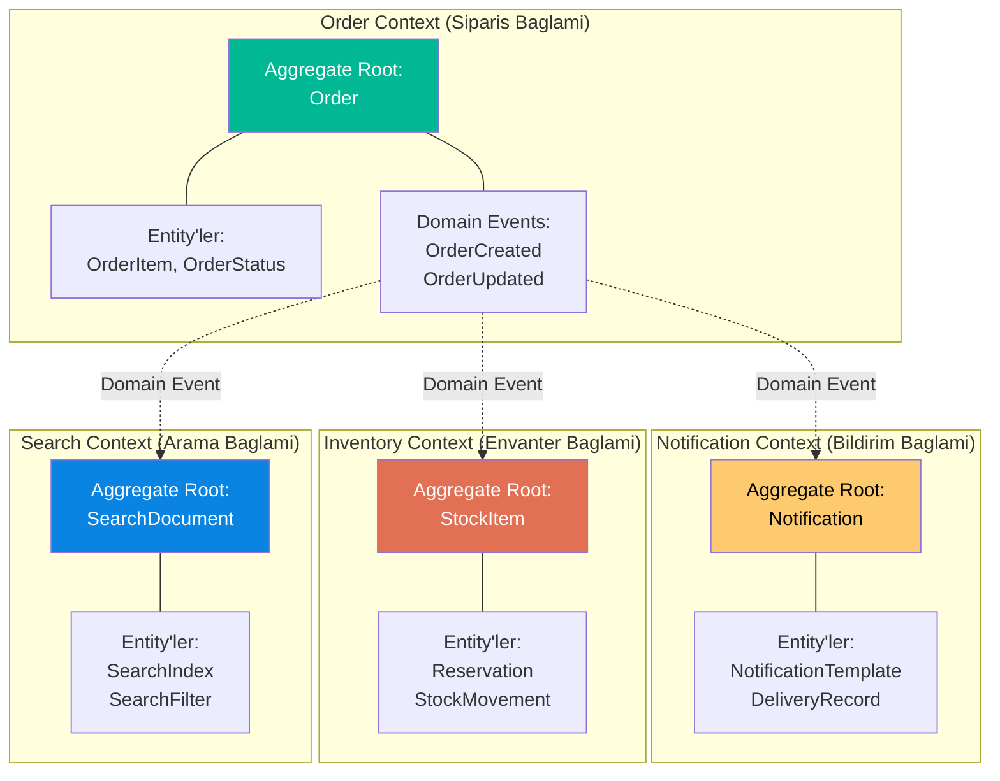
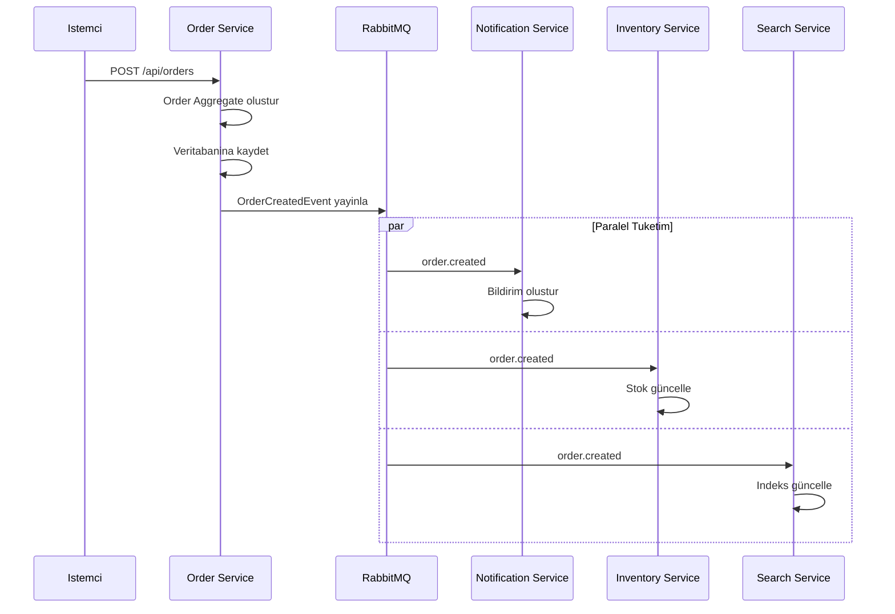
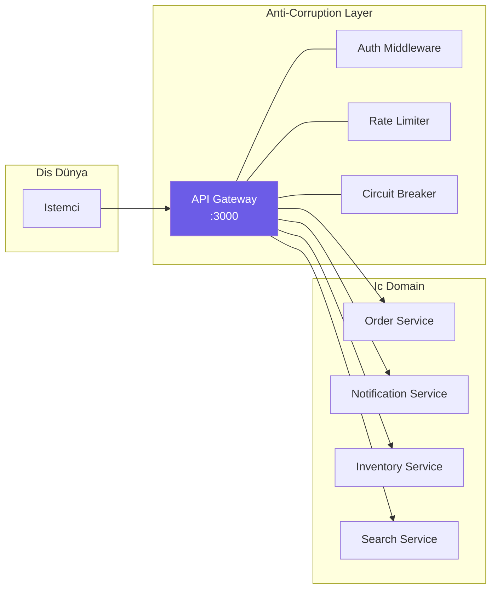
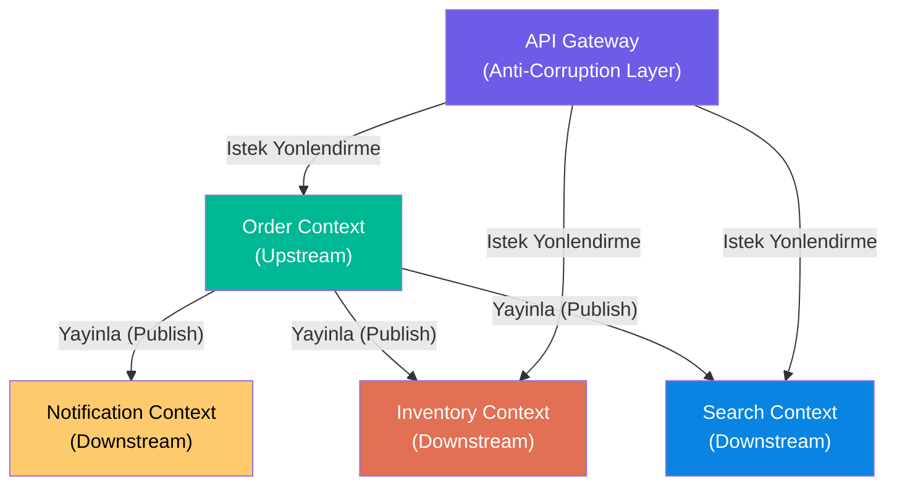

# Domain-Driven Design (Alan Odakli Tasarim)

Domain-Driven Design (DDD), karmasik yazilim sistemlerinin is alani (domain) bilgisine
dayali olarak modellenmesini savunan bir yazilim gelistirme yaklasimidir. Eric Evans tarafindan
2003 yilinda ortaya konmustur.

Bu projede DDD'nin temel kavramlari, mikroservis sinirlarinin belirlenmesinde ve olay
modellemesinde uygulanmaktadir.

<Note>
  DDD, sadece bir teknik yaklasim degil, ayni zamanda is birimi uzmanlari ile yazilim
  gelisricileri arasindaki iletisimi güclendiren bir disiplindir.
</Note>

---

## Temel DDD Kavramlari

<CardGroup cols={2}>
  <Card title="Bounded Context (Sinirli Baglam)" icon="border-all">
    Her mikroservis, belirli bir is alanini kapsayan bir Bounded Context'tir.
    Ayni kavram farkli baglanlarda farkli anlamlara gelebilir.
  </Card>
  <Card title="Aggregate Root (Kümele Koku)" icon="sitemap">
    Bir aggregate (küme) icindeki tüm islemlerin giris noktasidir. Dis dünya
    aggregate'e yalnizca root üzerinden erisir.
  </Card>
  <Card title="Domain Event (Alan Olayi)" icon="bolt">
    Is alaninda gerceklesen anlamli bir degisikligi temsil eder. Diger bounded
    context'lerin bu degisiklikten haberdar olmasini saglar.
  </Card>
  <Card title="Ubiquitous Language (Ortak Dil)" icon="comments">
    Gelistiriciler ve is birimi uzmanlari arasinda kullanilan ortak terminoloji.
    Kod, dokümantasyon ve konusmalar ayni dili kullanir.
  </Card>
</CardGroup>

---

## Bounded Context'ler (Sinirli Baglamlar)

Bu projedeki her mikroservis, bir Bounded Context olarak tanimlanmistir. Her baglam
kendi veri modelini, is kurallarini ve dilini icerir.



### Her Context'in Ayrintili Aciklamasi

<Tabs>
  <Tab title="Order Context">
    **Sorumluluk Alani:** Siparis yasam dongüsünün tamamini yonetir.

    **Aggregate Root:** `Order`
    - Siparis bilgilerini icerir (müsteri, ürünler, toplam tutar)
    - Siparis durumunu yonetir (created, processing, completed, cancelled)
    - Tüm siparis islemleri bu aggregate üzerinden gerceklestirilir

    **Domain Events:**
    - `OrderCreatedEvent` - Yeni siparis olusturuldugunda
    - `OrderUpdatedEvent` - Siparis guncellediginde

    **Veritabani:** PostgreSQL (iliskisel veri, ACID garantisi)
  </Tab>
  <Tab title="Notification Context">
    **Sorumluluk Alani:** Kullaniciya bildirim gonderimini yonetir.

    **Aggregate Root:** `Notification`
    - Bildirim icerigi ve hedef kitlesi
    - Gonderim durumu ve gecmisi
    - Sablon yonetimi

    **Dinledigi Events:**
    - `order.created` - Siparis onay bildirimi gonderir
    - `order.updated` - Siparis durum güncelleme bildirimi gonderir

    **Veritabani:** MongoDB (esnek sema, farkli bildirim tipleri)
  </Tab>
  <Tab title="Inventory Context">
    **Sorumluluk Alani:** Ürün stok miktarlarini yonetir.

    **Aggregate Root:** `StockItem`
    - Ürün basi stok miktari
    - Rezervasyon bilgileri
    - Stok hareketleri (giris/cikis)

    **Dinledigi Events:**
    - `order.created` - Stok düsürme islemi
    - `order.updated` - Stok güncelleme veya iade

    **Veritabani:** Redis (yüksek performansli atomik islemler)
  </Tab>
  <Tab title="Search Context">
    **Sorumluluk Alani:** Ürün arama ve filtreleme islemlerini saglar.

    **Aggregate Root:** `SearchDocument`
    - Arama indeksi dokümanlari
    - Filtreleme kriterleri
    - Siralama parametreleri

    **Dinledigi Events:**
    - `order.created` - Siparis verisini indeksler
    - `order.updated` - Indeks güncellemesi yapar

    **Veritabani:** Elasticsearch (tam metin arama, ters indeks)
  </Tab>
</Tabs>

---

## Aggregate Root: Order Entity

Order, bu projedeki ana Aggregate Root'tur. Tüm siparis islemleri bu entity üzerinden
gerceklestirilir ve disaridaki bilesenler Order icindeki alt entity'lere dogrudan erisiemez.

<CodeGroup>
```typescript Order Aggregate Root
interface Order {
  id: string;                // Benzersiz siparis kimlik numarasi
  customerId: string;        // Müsteri kimlik numarasi
  items: OrderItem[];        // Siparis kalemleri (alt entity)
  status: OrderStatus;       // Siparis durumu (value object)
  totalAmount: number;       // Toplam tutar
  createdAt: string;         // Olusturulma tarihi
  updatedAt: string;         // Güncellenme tarihi
}

// Alt Entity
interface OrderItem {
  productId: string;
  quantity: number;
  price: number;
}

// Value Object
type OrderStatus =
  | "created"
  | "processing"
  | "completed"
  | "cancelled";
```
</CodeGroup>

<Tip>
  Aggregate Root kurallari:
  - Dis dünya yalnizca Aggregate Root üzerinden islem yapar
  - Bir transaction (islem) sadece tek bir Aggregate'i degistirir
  - Aggregate Root, kendi tutarliligini (invariant) korur
</Tip>

---

## Domain Events (Alan Olaylari)

Domain Event'ler, is alaninda gerceklesen anlamli degisiklikleri temsil eder. Bu projede
domain event'ler RabbitMQ üzerinden diger bounded context'lere iletilir.

### Olay Yapisi

<CodeGroup>
```typescript BaseEvent - Tüm Olaylarin Temeli
export interface BaseEvent<T = unknown> {
  id: string;        // UUID - her olayin benzersiz kimlik numarasi
  type: string;      // Olay tipi (orn: "order.created")
  timestamp: string; // ISO 8601 zaman damgasi
  data: T;           // Olay verisi (generic)
}
```

```typescript OrderCreatedEvent
export interface OrderCreatedEvent extends BaseEvent<Order> {
  type: "order.created";
}
// Yeni bir siparis olusturuldugunda publish edilir
// data alani tam Order nesnesini icerir
```

```typescript OrderUpdatedEvent
export interface OrderUpdatedEvent extends BaseEvent<Order> {
  type: "order.updated";
}
// Siparis guncellediginde publish edilir
// data alani güncellenms Order nesnesini icerir
```
</CodeGroup>

### Olay Akis Diyagrami



---

## Ubiquitous Language (Ortak Dil)

Projede kullanilan ortak terminoloji asagidaki gibidir. Bu terimler kod, dokümantasyon ve
ekip ici iletisimde tutarli bir sekilde kullanilmalidir.

| Terim | Aciklama | Baglam |
|-------|----------|--------|
| **Order (Siparis)** | Müsterinin verdigi ürün siparisi | Order Context |
| **Checkout (Odeme)** | Siparisin tamamlanma süreci (Saga) | Order Context |
| **Stock (Stok)** | Bir ürünün mevcut miktari | Inventory Context |
| **Reservation (Rezervasyon)** | Odeme süresince tutulan stok | Inventory Context |
| **Notification (Bildirim)** | Kullaniciya gonderilen mesaj | Notification Context |
| **Index (Indeks)** | Aranabilir veri kopyasi | Search Context |
| **Event (Olay)** | Is alaninda gerceklesen degisiklik | Tüm Context'ler |
| **Saga** | Birden fazla servisi kapsayan is süreci | Order Context |
| **DLQ (Olü Mektup Kuyrugu)** | Islenemeyen mesajlarin toplandi kuyruk | Altyapi |

---

## Anti-Corruption Layer (Bozulmayi Onleme Katmani)

Anti-Corruption Layer (ACL), farkli bounded context'lerin birbirinin iç modelini
kirletmesini onleyen bir ara katmandir. Bu projede **API Gateway** bu gorevi üstlenir.



<Warning>
  Ic servisler dogrudan dis dünyaya acik degildir. Tüm istekler API Gateway üzerinden
  gecmek zorundadir. Bu sayede:
  - Kimlik dogrulama tek noktada yapilir
  - Hiz sinirlandirma merkezi olarak uygulanir
  - Dis API degisikliklerinden ic servisler etkilenmez
</Warning>

### ACL'nin Sagladigi Korumalar

<CardGroup cols={3}>
  <Card title="Kimlik Dogrulama" icon="lock">
    Better Auth ile email/sifre, GitHub ve Google OAuth destegi. Dogrulanmamis
    istekler ic servislere ulasamaz.
  </Card>
  <Card title="Hiz Sinirlandirma" icon="gauge-high">
    Dakikada 200 istek limiti. Kotu niyetli veya asiri istekler engellenir ve
    ic servisler korunur.
  </Card>
  <Card title="Devre Kesici" icon="toggle-off">
    Bir ic servis cokerse diger servislerin kaskat cökmesi (cascading failure)
    onlenir. 5 hata sonrasi devre 30 saniye acilir.
  </Card>
</CardGroup>

---

## Context Mapping (Baglam Haritalama)

Bounded Context'ler arasindaki iliskilerin genel haritasi:



| Iliski Tipi | Upstream | Downstream | Aciklama |
|-------------|----------|------------|----------|
| **Publisher-Subscriber** | Order | Notification | Siparis olaylarini dinler, bildirim gonderir |
| **Publisher-Subscriber** | Order | Inventory | Siparis olaylarini dinler, stok günceller |
| **Publisher-Subscriber** | Order | Search | Siparis olaylarini dinler, indeks günceller |
| **Anti-Corruption** | API Gateway | Tüm Servisler | Dis istekleri filtreler ve yonlendirir |

<Note>
  Order Context bir **upstream** (yukarı akıs) context olarak olay yayinlar. Diger context'ler
  **downstream** (asagi akis) olarak bu olaylara abone olur. Bu iliski modeli
  **Publisher-Subscriber** olarak tanimlanir.
</Note>
