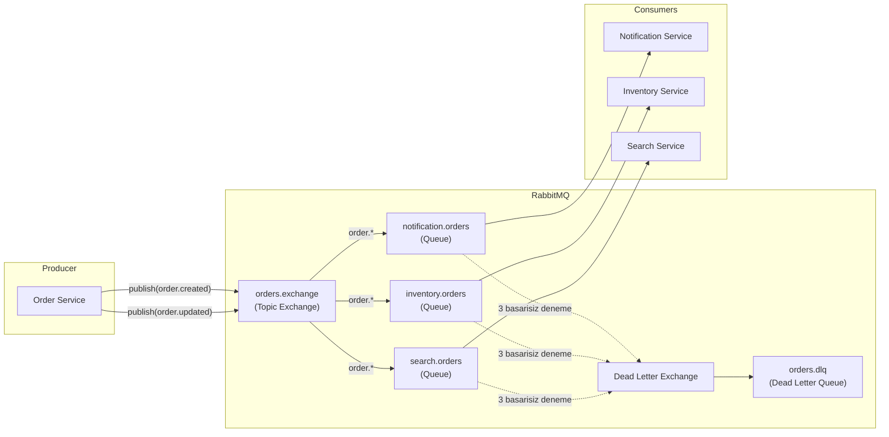
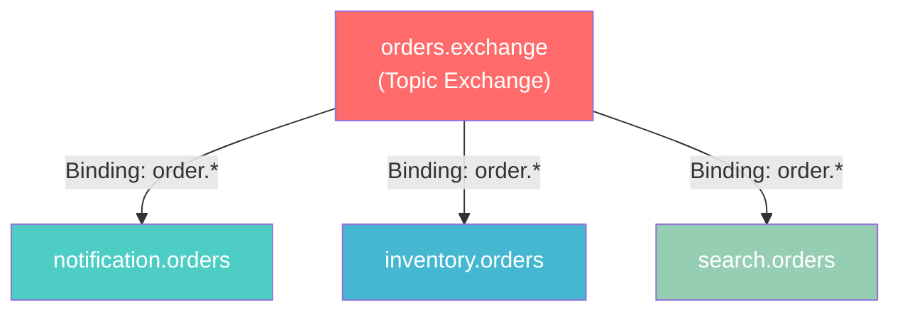

# Event-Driven Architecture (Olay Gudumlü Mimari)

Event-Driven Architecture (EDA), sistemdeki bilesenlerin birbirleriyle **event** (olay) adi verilen mesajlar
araciligiyla iletisim kurdugu bir yazilim mimari desenidir. Geleneksel istek-yanit (request-response) modelinin
aksine, EDA'da ureticiler (producer) olaylari yayinlar, tuketiciler (consumer) ise bu olaylara abone olarak
tepki verir.

<Note>
  Bu projede EDA uygulamasi icin **RabbitMQ** mesaj kuyrugu (message broker) kullanilmaktadir.
  RabbitMQ, AMQP (Advanced Message Queuing Protocol) protokolunu destekleyen, güvenilir ve yüksek
  performansli bir mesajlasma altyapisidir.
</Note>

## Neden Event-Driven Mimari?

<CardGroup cols={3}>
  <Card title="Gevsek Baglanti (Loose Coupling)" icon="link-slash">
    Servisler birbirini dogrudan cagirmaz. Bir servis olay yayinlar, diger servisler bu olaya abone olur.
    Boylece servisler arasinda siki bagimlilik ortadan kalkar.
  </Card>
  <Card title="Olceklenebilirlik (Scalability)" icon="arrows-maximize">
    Her tuketici bagimsiz olarak olceklenebilir. Siparis yogunlugu arttiysa sadece ilgili tuketici
    servisin replika sayisi arttirilabilir.
  </Card>
  <Card title="Dayaniklilik (Resilience)" icon="shield-check">
    Bir tuketici gecici olarak cokse bile mesajlar kuyrukta bekler. Servis tekrar ayaga kalktiginda
    islenmemis mesajlari isler.
  </Card>
</CardGroup>

---

## RabbitMQ Topic Exchange Yapisi

Bu projede **Topic Exchange** kullanilmaktadir. Topic Exchange, routing key (yonlendirme anahtari)
desenlerine gore mesajlari ilgili kuyruklara yonlendirir.

### Exchange ve Routing Key Tanimlari

<CodeGroup>
```typescript packages/shared/src/types.ts
export const EXCHANGES = {
  ORDERS: "orders.exchange",
} as const;

export const ROUTING_KEYS = {
  ORDER_CREATED: "order.created",
  ORDER_UPDATED: "order.updated",
} as const;

export const QUEUES = {
  NOTIFICATION_ORDERS: "notification.orders",
  INVENTORY_ORDERS: "inventory.orders",
  SEARCH_ORDERS: "search.orders",
  DLQ_ORDERS: "orders.dlq",
} as const;
```
</CodeGroup>

### Bilesenlerin Aciklamasi

| Bilesen | Deger | Aciklama |
|---------|-------|----------|
| **Exchange** | `orders.exchange` | Siparis olaylarinin yayinlandigi Topic Exchange |
| **Routing Key** | `order.created` | Yeni siparis olusturuldigunda kullanilir |
| **Routing Key** | `order.updated` | Siparis guncellediginde kullanilir |
| **Queue** | `notification.orders` | Bildirim servisinin dinledigi kuyruk |
| **Queue** | `inventory.orders` | Envanter servisinin dinledigi kuyruk |
| **Queue** | `search.orders` | Arama servisinin dinledigi kuyruk |
| **DLQ** | `orders.dlq` | Islenemeyen mesajlarin yonlendirildigi olü mektup kuyrugu |

---

## Mesaj Akis Diyagrami

Asagidaki diyagram, bir siparis olusturuldugunda mesajin uretici (producer) servisinden tuketici (consumer)
servislere nasil ulastigini gostermektedir:



---

## Event (Olay) Tipleri

Projede kullanilan olay tipleri, `BaseEvent` arayüzünden (interface) türetilmistir:

<CodeGroup>
```typescript BaseEvent Arayüzü
export interface BaseEvent<T = unknown> {
  id: string;        // Benzersiz olay kimlik numarasi (UUID)
  type: string;      // Olay tipi (orn: "order.created")
  timestamp: string; // Olayin olusturuldugu zaman damgasi (ISO 8601)
  data: T;           // Olay verisi (generic tip)
}
```

```typescript Siparis Olaylari
export interface OrderCreatedEvent extends BaseEvent<Order> {
  type: "order.created";
}

export interface OrderUpdatedEvent extends BaseEvent<Order> {
  type: "order.updated";
}

export type OrderEvent = OrderCreatedEvent | OrderUpdatedEvent;
```
</CodeGroup>

---

## Olay Yayinlama (Event Publishing)

Order Service, bir siparis olusturuldugunda veya guncellediginde `orders.exchange` uzerinden
ilgili routing key ile olayi yayinlar:

<CodeGroup>
```typescript Olay Yayinlama Ornegi
import { EXCHANGES, ROUTING_KEYS } from "@ecommerce/shared";

async function publishOrderCreated(order: Order): Promise<void> {
  const event: OrderCreatedEvent = {
    id: crypto.randomUUID(),
    type: "order.created",
    timestamp: new Date().toISOString(),
    data: order,
  };

  channel.publish(
    EXCHANGES.ORDERS,        // "orders.exchange"
    ROUTING_KEYS.ORDER_CREATED, // "order.created"
    Buffer.from(JSON.stringify(event)),
    {
      persistent: true,       // Mesaj diskte kalici olarak saklanir
      contentType: "application/json",
    }
  );
}
```
</CodeGroup>

<Tip>
  Mesajlar `persistent: true` secenegi ile yayinlanir. Bu sayede RabbitMQ yeniden baslatilsa bile
  mesajlar kaybolmaz.
</Tip>

---

## Dead Letter Queue (Olü Mektup Kuyrugu)

Dead Letter Queue (DLQ), islenemeyen mesajlarin yonlendirildigi ozel bir kuyruktur. Bir mesaj
belirli sayida basarisiz isleme denemesinden sonra DLQ'ya tasinir.

<Steps>
  <Step title="Mesaj Tuketilir">
    Tuketici servis (consumer) kuyruktan mesaji alir ve islemeye baslar.
  </Step>
  <Step title="Isleme Basarisiz Olur">
    Mesaj isleme sirasinda bir hata olusursa, mesaj `nack` (negative acknowledgement) ile
    reddedilir ve kuyruga geri konur.
  </Step>
  <Step title="Yeniden Deneme (Retry)">
    Mesaj en fazla **3 kez** yeniden islemeye alinir. Her denemede `x-death` basligindaki
    sayac artar.
  </Step>
  <Step title="DLQ'ya Tasinir">
    3 basarisiz denemeden sonra mesaj Dead Letter Exchange (DLX) uzerinden `orders.dlq`
    kuyruguna yonlendirilir. Bu mesajlar manuel olarak incelenebilir.
  </Step>
</Steps>

<Warning>
  DLQ'daki mesajlar otomatik olarak islenmez. Bu mesajlarin manuel olarak incelenmesi ve
  gerektiginde yeniden islenmesi (replay) gerekmektedir. Uretim ortaminda DLQ boyutunu
  izlemek icin Prometheus alert'leri olusturulmalidir.
</Warning>

---

## Queue Binding (Kuyruk Baglama) Yapisi

Topic Exchange'de her kuyruk bir **binding key** (baglama anahtari) deseni ile exchange'e baglanir:



`order.*` deseni, `order.` ile baslayan tüm routing key'lerle eslesir. Bu sayede:
- `order.created` mesajlari üc kuyruga da ulasir
- `order.updated` mesajlari üc kuyruga da ulasir
- Gelecekte eklenen `order.cancelled` gibi yeni olay tipleri de otomatik olarak yonlendirilir

---

## EDA'nin Bu Projedeki Avantajlari

<Tabs>
  <Tab title="Gevsek Baglanti">
    Order Service, Notification Service'in varligini bilmek zorunda degildir.
    Sadece `orders.exchange`'e mesaj yayinlar. Yeni bir tuketici eklemek icin
    mevcut kodu degistirmeye gerek yoktur; sadece yeni bir kuyruk olusturup
    exchange'e baglamak yeterlidir.
  </Tab>
  <Tab title="Olceklenebilirlik">
    Her tuketici servis bagimsiz olarak yatay olceklenebilir. Ornegin,
    Notification Service'in yukunu artirmak icin sadece bu servisin
    replika sayisini artirmak yeterlidir. RabbitMQ, mesajlari tuketiciler
    arasinda otomatik olarak dagitir (round-robin).
  </Tab>
  <Tab title="Dayaniklilik">
    Bir tuketici servis gecici olarak kullanim disi kalsa bile mesajlar
    kuyrukta guvenle bekler. Servis tekrar ayaga kalktiginda kaldigi yerden
    mesajlari islemeye devam eder. DLQ mekanizmasi sayesinde hata durumlarinda
    mesaj kaybi yasanmaz.
  </Tab>
  <Tab title="Izlenebilirlik">
    Her olay benzersiz bir `id` ve `timestamp` alanina sahiptir. Bu sayede
    mesajlarin izlenmesi (tracing) ve sorun giderme (debugging) isleri
    kolaylasir. RabbitMQ Management UI (port 15672) uzerinden kuyruk
    durumu izlenebilir.
  </Tab>
</Tabs>
