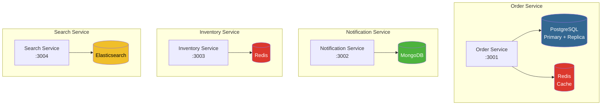
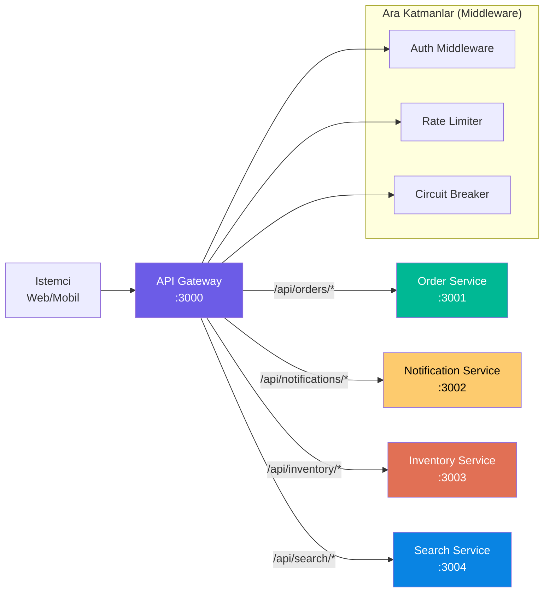
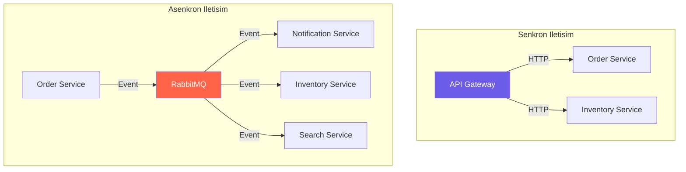

# Mikroservis Tasarimi

Bu proje, **Microservices Architecture** (Mikroservis Mimarisi) desenine gore tasarlanmistir.
Her servis belirli bir is alanina (business domain) odaklanir, kendi veritabanina sahiptir
ve bagimsiz olarak gelistirilip deploy edilebilir.

<Note>
  Tüm servisler **Bun** runtime üzerinde **Hono.dev** framework'ü ile gelistirilmistir.
  Veritabani islemleri icin **Drizzle ORM** (PostgreSQL), **ioredis** (Redis) ve
  native driver'lar (MongoDB, Elasticsearch) kullanilmaktadir.
</Note>

---

## DB-per-Service (Servise Ozel Veritabani) Deseni

Mikroservis mimarisinin temel prensiplerinden biri, her servisin kendi veritabanina sahip olmasidir.
Bu desen sayesinde servisler arasinda veritabani düzeyinde bagimlilik ortadan kalkar.



### Neden Farkli Veritabanlari?

<CardGroup cols={2}>
  <Card title="Order Service - PostgreSQL" icon="database">
    Siparisler iliskisel veri yapisina sahiptir (siparis-ürün iliskisi). ACID transaction
    garantisi gereklidir. Drizzle ORM ile type-safe sorgular yazilir. Read/write splitting
    ile okuma yogun islemler replica'ya yonlendirilir.
  </Card>
  <Card title="Notification Service - MongoDB" icon="bell">
    Bildirimler yari-yapisal (semi-structured) verilerdir. Farkli bildirim tipleri farkli
    alanlara sahip olabilir. MongoDB'nin esnek semasi bu ihtiyaca uygundur.
  </Card>
  <Card title="Inventory Service - Redis" icon="box">
    Envanter bilgisi yüksek hizda okunup yazilmalidir. Redis'in in-memory yapisi
    mikrosaniye düzeyinde erisim saglar. Stok sayaci icin atomik islemler (INCR/DECR)
    kullanilir.
  </Card>
  <Card title="Search Service - Elasticsearch" icon="magnifying-glass">
    Tam metin arama (full-text search) ve filtreleme islemleri icin Elasticsearch'ün
    ters indeks (inverted index) yapisi idealdir. Ürün arama, filtreleme ve siralama
    islemleri yüksek performansla gerceklestirilir.
  </Card>
</CardGroup>

---

## Servis Sinirlari ve Sorumluluklar

Her servis, tek bir is alani (bounded context) ile sinirlidir ve yalnizca kendi sorumluluk
alanindaki islemleri gerceklestirir:

<Tabs>
  <Tab title="API Gateway">
    **Port:** 3000

    API Gateway, dis dünya ile mikroservisler arasinda bir gecit (gateway) gorevidir.

    **Sorumluluklar:**
    - Istek yonlendirme (request routing)
    - Kimlik dogrulama (authentication) - Better Auth
    - Hiz sinirlandirma (rate limiting) - 200 istek/dakika
    - Circuit Breaker (devre kesici) deseni
    - CORS ve güvenlik baslik yonetimi

    **Veritabani:** PostgreSQL (kullanici ve oturum verileri)
  </Tab>
  <Tab title="Order Service">
    **Port:** 3001

    Siparis yasam dongüsünü yonetir.

    **Sorumluluklar:**
    - Siparis olusturma (CRUD islemleri)
    - Checkout Saga orkestrasyon
    - Siparis durumu yonetimi
    - Olay yayinlama (event publishing)

    **Veritabani:** PostgreSQL (primary + replica) + Redis (cache)
  </Tab>
  <Tab title="Notification Service">
    **Port:** 3002

    Bildirim gonderimini yonetir.

    **Sorumluluklar:**
    - Siparis olayi dinleme (event consuming)
    - E-posta bildirimi hazirlama
    - Bildirim gecmisi saklama
    - Bildirim sablonu yonetimi

    **Veritabani:** MongoDB
  </Tab>
  <Tab title="Inventory Service">
    **Port:** 3003

    Stok yonetimini saglar.

    **Sorumluluklar:**
    - Stok sorgulama ve güncelleme
    - Stok rezervasyonu (saga adimi)
    - Stok uyari esigi kontrolü
    - Atomik stok islemleri

    **Veritabani:** Redis
  </Tab>
  <Tab title="Search Service">
    **Port:** 3004

    Arama ve filtreleme islemlerini saglar.

    **Sorumluluklar:**
    - Ürün indeksleme
    - Tam metin arama (full-text search)
    - Filtreli arama ve siralama
    - Indeks güncelleme (olay tabanli)

    **Veritabani:** Elasticsearch
  </Tab>
</Tabs>

---

## API Gateway Deseni

API Gateway, tüm dis isteklerin ilk ulastigi noktadir. Istemciler (client) dogrudan
mikroservislere erisemez; tüm istekler API Gateway üzerinden yonlendirilir.



### Circuit Breaker (Devre Kesici) Deseni

Circuit Breaker, bir servis cokerse diger servislerin de etkilenmesini onlemek icin kullanilir.
Her upstream servis icin ayri bir devre kesici bulunur.

<Steps>
  <Step title="Kapali (Closed)">
    Normal calisma durumu. Istekler dogrudan servise yonlendirilir.
  </Step>
  <Step title="Acik (Open)">
    **5 ardisik basarisiz istekten** sonra devre acilir. Tüm istekler aninda 503 hata
    koduyla reddedilir. Downstream servise hicbir istek gitmez.
  </Step>
  <Step title="Yari Acik (Half-Open)">
    **30 saniye** sonra devre yari acik duruma gecer. Sinirli sayida istek denenir.
    Basarili olursa devre kapanir, basarisiz olursa tekrar acilir.
  </Step>
</Steps>

<Warning>
  Circuit Breaker acik durumda iken istemcilere 503 Service Unavailable yaniti doner.
  Istemci tarafinda bu duruma uygun yeniden deneme (retry) stratejisi uygulanmalidir.
</Warning>

---

## Bagimsiz Deploy ve Olcekleme

<CardGroup cols={2}>
  <Card title="Bagimsiz Deploy" icon="rocket">
    Her servis kendi Docker imajina sahiptir ve bagimsiz olarak deploy edilebilir.
    Bir serviste yapilan degisiklik diger servisleri etkilemez. CI/CD pipeline'i
    sadece degisen servisi build edip deploy eder.
  </Card>
  <Card title="Bagimsiz Olcekleme" icon="chart-line">
    Her servis yükü dogultusunda bagimsiz olarak yatay olceklenebilir. Kubernetes
    HorizontalPodAutoscaler (HPA) ile CPU ve bellek kullanimina gore otomatik
    olcekleme yapilabilir.
  </Card>
</CardGroup>

---

## Shared Package (Paylasilan Paket)

Servisler arasinda ortak kullanilan tip tanimlari, yardimci fonksiyonlar ve yapilandirmalar
`packages/shared` paketinde toplanmistir. Bun workspaces ile monorepo yapisi kullanilir.

<CodeGroup>
```typescript packages/shared/src/types.ts
// Olay tipleri
export interface BaseEvent<T = unknown> {
  id: string;
  type: string;
  timestamp: string;
  data: T;
}

// RabbitMQ sabitleri
export const EXCHANGES = { ORDERS: "orders.exchange" } as const;
export const ROUTING_KEYS = {
  ORDER_CREATED: "order.created",
  ORDER_UPDATED: "order.updated",
} as const;
export const QUEUES = {
  NOTIFICATION_ORDERS: "notification.orders",
  INVENTORY_ORDERS: "inventory.orders",
  SEARCH_ORDERS: "search.orders",
  DLQ_ORDERS: "orders.dlq",
} as const;
```

```typescript packages/shared/src/logger.ts
// Yapilandirilmis loglama (structured logging)
// Tüm servisler ayni log formatini kullanir
export const logger = {
  info: (message: string, meta?: object) => { /* ... */ },
  error: (message: string, meta?: object) => { /* ... */ },
  warn: (message: string, meta?: object) => { /* ... */ },
};
```
</CodeGroup>

<Tip>
  Shared paketi degistiginde tüm servislerin yeniden build edilmesi gerekmez.
  Bun workspaces sayesinde sembolik linkler (symlink) üzerinden dogrudan referans edilir
  ve degisiklikler aninda yansir.
</Tip>

---

## Servisler Arasi Iletisim

Mikroservisler arasinda iki farkli iletisim modeli kullanilmaktadir:

| Iletisim Modeli | Kullanim Alani | Mekanizma |
|-----------------|----------------|-----------|
| **Senkron (Synchronous)** | API Gateway → Servisler | HTTP/REST istekleri |
| **Asenkron (Asynchronous)** | Servisler arasi olay yayilimi | RabbitMQ mesajlasma |



<Note>
  Genel kural olarak, anlık yanıt gerektiren islemler senkron (HTTP), arka plan islemleri
  ve bildirimler ise asenkron (RabbitMQ) olarak gerceklestirilir.
</Note>
