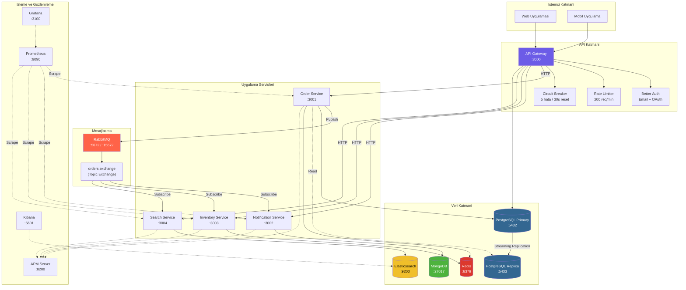
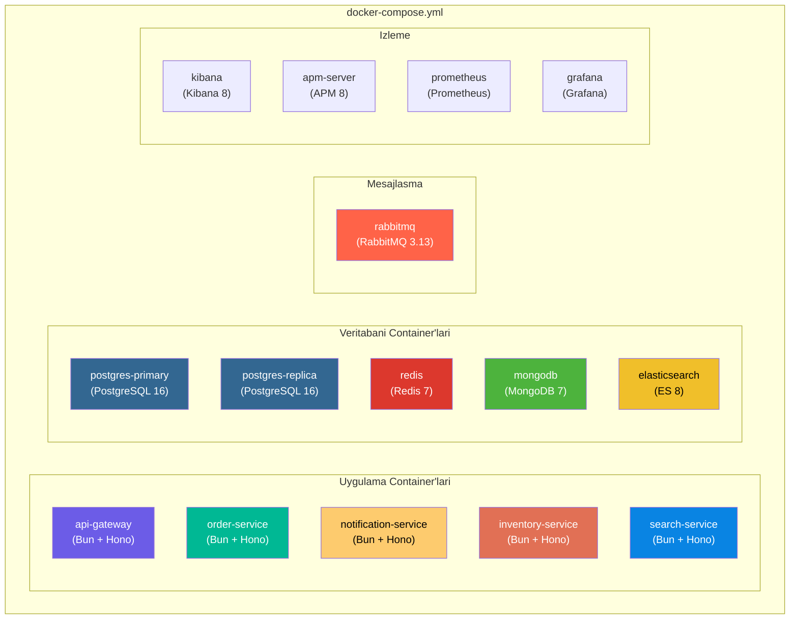
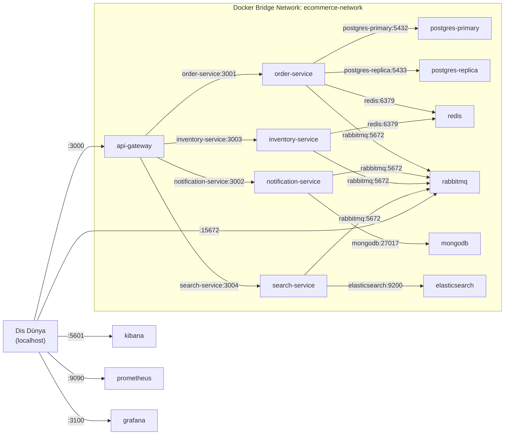
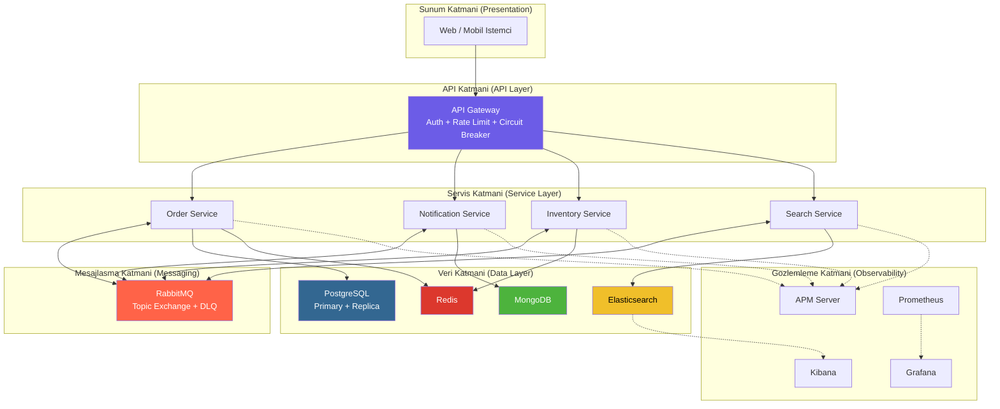

# Sistem Diyagrami

Bu sayfa, event-driven e-ticaret projesinin tüm sistem bilesenlerini, ag topolojisini
ve veri akis yollarini gorsellestirmektedir.

---

## Genel Sistem Mimarisi

Asagidaki diyagram, tüm sistem bilesenlerini ve aralarindaki iliskileri gostermektedir:

---

## Port Tablosu

### Uygulama Servisleri

| Servis | Port | Veritabani | Aciklama |
|--------|------|-----------|----------|
| **API Gateway** | 3000 | PostgreSQL (auth) | Istek yonlendirme, kimlik dogrulama, hiz sinirlandirma |
| **Order Service** | 3001 | PostgreSQL + Redis | Siparis yonetimi, Saga orkestrasyon |
| **Notification Service** | 3002 | MongoDB | Bildirim gonderimi ve gecmis kaydi |
| **Inventory Service** | 3003 | Redis | Stok yonetimi ve rezervasyon |
| **Search Service** | 3004 | Elasticsearch | Tam metin arama ve filtreleme |

### Altyapi Servisleri

| Servis | Port | Protokol | Aciklama |
|--------|------|----------|----------|
| **PostgreSQL Primary** | 5432 | TCP | Ana veritabani (okuma + yazma) |
| **PostgreSQL Replica** | 5433 | TCP | Kopya veritabani (sadece okuma) |
| **Redis** | 6379 | TCP | Onbellek ve stok deposu |
| **MongoDB** | 27017 | TCP | Bildirim veri deposu |
| **Elasticsearch** | 9200 | HTTP | Arama motoru |
| **RabbitMQ** | 5672 | AMQP | Mesaj kuyrugu (AMQP protokolü) |
| **RabbitMQ UI** | 15672 | HTTP | Yonetim arayüzü |

### Izleme ve Gozlemleme Servisleri

| Servis | Port | Aciklama |
|--------|------|----------|
| **Kibana** | 5601 | Elasticsearch goruntüleme ve analiz arayüzü |
| **APM Server** | 8200 | Uygulama performans izleme |
| **Prometheus** | 9090 | Metrik toplama ve sorgulama |
| **Grafana** | 3100 | Metrik goruntüleme ve dashboard |

---

## Docker Container Diyagrami

Proje toplamda **14 Docker container** icermektedir. Tüm container'lar `docker-compose.yml`
dosyasi ile yonetilir.

<Note>
  Grafana ve Prometheus dahil edildiginde toplam container sayisi 15'e cikabilir.
  Gelistirme ortaminda tüm container'lar ayni anda calistirilabilir ancak en az
  **8 GB RAM** onerilir.
</Note>

---

## Ag Topolojisi (Network Topology)

Docker Compose, tüm container'lar icin tek bir bridge network olusturur. Container'lar
birbirine servis adi (service name) ile erisir.

<Warning>
  Uretim ortaminda (production) yalnizca API Gateway portu (3000) dis dünyaya acik
  olmalidir. Veritabani portlari, RabbitMQ ve izleme araclari yalnizca ic ag
  üzerinden erisilebilir olmalidir.
</Warning>

---

## Veri Akis Genel Bakis

Sistemdeki veri akisi üc ana katmandan olusur:

<Steps>
  <Step title="Istek Alimi (Ingress)">
    Istemci istegi API Gateway'e ulasir. Gateway, kimlik dogrulama, hiz sinirlandirma
    ve circuit breaker kontrollerini uygular.
  </Step>
  <Step title="Is Mantigi (Business Logic)">
    Ilgili mikroservis istegi isler. Veritabani islemleri gerceklestirilir. Gerektiginde
    domain event'ler olusturulur.
  </Step>
  <Step title="Olay Yayilimi (Event Propagation)">
    Domain event RabbitMQ'ya yayinlanir. Topic Exchange, mesaji ilgili kuyruklara
    yonlendirir. Tuketici servisler mesaji isler.
  </Step>
  <Step title="Yanit (Response)">
    Senkron islemlerde yanit dogrudan istemciye doner. Asenkron islemler (bildirim,
    indeksleme) arka planda tamamlanir.
  </Step>
</Steps>

---

## Katmanli Mimari Görünümü

<Tip>
  Sistemi ayaga kaldirmak icin: `docker-compose up -d` komutu yeterlidir. Tüm servisler,
  veritabanlari ve izleme araclari otomatik olarak baslatilir. Servisler arasindaki
  bagimliliklar `depends_on` ile tanimlanmistir.
</Tip>
