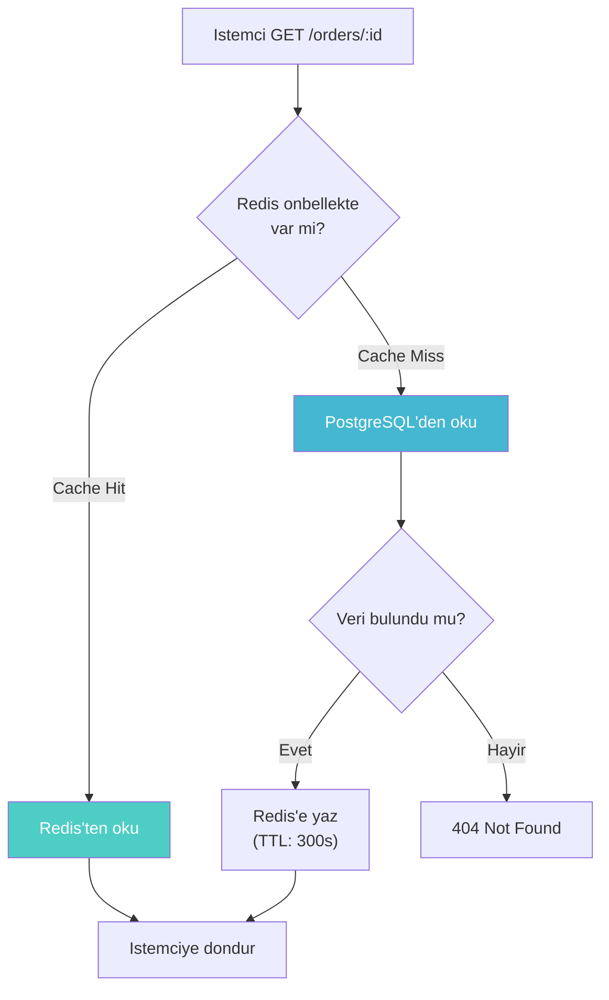
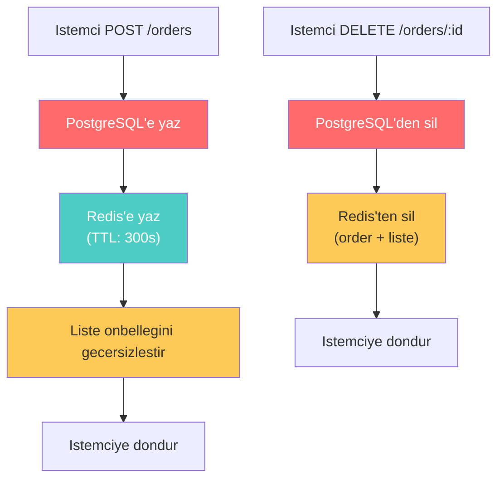

# Caching Stratejisi (Onbellekleme)

Caching (Onbellekleme), sik erisilen verilerin hizli bir depolama katmaninda (genellikle
bellek ici / in-memory) tutularak veritabani yukunu azaltma ve yanit surelerini iyilestirme
teknigdir. Bu projede **Redis** kullanilarak Order Service icin onbellekleme stratejisi
uygulanmistir.

Uygulanan strateji **Write-Through Cache** (Yazma-Gecisli Onbellek) olarak adlandirilir:
her yazma isleminde veri hem veritabanina hem de onbellege ayni anda yazilir. Okuma islemlerinde
once onbellek kontrol edilir; veri mevcutsa (cache hit) dogrudan dondurulur, degilse (cache miss)
veritabanindan okunup onbellege yazilir.

<CardGroup cols={3}>
  <Card title="5 Dakika TTL" icon="clock">
    Onbellekteki veriler **300 saniye** sonra otomatik olarak suresi dolar
  </Card>
  <Card title="Write-Through" icon="arrow-right-arrow-left">
    Yazma islemlerinde veri hem veritabanina hem onbellege yazilir
  </Card>
  <Card title="Liste Gecersizlestirme" icon="list-check">
    Tek bir siparis degistiginde **tum liste onbellegi** gecersizlestirilir
  </Card>
</CardGroup>

---

## Okuma ve Yazma Akisi

### Okuma Akisi (Read Path)



### Yazma Akisi (Write Path)



---

## Cache Modulu Kaynak Kodu

Asagida `cache.ts` dosyasinin tam kaynak kodu ve her fonksiyonun aciklamasi yer almaktadir:

<CodeGroup>
```typescript cache.ts
import Redis from "ioredis";
import type { Order } from "@ecommerce/shared";

const CACHE_TTL = 300; // 5 dakika (saniye cinsinden)
const ORDER_PREFIX = "order:";
const ORDER_LIST_KEY = "orders:all";

const redis = new Redis(process.env.REDIS_URL || "redis://localhost:6379");

export const cache = {
  // Tekil siparis okuma
  async getOrder(id: string): Promise<Order | null> {
    const data = await redis.get(`${ORDER_PREFIX}${id}`);
    return data ? JSON.parse(data) : null;
  },

  // Tekil siparis yazma + liste gecersizlestirme
  async setOrder(order: Order): Promise<void> {
    await redis.set(`${ORDER_PREFIX}${order.id}`, JSON.stringify(order), "EX", CACHE_TTL);
    await redis.del(ORDER_LIST_KEY); // Liste onbellegini gecersizlestir
  },

  // Siparis listesi okuma
  async getOrderList(): Promise<Order[] | null> {
    const data = await redis.get(ORDER_LIST_KEY);
    return data ? JSON.parse(data) : null;
  },

  // Siparis listesi yazma
  async setOrderList(orders: Order[]): Promise<void> {
    await redis.set(ORDER_LIST_KEY, JSON.stringify(orders), "EX", CACHE_TTL);
  },

  // Tekil siparis + liste gecersizlestirme
  async invalidateOrder(id: string): Promise<void> {
    await redis.del(`${ORDER_PREFIX}${id}`, ORDER_LIST_KEY);
  },

  // Redis istemcisine dogrudan erisim (rate limiter vb. icin)
  getClient() {
    return redis;
  },
};
```
</CodeGroup>

---

## Cache Islemleri Detayli Aciklama

<Tabs>
  <Tab title="getOrder">
    **Tekil siparis okuma** - Verilen `id` ile onbellekte siparis arar.

    ```typescript
    async getOrder(id: string): Promise<Order | null> {
      const data = await redis.get(`${ORDER_PREFIX}${id}`);
      return data ? JSON.parse(data) : null;
    }
    ```

    - Redis key formati: `order:{id}` (ornegin: `order:abc-123`)
    - Veri JSON string olarak saklanir, okunurken `JSON.parse` ile nesneye donusturulur
    - Veri bulunamazsa `null` dondurulur (cache miss)
  </Tab>

  <Tab title="setOrder">
    **Tekil siparis yazma** - Siparisi onbellege yazar ve **liste onbellegini gecersizlestirir**.

    ```typescript
    async setOrder(order: Order): Promise<void> {
      await redis.set(
        `${ORDER_PREFIX}${order.id}`,
        JSON.stringify(order),
        "EX",
        CACHE_TTL  // 300 saniye
      );
      await redis.del(ORDER_LIST_KEY); // Liste gecersizlestir
    }
    ```

    - `"EX"` parametresi TTL (Time To Live) ayarini saniye cinsinden belirler
    - Siparis nesnesine `JSON.stringify` uygulanarak string olarak saklanir
    - **Kritik**: Her tekil siparis degisikliginde liste onbellegi silinir cunku liste artik guncel degildir
  </Tab>

  <Tab title="getOrderList / setOrderList">
    **Siparis listesi okuma ve yazma** - Tum siparislerin listesini tek bir key altinda saklar.

    ```typescript
    async getOrderList(): Promise<Order[] | null> {
      const data = await redis.get(ORDER_LIST_KEY);
      return data ? JSON.parse(data) : null;
    }

    async setOrderList(orders: Order[]): Promise<void> {
      await redis.set(ORDER_LIST_KEY, JSON.stringify(orders), "EX", CACHE_TTL);
    }
    ```

    - Key: `orders:all` - tum siparis listesi tek bir key'de tutulur
    - Buyuk veri setlerinde bu yaklasim bellek kullanimini artirabilir
    - TTL ayni sekilde 300 saniye olarak ayarlanir
  </Tab>

  <Tab title="invalidateOrder">
    **Gecersizlestirme** - Hem tekil siparis hem liste onbellegini siler.

    ```typescript
    async invalidateOrder(id: string): Promise<void> {
      await redis.del(`${ORDER_PREFIX}${id}`, ORDER_LIST_KEY);
    }
    ```

    - `redis.del()` birden fazla key alabilir, tek cagirimda iki key silinir
    - Siparis silindiginde veya kritik bir degisiklik yapildiginda kullanilir
    - Silme isleminden sonra bir sonraki okuma veritabanindan yapilir (cache miss)
  </Tab>
</Tabs>

---

## Redis Key Yapisi

| Key Formati | Ornek | Aciklama | TTL |
|-------------|-------|----------|-----|
| `order:{id}` | `order:abc-123` | Tekil siparis verisi | 300s |
| `orders:all` | `orders:all` | Tum siparis listesi | 300s |

<Note>
  Key isimlendirmesinde iki nokta (`:`) ayirici olarak kullanilmaktadir. Bu, Redis'te
  yaygin bir konvansiyondur ve key'lerin mantiksal olarak gruplanmasini saglar.
  `ORDER_PREFIX` sabiti (`"order:"`) tum tekil siparis key'lerinin baslangicini belirler.
</Note>

---

## Gecersizlestirme (Invalidation) Stratejisi

Bu projedeki onbellek gecersizlestirme stratejisi su kurallara dayanir:

<Steps>
  <Step title="Tekil Siparis Degisikligi">
    Bir siparis guncellediginde veya olusturuldigunda (`setOrder`):
    1. Yeni siparis verisi `order:{id}` key'ine yazilir
    2. `orders:all` liste key'i **silinir** (gecersizlestirilir)
    3. Bir sonraki liste isteginde veri veritabanindan cekilir
  </Step>

  <Step title="Siparis Silme">
    Bir siparis silindiginde (`invalidateOrder`):
    1. `order:{id}` key'i silinir
    2. `orders:all` liste key'i silinir
    3. Her iki key de tek `redis.del()` cagrisi ile silinir
  </Step>

  <Step title="TTL ile Otomatik Sureklilik">
    Herhangi bir acik gecersizlestirme yapilmasa bile, tum key'ler **300 saniye** sonra
    otomatik olarak Redis tarafindan silinir. Bu, veritabanindaki degisikliklerin en gec
    5 dakika icinde onbellege yansitilmasini garanti eder.
  </Step>
</Steps>

<Warning>
  Mevcut uygulama, siparis listesini tek bir Redis key'inde tutar (`orders:all`). Buyuk veri
  setlerinde bu yaklasim sorunlara yol acabilir:

  - **Bellek**: Binlerce siparisin JSON string olarak saklanmasi yuksek bellek tuketir
  - **Serializasyon**: Buyuk JSON'larin parse edilmesi CPU yuku olusturur
  - **Kismen Guncelleme**: Tek bir siparis degistiginde tum liste gecersizlestirilir

  Uretim ortaminda sayfalama (pagination) tabanli onbellekleme veya Redis Sorted Set
  yapilarinin kullanilmasi onerılir.
</Warning>

---

## TTL (Time To Live) Secimi

```typescript
const CACHE_TTL = 300; // 5 dakika
```

TTL degeri, veri tazeligi (freshness) ile performans arasindaki dengeyi belirler:

| TTL Degeri | Avantaj | Dezavantaj |
|------------|---------|------------|
| Cok kisa (orn: 30s) | Veri her zaman guncel | Onbellek etkisi dusuk, veritabani yuku yuksek |
| Orta (orn: 300s) | Iyi denge | 5 dakikaya kadar eski veri gorulebilir |
| Cok uzun (orn: 3600s) | Veritabani yuku cok dusuk | Uzun sure eski veri gosterilir |

Bu projede **300 saniye (5 dakika)** secilmistir. Bu deger, bir e-ticaret uygulamasinda
siparis verilerinin makul bir sure icinde guncellenmesini saglarken, veritabani yukunu
onemli olcude azaltir.

<Tip>
  `CACHE_TTL` degerini ortam degiskeni (environment variable) olarak disari almak, farkli
  ortamlarda (gelistirme, test, uretim) farkli TTL degerleri kullanmayi kolaylastirir.
  Ornegin, gelistirme ortaminda daha kisa bir TTL kullanilarak onbellek davranisi daha
  kolay test edilebilir.
</Tip>

---

## Redis Istemcisi Paylasimi

`cache.getClient()` metodu, Redis istemcisine dogrudan erisim saglar. Bu, onbellek disindaki
Redis islemleri (ornegin rate limiting) icin ayni baglantinin yeniden kullanilmasina olanak
tanir:

```typescript
// cache.ts
getClient() {
  return redis;
}

// rate-limit.ts (ayni Redis baglantisinini kullanir)
import { cache } from "../cache";

export async function rateLimiter(c: Context, next: Next) {
  const redis = cache.getClient();
  const current = await redis.incr(key);
  // ...
}
```

Bu yaklasim, birden fazla Redis baglantisinini acmayi onler ve kaynak kullanimini optimize eder.

---

## Kaynak Kod

**`services/order-service/src/cache.ts`**

<CodeGroup>
```typescript cache.ts (tam kaynak)
import Redis from "ioredis";
import type { Order } from "@ecommerce/shared";

const CACHE_TTL = 300;
const ORDER_PREFIX = "order:";
const ORDER_LIST_KEY = "orders:all";

const redis = new Redis(process.env.REDIS_URL || "redis://localhost:6379");

export const cache = {
  async getOrder(id: string): Promise<Order | null> {
    const data = await redis.get(`${ORDER_PREFIX}${id}`);
    return data ? JSON.parse(data) : null;
  },

  async setOrder(order: Order): Promise<void> {
    await redis.set(`${ORDER_PREFIX}${order.id}`, JSON.stringify(order), "EX", CACHE_TTL);
    await redis.del(ORDER_LIST_KEY);
  },

  async getOrderList(): Promise<Order[] | null> {
    const data = await redis.get(ORDER_LIST_KEY);
    return data ? JSON.parse(data) : null;
  },

  async setOrderList(orders: Order[]): Promise<void> {
    await redis.set(ORDER_LIST_KEY, JSON.stringify(orders), "EX", CACHE_TTL);
  },

  async invalidateOrder(id: string): Promise<void> {
    await redis.del(`${ORDER_PREFIX}${id}`, ORDER_LIST_KEY);
  },

  getClient() {
    return redis;
  },
};
```
</CodeGroup>
