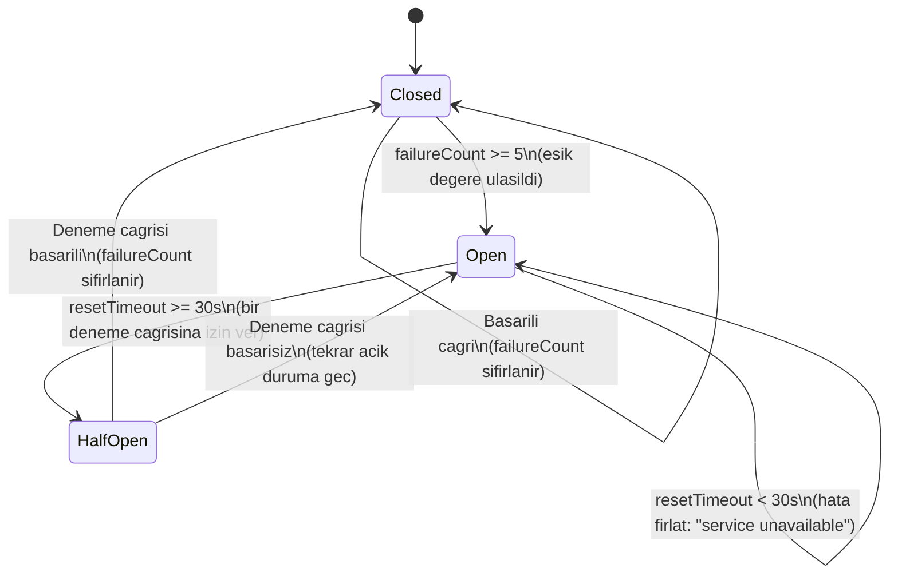
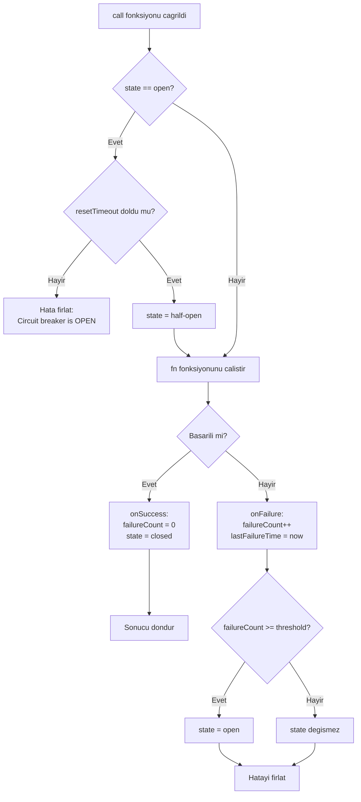

# Circuit Breaker Pattern (Devre Kesici Kalibi)

Circuit Breaker (Devre Kesici), dagitik sistemlerde bir servisin kullanim disi (down) veya yavas
yanit verdigi durumlarda, o servise yapilan cagrilari gecici olarak durduran bir tasarim kalibidir.
Elektrik devresindeki sigortaya benzer sekilde calisir: belirli sayida basarisizlik tespit
edildiginde devre "acilir" ve daha fazla basarisiz cagrinin yapilmasini engeller.

Bu projede Circuit Breaker, **API Gateway** katmaninda uygulanmistir. Gateway, arka plandaki
servislere (Order, Inventory, Notification, Search) istek yonlendirirken, her servis icin ayri
bir devre kesici kullanir.

<CardGroup cols={3}>
  <Card title="Hata Esigi" icon="gauge-high">
    **5 basarisiz cagri** sonrasinda devre acilir
  </Card>
  <Card title="Sifirlama Suresi" icon="clock">
    **30 saniye** sonra devre yari-acik duruma gecer
  </Card>
  <Card title="Servis Basina" icon="cubes">
    Her upstream servis icin **ayri bir devre kesici** olusturulur
  </Card>
</CardGroup>

---

## Devre Kesici Durumlari (States)

Circuit Breaker uc durumda (state) calisir:



<Tabs>
  <Tab title="Closed (Kapali)">
    **Normal calisma durumu.** Tum istekler arka plandaki servise yonlendirilir.

    - Her basarili cagri `failureCount` sayacini sifirlar
    - Her basarisiz cagri `failureCount` sayacini 1 arttirir
    - `failureCount >= failureThreshold` (5) oldiginda durum **Open** durumuna gecer

    ```typescript
    private onSuccess() {
      this.failureCount = 0;
      this.state = "closed";
    }

    private onFailure() {
      this.failureCount++;
      this.lastFailureTime = Date.now();
      if (this.failureCount >= this.failureThreshold) {
        this.state = "open";
      }
    }
    ```
  </Tab>

  <Tab title="Open (Acik)">
    **Koruma durumu.** Tum istekler arka plandaki servise gonderilmeden hemen reddedilir.
    Bu durum, zaten basarisiz olan bir servise gereksiz istek gondererek kaynak israfini onler.

    - Her gelen istekte `resetTimeout` suresi kontrol edilir
    - Surenin dolup dolmadigi `Date.now() - lastFailureTime > resetTimeout` ile olculur
    - Sure dolmadiysa aninda hata dondurulur: `"Circuit breaker is OPEN - service unavailable"`
    - Sure dolduysa durum **Half-Open** durumuna gecer

    ```typescript
    if (this.state === "open") {
      if (Date.now() - this.lastFailureTime > this.resetTimeout) {
        this.state = "half-open";
      } else {
        throw new Error("Circuit breaker is OPEN - service unavailable");
      }
    }
    ```
  </Tab>

  <Tab title="Half-Open (Yari-Acik)">
    **Deneme durumu.** Bekleme suresi dolduktan sonra arka plandaki servisin toparlanip
    toparlanmadigini test etmek icin **tek bir istege** izin verilir.

    - Deneme istegi **basarili** olursa: durum **Closed** durumuna doner, sayaclar sifirlanir
    - Deneme istegi **basarisiz** olursa: durum tekrar **Open** durumuna doner

    Bu yaklasim, servisin tekrar saglikli oldugunu dogruladiktan sonra tam trafigi yonlendirmeye
    baslar.
  </Tab>
</Tabs>

---

## CircuitBreaker Sinifi

Asagida `CircuitBreaker` sinifinin tam kaynak kodu ve satir satir aciklamasi yer almaktadir:

<CodeGroup>
```typescript circuit-breaker.ts
type State = "closed" | "open" | "half-open";

interface CircuitBreakerOptions {
  failureThreshold: number;  // Devreyi acmak icin gereken basarisiz cagri sayisi
  resetTimeout: number;      // Devre acildiktan sonra bekleme suresi (ms)
}

class CircuitBreaker {
  private state: State = "closed";           // Baslangic durumu: kapali
  private failureCount = 0;                  // Ardisik basarisiz cagri sayaci
  private lastFailureTime = 0;               // Son basarisizlik zaman damgasi
  private readonly failureThreshold: number; // Esik deger (varsayilan: 5)
  private readonly resetTimeout: number;     // Sifirlama suresi (varsayilan: 30000ms)

  constructor(options: CircuitBreakerOptions) {
    this.failureThreshold = options.failureThreshold;
    this.resetTimeout = options.resetTimeout;
  }

  async call<T>(fn: () => Promise<T>): Promise<T> {
    // 1. Devre aciksa sure kontrolu yap
    if (this.state === "open") {
      if (Date.now() - this.lastFailureTime > this.resetTimeout) {
        this.state = "half-open"; // Sifirlama suresi doldu, deneme yap
      } else {
        throw new Error("Circuit breaker is OPEN - service unavailable");
      }
    }

    try {
      // 2. Islemi calistir (closed veya half-open durumda)
      const result = await fn();
      this.onSuccess(); // Basarili: durumu closed'a al, sayaci sifirla
      return result;
    } catch (err) {
      this.onFailure(); // Basarisiz: sayaci artir, esik asildiysa devre ac
      throw err;
    }
  }

  private onSuccess() {
    this.failureCount = 0;
    this.state = "closed";
  }

  private onFailure() {
    this.failureCount++;
    this.lastFailureTime = Date.now();
    if (this.failureCount >= this.failureThreshold) {
      this.state = "open";
    }
  }

  getState() {
    return this.state;
  }
}
```
</CodeGroup>

### Sinif Alanlari

| Alan | Tip | Varsayilan | Aciklama |
|------|-----|------------|----------|
| `state` | `"closed" \| "open" \| "half-open"` | `"closed"` | Devre kesicinin mevcut durumu |
| `failureCount` | `number` | `0` | Ardisik basarisiz cagri sayisi |
| `lastFailureTime` | `number` | `0` | Son basarisizligin milisaniye cinsinden zaman damgasi |
| `failureThreshold` | `number` | `5` | Devreyi acmak icin gereken basarisiz cagri sayisi |
| `resetTimeout` | `number` | `30_000` | Devre acildiktan sonra yari-acik duruma gecis suresi (ms) |

---

## `call<T>()` Metodu Akis Diyagrami



---

## Servis Basina Devre Kesici (Per-Service Breaker)

Her upstream servis icin ayri bir `CircuitBreaker` ornegi (instance) olusturulur. Bu yaklasim,
bir servisin basarisizliginin diger servisleri etkilememesini saglar:

```typescript
// Her servis icin ayri bir devre kesici
const breakers: Record<string, CircuitBreaker> = {};

export function getBreaker(service: string): CircuitBreaker {
  if (!breakers[service]) {
    breakers[service] = new CircuitBreaker({
      failureThreshold: 5,     // 5 basarisiz cagri sonrasi devre acilir
      resetTimeout: 30_000,    // 30 saniye sonra yari-acik duruma gecer
    });
  }
  return breakers[service];
}
```

### Kullanim Ornegi

API Gateway'de bir servise istek yonlendirirken devre kesici su sekilde kullanilir:

```typescript
import { getBreaker } from "./middleware/circuit-breaker";

// Order Service'e istek yonlendirme
app.get("/api/orders", async (c) => {
  const breaker = getBreaker("order-service");

  try {
    const result = await breaker.call(async () => {
      const res = await fetch("http://order-service:3001/orders");
      if (!res.ok) throw new Error(`Order service error: ${res.status}`);
      return res.json();
    });
    return c.json(result);
  } catch (err) {
    // Devre aciksa veya servis hata dondurduyse
    return c.json({ error: (err as Error).message }, 503);
  }
});
```

<Tip>
  `getBreaker()` fonksiyonu **lazy initialization** (tembel baslatma) kullanir. Bir servis
  icin ilk kez cagrildiginda yeni bir `CircuitBreaker` olusturulur ve `breakers` nesnesinde
  saklanir. Sonraki cagrilarda ayni ornek yeniden kullanilir.
</Tip>

---

## Senaryo Ornekleri

<Tabs>
  <Tab title="Normal Calisma">
    Order Service sorunsuz calisirken:

    1. Gateway, `getBreaker("order-service")` ile devre kesici alir
    2. `breaker.call()` ile istek gonderilir
    3. Istek basarili olur, `onSuccess()` cagrilir
    4. `failureCount` sifirlanir, durum `closed` kalir
    5. Sonuc istemciye dondurulur
  </Tab>

  <Tab title="Artan Hatalar">
    Order Service aralıkli hata vermeye basladiginda:

    1. 1. basarisiz cagri: `failureCount = 1`, durum `closed`
    2. 2. basarisiz cagri: `failureCount = 2`, durum `closed`
    3. Arada basarili bir cagri gelirse: `failureCount = 0`, sayac sifirlanir
    4. 5. **ardisik** basarisiz cagri: `failureCount = 5`, durum **`open`** olur
  </Tab>

  <Tab title="Devre Acildi">
    Order Service tamamen cokmus durumda:

    1. Durum `open`, `lastFailureTime` kaydedilmis
    2. Gelen tum istekler aninda `"Circuit breaker is OPEN"` hatasi ile reddedilir
    3. Arka plandaki servise **hicbir istek gonderilmez** (kaynak korunur)
    4. 30 saniye gecmesini bekler
  </Tab>

  <Tab title="Toparlanma">
    30 saniye sonra servis tekrar denenir:

    1. `Date.now() - lastFailureTime > 30000` kosulu saglanir
    2. Durum `half-open` olur, bir istege izin verilir
    3. **Basarili**: durum `closed` olur, normal calismaya devam edilir
    4. **Basarisiz**: durum tekrar `open` olur, 30 saniye daha beklenir
  </Tab>
</Tabs>

---

## Yapilandirma Parametreleri

| Parametre | Deger | Aciklama |
|-----------|-------|----------|
| `failureThreshold` | `5` | Devreyi acmak icin gereken ardisik basarisiz cagri sayisi. Cok dusuk tutulmasi yanlis alarmlara, cok yuksek tutulmasi gec mudahaleye yol acar. |
| `resetTimeout` | `30_000` (30 saniye) | Devre acildiktan sonra yari-acik duruma gecis suresi. Servisin toparlanmasi icin yeterli sure verilmelidir. |

<Warning>
  Mevcut uygulama, yapılandirma degerlerini kod icinde sabit (hard-coded) olarak tutar.
  Uretim ortaminda bu degerlerin ortam degiskenleri (environment variables) veya bir
  yapilandirma servisi uzerinden dinamik olarak ayarlanabilir olmasi oneriler. Ayrica,
  devre kesici durum degisiklikleri icin Prometheus metrikleri ve alert'ler tanimlanmalidir.
</Warning>

---

## Kaynak Kod

**`services/api-gateway/src/middleware/circuit-breaker.ts`**

<CodeGroup>
```typescript circuit-breaker.ts (tam kaynak)
type State = "closed" | "open" | "half-open";

interface CircuitBreakerOptions {
  failureThreshold: number;
  resetTimeout: number;
}

class CircuitBreaker {
  private state: State = "closed";
  private failureCount = 0;
  private lastFailureTime = 0;
  private readonly failureThreshold: number;
  private readonly resetTimeout: number;

  constructor(options: CircuitBreakerOptions) {
    this.failureThreshold = options.failureThreshold;
    this.resetTimeout = options.resetTimeout;
  }

  async call<T>(fn: () => Promise<T>): Promise<T> {
    if (this.state === "open") {
      if (Date.now() - this.lastFailureTime > this.resetTimeout) {
        this.state = "half-open";
      } else {
        throw new Error("Circuit breaker is OPEN - service unavailable");
      }
    }

    try {
      const result = await fn();
      this.onSuccess();
      return result;
    } catch (err) {
      this.onFailure();
      throw err;
    }
  }

  private onSuccess() {
    this.failureCount = 0;
    this.state = "closed";
  }

  private onFailure() {
    this.failureCount++;
    this.lastFailureTime = Date.now();
    if (this.failureCount >= this.failureThreshold) {
      this.state = "open";
    }
  }

  getState() {
    return this.state;
  }
}

const breakers: Record<string, CircuitBreaker> = {};

export function getBreaker(service: string): CircuitBreaker {
  if (!breakers[service]) {
    breakers[service] = new CircuitBreaker({
      failureThreshold: 5,
      resetTimeout: 30_000,
    });
  }
  return breakers[service];
}
```
</CodeGroup>
