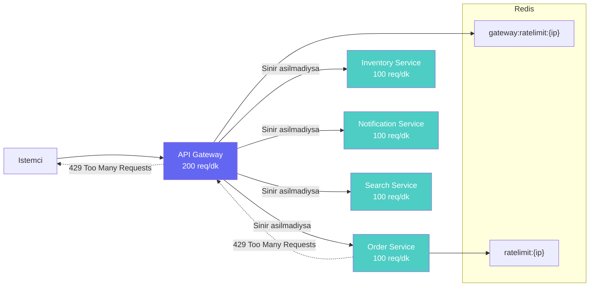

# Rate Limiting (Hiz Sinirlamasi)

Rate Limiting, belirli bir zaman diliminde bir istemciden kabul edilecek maksimum istek sayisini
sinirlandiran bir guvenlik ve performans mekanizmasidir. Bu projede **iki katmanli** (two-tier)
rate limiting uygulanmistir: istekler once API Gateway katmaninda, ardindan hedef servis
katmaninda kontrol edilir.

Her iki katman da **Redis** uzerinde **sliding window counter** (kayan pencere sayaci) algoritmasi
kullanir. Bu algoritma, `INCR` (artirma) ve `EXPIRE` (sure dolumu) komutlarinin kombinasyonu ile
her IP adresi icin ayri bir sayac tutar.

<CardGroup cols={2}>
  <Card title="Gateway Katmani" icon="shield-halved">
    **200 istek / dakika** - Tum servislere giden istekleri sinirlar.
    `services/api-gateway/src/middleware/rate-limit.ts`
  </Card>
  <Card title="Servis Katmani" icon="server">
    **100 istek / dakika** - Her bir servisin kendi siniri.
    `services/order-service/src/middleware/rate-limit.ts`
  </Card>
</CardGroup>

---

## Iki Katmanli Rate Limiting Mimarisi



### Neden Iki Katman?

| Katman | Amac | Senaryo |
|--------|------|---------|
| **Gateway** (200/dk) | Genel sistem korumasi | Tek bir IP'nin tum sistemi asiri yuklemesini onler |
| **Servis** (100/dk) | Servis bazli koruma | Bir servisin diger servislerden bagimsiz olarak korunmasini saglar |

<Note>
  Gateway siniri (200/dk), servis sinirinin (100/dk) toplamlarindan daha dusuk tutulmustur.
  Bu, bir istemcinin tum isteklerini tek bir servise yonlendirse bile gateway tarafindan
  durdurulmasini saglar. Eger bir istemci isteklerini servislere dagitiyorsa, her servisin
  kendi siniri ek bir koruma katmani saglar.
</Note>

---

## Gateway Rate Limiter

API Gateway'deki rate limiter tum gelen istekleri kontrol eder:

<CodeGroup>
```typescript gateway/rate-limit.ts
import type { Context, Next } from "hono";
import Redis from "ioredis";

const WINDOW_SECONDS = 60;       // 1 dakikalik pencere
const MAX_REQUESTS = 200;         // Dakikada maksimum 200 istek

const redis = new Redis(process.env.REDIS_URL || "redis://localhost:6379");

export async function gatewayRateLimiter(c: Context, next: Next) {
  // 1. Istemci IP adresini al
  const ip = c.req.header("x-forwarded-for") || c.req.header("x-real-ip") || "unknown";
  const key = `gateway:ratelimit:${ip}`;

  // 2. Redis'te sayaci 1 artir (key yoksa olusturulur, deger 1 olur)
  const current = await redis.incr(key);

  // 3. Ilk istekse (current === 1), key'e 60 saniye TTL ayarla
  if (current === 1) {
    await redis.expire(key, WINDOW_SECONDS);
  }

  // 4. Kalan sure bilgisini al
  const ttl = await redis.ttl(key);

  // 5. Yanit basliklarini ayarla
  c.header("X-RateLimit-Limit", String(MAX_REQUESTS));
  c.header("X-RateLimit-Remaining", String(Math.max(0, MAX_REQUESTS - current)));
  c.header("X-RateLimit-Reset", String(ttl));

  // 6. Sinir asildiysa 429 dondur
  if (current > MAX_REQUESTS) {
    return c.json({ success: false, error: "Too many requests" }, 429);
  }

  // 7. Sinir asilmadiysa sonraki middleware'e gec
  await next();
}
```
</CodeGroup>

---

## Servis Rate Limiter

Her mikroservisin kendi rate limiter'i vardir. Order Service ornegi:

<CodeGroup>
```typescript order-service/rate-limit.ts
import type { Context, Next } from "hono";
import { cache } from "../cache";

const WINDOW_SECONDS = 60;       // 1 dakikalik pencere
const MAX_REQUESTS = 100;         // Dakikada maksimum 100 istek

export async function rateLimiter(c: Context, next: Next) {
  // 1. Istemci IP adresini al
  const ip = c.req.header("x-forwarded-for") || "unknown";
  const key = `ratelimit:${ip}`;

  // 2. Mevcut cache modulu uzerinden Redis istemcisini al
  const redis = cache.getClient();

  // 3. Redis'te sayaci 1 artir
  const current = await redis.incr(key);

  // 4. Ilk istekse TTL ayarla
  if (current === 1) {
    await redis.expire(key, WINDOW_SECONDS);
  }

  // 5. Kalan sure bilgisini al
  const ttl = await redis.ttl(key);

  // 6. Yanit basliklarini ayarla
  c.header("X-RateLimit-Limit", String(MAX_REQUESTS));
  c.header("X-RateLimit-Remaining", String(Math.max(0, MAX_REQUESTS - current)));
  c.header("X-RateLimit-Reset", String(ttl));

  // 7. Sinir asildiysa 429 dondur
  if (current > MAX_REQUESTS) {
    return c.json({ success: false, error: "Too many requests" }, 429);
  }

  // 8. Sinir asilmadiysa sonraki middleware'e gec
  await next();
}
```
</CodeGroup>

---

## Gateway ve Servis Karsilastirmasi

<Tabs>
  <Tab title="Gateway Rate Limiter">
    **Dosya:** `services/api-gateway/src/middleware/rate-limit.ts`

    | Ozellik | Deger |
    |---------|-------|
    | Sinir | 200 istek / dakika |
    | Key formati | `gateway:ratelimit:{ip}` |
    | Redis baglantisi | Kendi Redis instance'i |
    | IP kaynaklari | `x-forwarded-for`, `x-real-ip`, `"unknown"` |
    | Kapsam | Tum servislere giden istekler |

    Gateway seviyesinde `gateway:` prefix'i kullanilir, boylece servis seviyesindeki key'lerle
    cakisma olmaz. IP adresi icin `x-real-ip` header'i da kontrol edilir (reverse proxy arkasinda
    calisma durumunda).
  </Tab>

  <Tab title="Servis Rate Limiter">
    **Dosya:** `services/order-service/src/middleware/rate-limit.ts`

    | Ozellik | Deger |
    |---------|-------|
    | Sinir | 100 istek / dakika |
    | Key formati | `ratelimit:{ip}` |
    | Redis baglantisi | `cache.getClient()` uzerinden paylasilanr |
    | IP kaynaklari | `x-forwarded-for`, `"unknown"` |
    | Kapsam | Sadece bu servisin endpoint'leri |

    Servis seviyesinde Redis istemcisi cache modulu uzerinden paylasilir. Bu, ek Redis
    baglantisi acmayi onler. Key formati gateway'den farklidir (`gateway:` prefix'i yoktur).
  </Tab>
</Tabs>

---

## Sliding Window Counter Algoritmasi

Her iki rate limiter da ayni algortimayi kullanir:

<Steps>
  <Step title="INCR - Sayaci Artir">
    `redis.incr(key)` komutu calistirilir. Redis'te bu key ilk kez olusturuluyorsa degeri `1`
    olarak ayarlanir; zaten mevcutsa degeri `1` arttirilir. Bu islem **atomik** (atomic) oldugu
    icin es zamanli isteklerde race condition (yaris kosulu) olusmamasini saglar.
  </Step>

  <Step title="EXPIRE - TTL Ayarla">
    Eger `current === 1` ise (yani bu IP'den gelen ilk istek ise), key'e `EXPIRE` komutu ile
    60 saniye TTL ayarlanir. Bu, pencerenin baslangic zamanini belirler.

    ```typescript
    if (current === 1) {
      await redis.expire(key, WINDOW_SECONDS); // 60 saniye
    }
    ```
  </Step>

  <Step title="TTL - Kalan Sureyi Oku">
    `redis.ttl(key)` komutu ile key'in suresi dolana kadar kalan saniye okunur. Bu deger
    istemciye `X-RateLimit-Reset` header'i ile bildirilir.
  </Step>

  <Step title="Sinir Kontrolu">
    Mevcut sayac degeri (`current`) maksimum istek siniri ile karsilastirilir. Sinir
    asildiysa `429 Too Many Requests` yaniti dondurulur.
  </Step>
</Steps>

<Warning>
  Bu implementasyon **fixed window** (sabit pencere) yaklasimidir, gercek anlamda sliding window
  degildir. Pencere basinda kisa surede gelen yogun isteklerde sinir asilabilir. Ornegin, bir
  istemci pencerenin son saniyesinde 200 istek, yeni pencerenin ilk saniyesinde 200 istek daha
  gonderebilir (2 saniyede 400 istek). Daha hassas kontrol icin Redis'in `ZRANGEBYSCORE`
  komutu ile gercek sliding window algoritmasi uygulanabilir.
</Warning>

---

## Yanit Basliklari (Response Headers)

Her yanita eklenen rate limit bilgi basliklari:

| Header | Ornek Deger | Aciklama |
|--------|-------------|----------|
| `X-RateLimit-Limit` | `200` | Pencere icinde izin verilen maksimum istek sayisi |
| `X-RateLimit-Remaining` | `185` | Kalan istek hakki. `Math.max(0, limit - current)` ile hesaplanir |
| `X-RateLimit-Reset` | `45` | Pencerenin sifirlanmasina kalan sure (saniye cinsinden) |

### Ornek HTTP Yaniti

```http
HTTP/1.1 200 OK
X-RateLimit-Limit: 200
X-RateLimit-Remaining: 185
X-RateLimit-Reset: 45
Content-Type: application/json

{ "success": true, "data": [...] }
```

### Sinir Asildiginda

```http
HTTP/1.1 429 Too Many Requests
X-RateLimit-Limit: 200
X-RateLimit-Remaining: 0
X-RateLimit-Reset: 12
Content-Type: application/json

{ "success": false, "error": "Too many requests" }
```

<Tip>
  Istemci uygulamalari `X-RateLimit-Remaining` ve `X-RateLimit-Reset` basliklarini
  kullanarak isteklerini hiz sinirini asmadan zamanlayabilir. Bu, `429` yaniti almadan
  once istemci tarafli hiz kontolu (client-side throttling) yapmaya olanak tanir.
</Tip>

---

## Yapilandirma Parametreleri

| Parametre | Gateway | Servis | Aciklama |
|-----------|---------|--------|----------|
| `WINDOW_SECONDS` | `60` | `60` | Pencere suresi (saniye) |
| `MAX_REQUESTS` | `200` | `100` | Pencere icindeki maksimum istek |
| Key prefix | `gateway:ratelimit:` | `ratelimit:` | Redis key isimlendirme |
| Redis | Kendi instance | `cache.getClient()` | Redis baglanti yontemi |

---

## Hono Middleware Olarak Kullanim

Her iki rate limiter da **Hono middleware** olarak uygulanmistir ve rota tanimlarindan once
zincirlenir:

```typescript
import { Hono } from "hono";
import { gatewayRateLimiter } from "./middleware/rate-limit";

const app = new Hono();

// Tum rotalara rate limiting uygula
app.use("*", gatewayRateLimiter);

// Rotalar
app.get("/api/orders", async (c) => { /* ... */ });
app.post("/api/orders", async (c) => { /* ... */ });
```

`app.use("*", rateLimiter)` ifadesi, tum rotalara gelen isteklerin once rate limiter
middleware'inden gecmesini saglar. Sinir asilmamissa `await next()` ile sonraki
middleware veya rota handler'ina gecilir.
