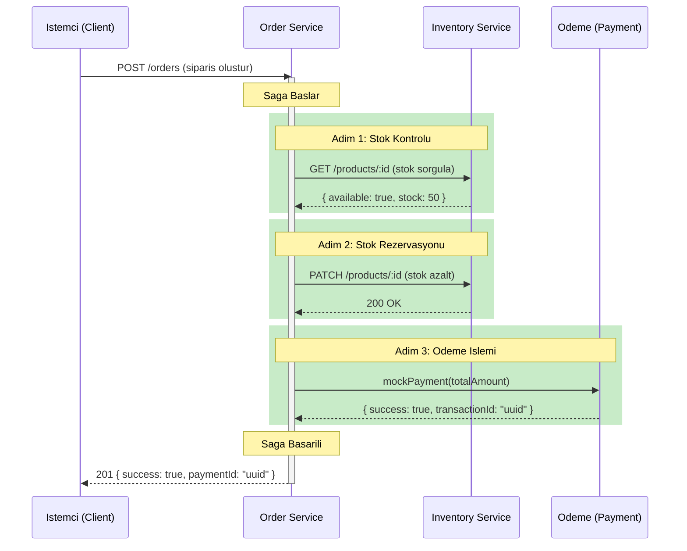
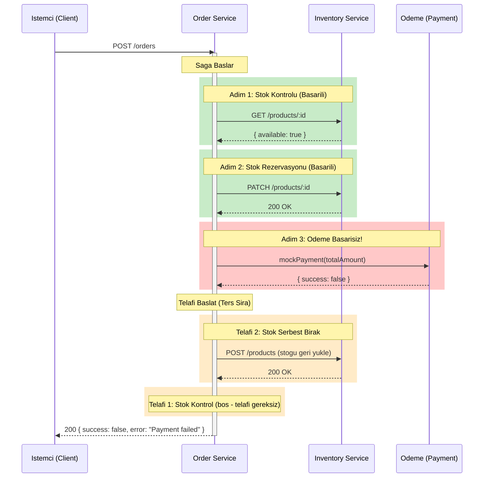

# Saga Pattern (Dagitik Islem Yonetimi)

Saga Pattern, dagitik sistemlerde birden fazla servisi kapsayan islemleri (distributed transaction) yonetmek
icin kullanilan bir tasarim kalibidir. Geleneksel monolitik uygulamalarda veritabani islemleri tek bir
**ACID transaction** ile sarmalanabilirken, mikroservis mimarisinde her servis kendi veritabanina sahip
oldugundan bu yaklasim mumkun degildir.

Saga Pattern, uzun sureli bir islemi birden fazla kucuk, bagimli adima (step) boler. Her adim basarili
olursa bir sonraki adim calistirilir. Herhangi bir adim basarisiz olursa, daha once tamamlanmis adimlarin
**compensation** (telafi) islemleri ters sirada calistirilarak sistem tutarli bir duruma geri getirilir.

<Note>
  Bu projede **Orchestration-Based Saga** (Orkestrasyon Tabanli Saga) kullanilmaktadir. Order Service,
  saga'nin orkestratoru olarak her adimi sirasiyla calistirir ve hata durumunda telafi islemlerini
  yonetir. Alternatif yaklasim olan Choreography-Based Saga'da ise her servis bir sonraki adimi
  tetikleyen olaylari kendisi yayinlar.
</Note>

---

## Saga Akis Diyagrami

### Basarili Siparis Akisi



### Basarisiz Siparis Akisi (Odeme Hatasi)



---

## SagaStep Arayuzu (Interface)

Saga'daki her adim, iki fonksiyonu olan bir `SagaStep` arayuzune uyar:

```typescript
interface SagaStep {
  name: string;                        // Adimin benzersiz adi (loglama ve izleme icin)
  execute: () => Promise<void>;        // Adimin ana islemi
  compensate: () => Promise<void>;     // Hata durumunda telafi islemi
}
```

| Alan | Tip | Aciklama |
|------|-----|----------|
| `name` | `string` | Adimin tanimlayici adi. Loglama ve hata ayiklamada kullanilir (orn: `check-stock-123`, `process-payment`) |
| `execute` | `() => Promise<void>` | Adimin asil islevini gerceklestiren asenkron fonksiyon. Hata firlatirsa saga durdurulur |
| `compensate` | `() => Promise<void>` | `execute` basarili olduktan sonra bir sonraki adim basarisiz olursa cagrilacak geri alma fonksiyonu |

<Tip>
  Her adimin `compensate` fonksiyonu, o adimin `execute` fonksiyonunun yan etkilerini (side effects) geri
  almalidir. Ornegin stok rezervasyonu adimi basarili olmussa, telafi islemi rezerve edilen stogu serbest
  birakir.
</Tip>

---

## Saga Adimlari Detayli Aciklama

Bu projede siparis olusturma saga'si 3 ana adimdan olusur:

<Steps>
  <Step title="Stok Kontrolu (Check Stock)">
    Siparis edilen her urun icin Inventory Service'e HTTP istegi gonderilir ve stok durumu sorgulanir.
    Yeterli stok yoksa saga hemen durdurulur. Bu adimin telafi islemi **bos** fonksiyondur cunku
    salt okunur (read-only) bir islemdir; herhangi bir veri degisikligi yapmaz.

    ```typescript
    // Siparis edilen her urun icin bir SagaStep olusturulur
    for (const item of items) {
      steps.push({
        name: `check-stock-${item.productId}`,
        execute: async () => {
          const result = await checkStock(item.productId, item.quantity);
          if (!result.available) {
            throw new Error(
              `Insufficient stock for ${item.productId} (need ${item.quantity}, have ${result.product?.stock ?? 0})`
            );
          }
        },
        compensate: async () => {}, // Salt okunur islem - telafi gereksiz
      });
    }
    ```

    `checkStock` fonksiyonu Inventory Service'in `GET /products/:id` endpoint'ine istek atar:

    ```typescript
    async function checkStock(productId: string, quantity: number): Promise<StockCheckResult> {
      const res = await fetch(`${INVENTORY_URL}/products/${productId}`);
      if (!res.ok) return { available: false };

      const { data } = await res.json() as { data: { id: string; stock: number } };
      return { available: data.stock >= quantity, product: data };
    }
    ```
  </Step>

  <Step title="Stok Rezervasyonu (Reserve Stock)">
    Stok kontrolunden gecen her urun icin Inventory Service'e `PATCH` istegi gonderilerek stok
    miktari azaltilir (rezerve edilir). Bu adimin telafi islemi, azaltilan stogu geri yukleyerek
    serbest birakir.

    ```typescript
    for (const item of items) {
      steps.push({
        name: `reserve-stock-${item.productId}`,
        execute: async () => {
          const ok = await reserveStock(item.productId, item.quantity);
          if (!ok) throw new Error(`Failed to reserve stock for ${item.productId}`);
        },
        compensate: async () => {
          await releaseStock(item.productId, item.quantity);
        },
      });
    }
    ```

    Telafi islemi olan `releaseStock`, mevcut stok miktarini okuyup geri yukler:

    ```typescript
    async function releaseStock(productId: string, quantity: number): Promise<void> {
      const product = await fetch(`${INVENTORY_URL}/products/${productId}`);
      if (!product.ok) return;

      const { data } = await product.json() as { data: { id: string; name: string; stock: number; price: number } };
      await fetch(`${INVENTORY_URL}/products`, {
        method: "POST",
        headers: { "Content-Type": "application/json" },
        body: JSON.stringify({ ...data, stock: data.stock + quantity }),
      });
    }
    ```
  </Step>

  <Step title="Odeme Islemi (Process Payment)">
    Son adimda odeme islemi gerceklestirilir. Odeme basarili olursa `transactionId` saklanir.
    Telafi islemi, saklanan `transactionId` ile odeme iadesini (refund) baslatir.

    ```typescript
    steps.push({
      name: "process-payment",
      execute: async () => {
        const result = await mockPayment(totalAmount);
        if (!result.success) throw new Error("Payment failed");
        paymentTransactionId = result.transactionId;
      },
      compensate: async () => {
        if (paymentTransactionId) {
          await mockPaymentRefund(paymentTransactionId);
        }
      },
    });
    ```
  </Step>
</Steps>

---

## Saga Yurütme Mekanizmasi

Tum adimlar tanimlandiktan sonra, saga motoru adimlari sirayla calistirir. Her basarili adim
`completedSteps` listesine eklenir. Bir adim basarisiz olursa, tamamlanmis adimlar **ters
sirada** telafi edilir:

<CodeGroup>
```typescript Saga Yurutme Dongusu
export async function executeOrderSaga(
  items: OrderItem[],
  totalAmount: number
): Promise<SagaResult> {
  const completedSteps: SagaStep[] = [];
  let paymentTransactionId = "";
  const steps: SagaStep[] = [];

  // ... adimlar yukarida tanimlandi ...

  // Saga yurutme dongusu
  for (const step of steps) {
    try {
      await step.execute();
      completedSteps.push(step);
      logger.info(`Saga step completed: ${step.name}`);
    } catch (err) {
      const error = (err as Error).message;
      logger.error(`Saga step failed: ${step.name}`, { error });

      // Telafi: tamamlanmis adimlari TERS SIRADA geri al
      for (let i = completedSteps.length - 1; i >= 0; i--) {
        try {
          await completedSteps[i].compensate();
          logger.info(`Compensated: ${completedSteps[i].name}`);
        } catch (compErr) {
          logger.error(`Compensation failed: ${completedSteps[i].name}`, {
            error: (compErr as Error).message,
          });
        }
      }

      return { success: false, error };
    }
  }

  return { success: true, paymentId: paymentTransactionId };
}
```

```typescript SagaResult Arayuzu
export interface SagaResult {
  success: boolean;    // Saga basarili mi?
  error?: string;      // Basarisizlik durumunda hata mesaji
  paymentId?: string;  // Basarili durumda odeme islem kimlik numarasi
}
```
</CodeGroup>

### Yurutme Mantigi Satir Satir

| Satir | Islem | Aciklama |
|-------|-------|----------|
| `for (const step of steps)` | Dongu | Her adim sirayla calistirilir |
| `await step.execute()` | Calistir | Adimin ana islemi gerceklestirilir |
| `completedSteps.push(step)` | Kaydet | Basarili adim listeye eklenir |
| `catch (err)` | Yakala | Bir adim basarisiz olursa telafi baslar |
| `for (let i = completedSteps.length - 1; ...)` | Ters Dongu | Tamamlanmis adimlar **sondan basa** telafi edilir |
| `completedSteps[i].compensate()` | Telafi Et | Her adimin geri alma islemi calistirilir |
| `return { success: false, error }` | Sonuc | Basarisizlik durumu dondurulur |

<Warning>
  Telafi islemleri sirasinda da hata olusabilir. Bu durumda hata loglanir ancak telafi dongusu
  **durmaz** ve kalan adimlar icin telafi devam eder. Bu yaklasim "best-effort compensation"
  (en iyi caba telafisi) olarak adlandirilir. Uretim ortaminda, basarisiz telafi islemlerinin
  manuel olarak cozumlenmesi icin bir alarm sistemi kurulmalidir.
</Warning>

---

## Mock Odeme Sistemi

Test ve gelistirme ortaminda gercek bir odeme sistemi yerine `mockPayment` fonksiyonu kullanilir:

```typescript
function mockPayment(_amount: number): Promise<{ success: boolean; transactionId: string }> {
  // Simule edilmis odeme - %90 basari orani
  const success = Math.random() > 0.1;
  return Promise.resolve({
    success,
    transactionId: success ? crypto.randomUUID() : "",
  });
}

function mockPaymentRefund(_transactionId: string): Promise<void> {
  logger.info("Payment refunded", { transactionId: _transactionId });
  return Promise.resolve();
}
```

<Note>
  Mock odeme fonksiyonu **%90 basari orani** ile calisir (`Math.random() > 0.1`). Bu, saga'nin
  telafi mekanizmasini test etmek icin kasitli olarak belirlenmistir. Her 10 siparisten
  yaklasik 1 tanesi odeme asamasinda basarisiz olur ve stok telafisi tetiklenir. Uretim
  ortaminda bu fonksiyon gercek bir odeme saglayicisi (payment provider) entegrasyonu ile
  degistirilmelidir.
</Note>

---

## Yardimci Fonksiyonlar

<Tabs>
  <Tab title="checkStock">
    Envanter servisinden urunun mevcut stok miktarini sorgular ve talep edilen miktar ile karsilastirir.

    ```typescript
    const INVENTORY_URL = process.env.INVENTORY_SERVICE_URL || "http://localhost:3003";

    interface StockCheckResult {
      available: boolean;
      product?: { id: string; stock: number };
    }

    async function checkStock(productId: string, quantity: number): Promise<StockCheckResult> {
      const res = await fetch(`${INVENTORY_URL}/products/${productId}`);
      if (!res.ok) return { available: false };

      const { data } = await res.json() as { data: { id: string; stock: number } };
      return { available: data.stock >= quantity, product: data };
    }
    ```
  </Tab>

  <Tab title="reserveStock">
    Urunun stok miktarini belirtilen miktar kadar azaltir (negatif degisiklik gondererek).

    ```typescript
    async function reserveStock(productId: string, quantity: number): Promise<boolean> {
      const res = await fetch(`${INVENTORY_URL}/products/${productId}`, {
        method: "PATCH",
        headers: { "Content-Type": "application/json" },
        body: JSON.stringify({ stockChange: -quantity }),
      });
      return res.ok;
    }
    ```
  </Tab>

  <Tab title="releaseStock">
    Telafi islemi olarak daha once rezerve edilen stogu geri yukler. Mevcut stok miktarini
    okuyup uzerine ekleyerek gunceller.

    ```typescript
    async function releaseStock(productId: string, quantity: number): Promise<void> {
      const product = await fetch(`${INVENTORY_URL}/products/${productId}`);
      if (!product.ok) return;

      const { data } = await product.json() as {
        data: { id: string; name: string; stock: number; price: number }
      };
      await fetch(`${INVENTORY_URL}/products`, {
        method: "POST",
        headers: { "Content-Type": "application/json" },
        body: JSON.stringify({ ...data, stock: data.stock + quantity }),
      });
    }
    ```
  </Tab>
</Tabs>

---

## Saga Kalibinin Avantaj ve Dezavantajlari

<CardGroup cols={2}>
  <Card title="Avantajlar" icon="circle-check">
    - Dagitik islemlerde veri tutarliligi saglar
    - Her adim bagimsizsiz test edilebilir
    - Telafi mekanizmasi ile kismi basarisizliklar yonetilebilir
    - Her adim loglanir, izlenebilirlik yuksektir
  </Card>
  <Card title="Dezavantajlar" icon="triangle-exclamation">
    - Kod karmasikligi artar (her adim icin telafi yazilmali)
    - Telafi islemleri garanti degildir (best-effort)
    - Saga sirasinda gecici tutarsizlik (eventual consistency) olusabilir
    - Hata ayiklama (debugging) zor olabilir
  </Card>
</CardGroup>

---

## Kaynak Kod

Saga Pattern uygulamasinin tam kaynak kodu:

**`services/order-service/src/saga/order-saga.ts`**

<CodeGroup>
```typescript order-saga.ts
import type { Order, OrderItem } from "@ecommerce/shared";
import { logger } from "@ecommerce/shared";

const INVENTORY_URL = process.env.INVENTORY_SERVICE_URL || "http://localhost:3003";

interface SagaStep {
  name: string;
  execute: () => Promise<void>;
  compensate: () => Promise<void>;
}

interface StockCheckResult {
  available: boolean;
  product?: { id: string; stock: number };
}

async function checkStock(productId: string, quantity: number): Promise<StockCheckResult> {
  const res = await fetch(`${INVENTORY_URL}/products/${productId}`);
  if (!res.ok) return { available: false };
  const { data } = await res.json() as { data: { id: string; stock: number } };
  return { available: data.stock >= quantity, product: data };
}

async function reserveStock(productId: string, quantity: number): Promise<boolean> {
  const res = await fetch(`${INVENTORY_URL}/products/${productId}`, {
    method: "PATCH",
    headers: { "Content-Type": "application/json" },
    body: JSON.stringify({ stockChange: -quantity }),
  });
  return res.ok;
}

async function releaseStock(productId: string, quantity: number): Promise<void> {
  const product = await fetch(`${INVENTORY_URL}/products/${productId}`);
  if (!product.ok) return;
  const { data } = await product.json() as { data: { id: string; name: string; stock: number; price: number } };
  await fetch(`${INVENTORY_URL}/products`, {
    method: "POST",
    headers: { "Content-Type": "application/json" },
    body: JSON.stringify({ ...data, stock: data.stock + quantity }),
  });
}

function mockPayment(_amount: number): Promise<{ success: boolean; transactionId: string }> {
  const success = Math.random() > 0.1;
  return Promise.resolve({
    success,
    transactionId: success ? crypto.randomUUID() : "",
  });
}

function mockPaymentRefund(_transactionId: string): Promise<void> {
  logger.info("Payment refunded", { transactionId: _transactionId });
  return Promise.resolve();
}

export interface SagaResult {
  success: boolean;
  error?: string;
  paymentId?: string;
}

export async function executeOrderSaga(items: OrderItem[], totalAmount: number): Promise<SagaResult> {
  const completedSteps: SagaStep[] = [];
  let paymentTransactionId = "";
  const steps: SagaStep[] = [];

  for (const item of items) {
    steps.push({
      name: `check-stock-${item.productId}`,
      execute: async () => {
        const result = await checkStock(item.productId, item.quantity);
        if (!result.available) {
          throw new Error(`Insufficient stock for ${item.productId} (need ${item.quantity}, have ${result.product?.stock ?? 0})`);
        }
      },
      compensate: async () => {},
    });
  }

  for (const item of items) {
    steps.push({
      name: `reserve-stock-${item.productId}`,
      execute: async () => {
        const ok = await reserveStock(item.productId, item.quantity);
        if (!ok) throw new Error(`Failed to reserve stock for ${item.productId}`);
      },
      compensate: async () => { await releaseStock(item.productId, item.quantity); },
    });
  }

  steps.push({
    name: "process-payment",
    execute: async () => {
      const result = await mockPayment(totalAmount);
      if (!result.success) throw new Error("Payment failed");
      paymentTransactionId = result.transactionId;
    },
    compensate: async () => {
      if (paymentTransactionId) await mockPaymentRefund(paymentTransactionId);
    },
  });

  for (const step of steps) {
    try {
      await step.execute();
      completedSteps.push(step);
      logger.info(`Saga step completed: ${step.name}`);
    } catch (err) {
      const error = (err as Error).message;
      logger.error(`Saga step failed: ${step.name}`, { error });
      for (let i = completedSteps.length - 1; i >= 0; i--) {
        try {
          await completedSteps[i].compensate();
          logger.info(`Compensated: ${completedSteps[i].name}`);
        } catch (compErr) {
          logger.error(`Compensation failed: ${completedSteps[i].name}`, {
            error: (compErr as Error).message,
          });
        }
      }
      return { success: false, error };
    }
  }

  return { success: true, paymentId: paymentTransactionId };
}
```
</CodeGroup>
