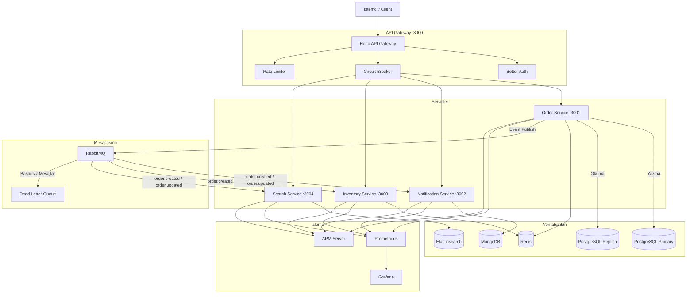

# Servis Mimarisi Genel Bakis

Bu platform, **event-driven architecture** (olay tabanli mimari) uzerine kurulu bir mikroservis ekosistemidir. Her servis bagimsiz olarak calisir, kendi veritabanina sahiptir ve servisler arasi iletisim **RabbitMQ** uzerinden asenkron mesajlasma ile saglanir.

## Servisler

<CardGroup cols={2}>
  <Card title="API Gateway" icon="shield" href="/servisler/api-gateway">
    **Port:** 3000

    **Veritabani:** PostgreSQL (auth)

    Tum disaridan gelen isteklerin tek giris noktasi. Kimlik dogrulama, rate limiting (istek hiz sinirlandirma), circuit breaker (devre kesici) ve servis yonlendirme islemlerini yonetir.
  </Card>

  <Card title="Order Service" icon="cart-shopping" href="/servisler/order-service">
    **Port:** 3001

    **Veritabani:** PostgreSQL + Redis

    Siparis CRUD islemleri, saga tabanli checkout akisi, write-through cache ve event publishing (olay yayinlama) islemlerini yurutur.
  </Card>

  <Card title="Notification Service" icon="bell" href="/servisler/notification-service">
    **Port:** 3002

    **Veritabani:** MongoDB

    Siparis olaylarini RabbitMQ uzerinden dinler, bildirimleri MongoDB'ye kaydeder. DLQ (Dead Letter Queue - olu mektup kuyrugu) ile hata yonetimi saglar.
  </Card>

  <Card title="Inventory Service" icon="warehouse" href="/servisler/inventory-service">
    **Port:** 3003

    **Veritabani:** Redis

    Urun ve stok yonetimi. Saga pattern ile entegre calisarak stok rezervasyonu ve geri birakma islemlerini gerceklestirir.
  </Card>

  <Card title="Search Service" icon="magnifying-glass" href="/servisler/search-service">
    **Port:** 3004

    **Veritabani:** Elasticsearch

    Full-text search (tam metin arama) ve aggregation (veri toplama) islemleri. RabbitMQ consumer ile siparisleri otomatik indeksler.
  </Card>

  <Card title="Shared Package" icon="cube" href="/servisler/shared-package">
    **Paket:** @ecommerce/shared

    Tum servislerin ortak kullandigi tipler, logger, metrics middleware ve APM middleware bilesenlerini icerir.
  </Card>
</CardGroup>

## Port ve Servis Haritasi

| Servis / Arac           | Port  | Aciklama                          |
|--------------------------|-------|-----------------------------------|
| API Gateway              | 3000  | Ana giris noktasi                 |
| Order Service            | 3001  | Siparis yonetimi                  |
| Notification Service     | 3002  | Bildirim yonetimi                 |
| Inventory Service        | 3003  | Stok yonetimi                     |
| Search Service           | 3004  | Arama ve istatistik               |
| Kibana                   | 5601  | Elasticsearch gorsel arayuzu      |
| Elasticsearch            | 9200  | Arama motoru                      |
| RabbitMQ Management UI   | 15672 | Kuyruk yonetim paneli             |
| APM Server               | 8200  | Performans izleme sunucusu        |
| Prometheus               | 9090  | Metrik toplama                    |
| Grafana                  | 3100  | Izleme panelleri                  |

## Servisler Arasi Iletisim

Asagidaki diyagram, servislerin birbirleriyle nasil iletisim kurdugunu gostermektedir:

## Olay Akisi (Event Flow)

Bir siparis olusturuldugunda sistemdeki olay akisi su sekilde gerceklesir:

<Steps>
  <Step title="Siparis Olusturma">
    Istemci, API Gateway uzerinden `POST /api/orders` istegi gonderir. Gateway, kimlik dogrulamayi kontrol eder ve istegi Order Service'e yonlendirir.
  </Step>
  <Step title="Veritabanina Kayit">
    Order Service, siparisi PostgreSQL primary veritabanina yazar ve Redis cache'i gunceller (write-through pattern).
  </Step>
  <Step title="Olay Yayinlama">
    Order Service, `order.created` olayini RabbitMQ'nun `orders.exchange` topic exchange'ine yayinlar.
  </Step>
  <Step title="Bildirim Isleme">
    Notification Service, `notification.orders` kuyrugundan mesaji alir ve bildirimi MongoDB'ye kaydeder.
  </Step>
  <Step title="Stok Guncelleme">
    Inventory Service, `inventory.orders` kuyrugundan mesaji alir ve ilgili urunlerin stoklarini duser.
  </Step>
  <Step title="Arama Indeksleme">
    Search Service, `search.orders` kuyrugundan mesaji alir ve siparisi Elasticsearch'e indeksler.
  </Step>
</Steps>

## Teknoloji Yigini

| Katman            | Teknoloji                          |
|-------------------|------------------------------------|
| Runtime           | Bun                                |
| Framework         | Hono.dev                           |
| ORM               | Drizzle ORM                        |
| Kimlik Dogrulama  | Better Auth                        |
| Mesajlasma        | RabbitMQ (topic exchange)          |
| Onbellekleme      | Redis (ioredis)                    |
| Belge Veritabani  | MongoDB                            |
| Arama Motoru      | Elasticsearch                      |
| Izleme            | Prometheus + Grafana               |
| Dagitik Izleme    | APM (custom middleware)            |
| Dogrulama         | Zod                                |
| Monorepo          | Bun workspaces                     |
