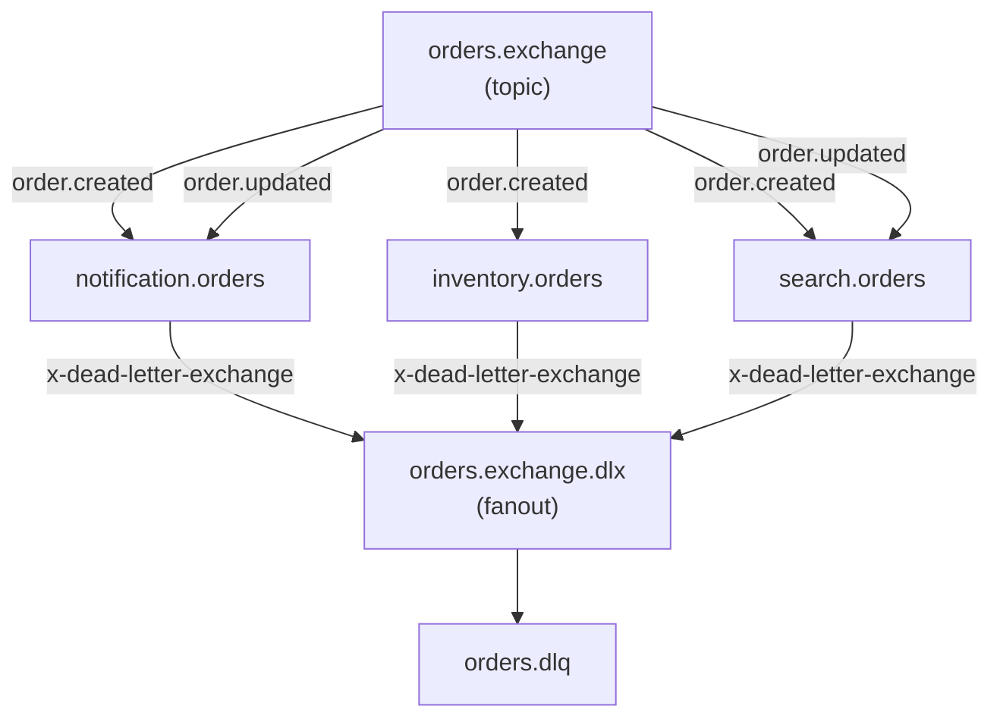
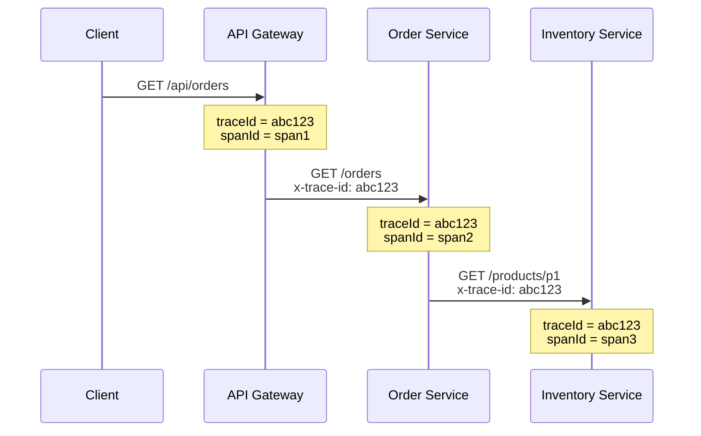

# Shared Package (@ecommerce/shared)

`@ecommerce/shared` paketi, tum mikroservislerin ortak kullandigi bilesenlerle **code reuse** (kod tekrar kullanimi) saglar. Bu paket Bun workspaces ile monorepo yapisinda yonetilir.

**Paket Adi:** `@ecommerce/shared`
**Konum:** `packages/shared/src/`

## Paket Icerigi

<CardGroup cols={2}>
  <Card title="Tip Tanimlari" icon="code">
    Order, OrderItem, OrderEvent tipleri ve RabbitMQ sabitleri
  </Card>
  <Card title="Logger" icon="file-lines">
    Yapilandirilmis JSON loglama (debug, info, warn, error)
  </Card>
  <Card title="Metrics Middleware" icon="chart-bar">
    HTTP metrik toplama ve Prometheus formati cikti
  </Card>
  <Card title="APM Middleware" icon="route">
    Dagitik izleme (distributed tracing) icin trace/span ID yonetimi
  </Card>
</CardGroup>

### Export'lar

```typescript
// packages/shared/src/index.ts
export type {
  Order, OrderItem, OrderStatus,
  CreateOrderInput, UpdateOrderInput,
  ApiResponse,
  BaseEvent, OrderCreatedEvent, OrderUpdatedEvent, OrderEvent,
} from "./types";

export { EXCHANGES, ROUTING_KEYS, QUEUES } from "./types";
export { logger } from "./logger";
export { apmMiddleware, getTraceHeaders } from "./apm";
export { metricsMiddleware, getPrometheusMetrics } from "./metrics";
export { mountSwagger } from "./swagger";
export type { OpenApiSpec } from "./swagger";
```

## Tip Tanimlari (Types)

Tum servisler arasinda paylasilan veri tipleri:

### Siparis Tipleri

```typescript
// packages/shared/src/types.ts
export type OrderStatus =
  | "pending"
  | "confirmed"
  | "processing"
  | "shipped"
  | "delivered"
  | "cancelled";

export interface OrderItem {
  productId: string;
  name: string;
  quantity: number;
  price: number;
}

export interface Order {
  id: string;
  customerName: string;
  customerEmail: string;
  items: OrderItem[];
  totalAmount: number;
  status: OrderStatus;
  createdAt: string;
  updatedAt: string;
}

export interface CreateOrderInput {
  customerName: string;
  customerEmail: string;
  items: OrderItem[];
}

export interface UpdateOrderInput {
  customerName?: string;
  customerEmail?: string;
  status?: OrderStatus;
}

export interface ApiResponse<T = unknown> {
  success: boolean;
  data?: T;
  error?: string;
}
```

### Olay Tipleri (Event Types)

```typescript
// packages/shared/src/types.ts
export interface BaseEvent<T = unknown> {
  id: string;
  type: string;
  timestamp: string;
  data: T;
}

export interface OrderCreatedEvent extends BaseEvent<Order> {
  type: "order.created";
}

export interface OrderUpdatedEvent extends BaseEvent<Order> {
  type: "order.updated";
}

export type OrderEvent = OrderCreatedEvent | OrderUpdatedEvent;
```

Ornek bir `OrderEvent` mesaji:

```json
{
  "id": "a1b2c3d4-e5f6-7890-abcd-ef1234567890",
  "type": "order.created",
  "timestamp": "2026-03-03T10:00:00.000Z",
  "data": {
    "id": "550e8400-e29b-41d4-a716-446655440000",
    "customerName": "Ahmet Yilmaz",
    "customerEmail": "ahmet@example.com",
    "items": [
      { "productId": "p1", "name": "Laptop", "quantity": 1, "price": 15000 }
    ],
    "totalAmount": 15000,
    "status": "pending",
    "createdAt": "2026-03-03T10:00:00.000Z",
    "updatedAt": "2026-03-03T10:00:00.000Z"
  }
}
```

### RabbitMQ Sabitleri

```typescript
// packages/shared/src/types.ts
export const EXCHANGES = {
  ORDERS: "orders.exchange",
} as const;

export const ROUTING_KEYS = {
  ORDER_CREATED: "order.created",
  ORDER_UPDATED: "order.updated",
} as const;

export const QUEUES = {
  NOTIFICATION_ORDERS: "notification.orders",
  INVENTORY_ORDERS:    "inventory.orders",
  SEARCH_ORDERS:       "search.orders",
  DLQ_ORDERS:          "orders.dlq",
} as const;
```

Bu sabitlerin tum servislerde tutarli olarak kullanilmasi, yazim hatarindan kaynaklanabilecek hatalarin onune gecer.



## Logger (Yapilandirilmis Loglama)

JSON formatinda yapilandirilmis loglama modulu. Her log girdisi timestamp, seviye, servis adi ve ek meta verileri icerir.

```typescript
// packages/shared/src/logger.ts
type LogLevel = "debug" | "info" | "warn" | "error";

interface LogEntry {
  timestamp: string;
  level: LogLevel;
  service: string;
  message: string;
  traceId?: string;
  spanId?: string;
  [key: string]: unknown;
}

const SERVICE_NAME = process.env.APM_SERVICE_NAME || "unknown";

function log(level: LogLevel, message: string, meta?: Record<string, unknown>) {
  const entry: LogEntry = {
    timestamp: new Date().toISOString(),
    level,
    service: SERVICE_NAME,
    message,
    ...meta,
  };
  const output = JSON.stringify(entry);

  if (level === "error") {
    console.error(output);
  } else if (level === "warn") {
    console.warn(output);
  } else {
    console.log(output);
  }
}

export const logger = {
  debug: (msg: string, meta?: Record<string, unknown>) => log("debug", msg, meta),
  info:  (msg: string, meta?: Record<string, unknown>) => log("info",  msg, meta),
  warn:  (msg: string, meta?: Record<string, unknown>) => log("warn",  msg, meta),
  error: (msg: string, meta?: Record<string, unknown>) => log("error", msg, meta),
};
```

### Kullanim Ornekleri

<CodeGroup>
```typescript Temel Kullanim
import { logger } from "@ecommerce/shared";

logger.info("Siparis olusturuldu", { orderId: "abc-123" });
logger.error("Veritabani baglantisi basarisiz", { error: err.message });
logger.warn("Stok seviyesi dusuk", { productId: "p1", stock: 3 });
logger.debug("Cache'den okundu", { key: "order:abc-123" });
```

```json Cikti Ornegi
{"timestamp":"2026-03-03T10:00:00.000Z","level":"info","service":"order-service","message":"Siparis olusturuldu","orderId":"abc-123"}
{"timestamp":"2026-03-03T10:00:01.000Z","level":"error","service":"order-service","message":"Veritabani baglantisi basarisiz","error":"Connection refused"}
```
</CodeGroup>

| Log Seviyesi | console Metodu | Kullanim Alani                            |
|-------------|----------------|-------------------------------------------|
| `debug`     | `console.log`  | Gelistirme sirasinda detayli bilgi         |
| `info`      | `console.log`  | Normal islem akisi bilgilendirmesi        |
| `warn`      | `console.warn` | Potansiyel sorunlar                       |
| `error`     | `console.error`| Hata durumlari                            |

<Tip>
  Servis adi `APM_SERVICE_NAME` ortam degiskeninden alinir. Bu, log ciktisinda hangi servisin log uretigini ayirt etmek icin kullanilir.
</Tip>

## Metrics Middleware (Prometheus Metrikleri)

HTTP isteklerinin performans metriklerini toplar ve Prometheus formati (Prometheus-compatible exposition format) olarak sunar.

### Middleware

```typescript
// packages/shared/src/metrics.ts
interface MetricEntry {
  method: string;
  path: string;
  status: number;
  duration: number;
}

const metrics: MetricEntry[] = [];
let requestCount = 0;
let errorCount = 0;
const startTime = Date.now();

export function metricsMiddleware() {
  return async (c: Context, next: Next) => {
    const start = performance.now();
    await next();
    const duration = performance.now() - start;

    requestCount++;
    if (c.res.status >= 400) errorCount++;

    metrics.push({
      method: c.req.method,
      path: c.req.path,
      status: c.res.status,
      duration,
    });

    // Bellekte en fazla 1000 girdi tut
    if (metrics.length > 1000) metrics.splice(0, metrics.length - 1000);
  };
}
```

### Prometheus Cikti Formati

```typescript
// packages/shared/src/metrics.ts
export function getPrometheusMetrics(serviceName: string): string {
  // method + path + status bazinda gruplama yapar
  // ve Prometheus text format'inda doner
}
```

Her servis `/metrics` endpoint'inden Prometheus metriklerini sunar:

<CodeGroup>
```bash Istek
curl http://localhost:3001/metrics
```

```text Cikti
# HELP http_requests_total Total HTTP requests
# TYPE http_requests_total counter
http_requests_total{service="order-service"} 150
# HELP http_errors_total Total HTTP errors (4xx+5xx)
# TYPE http_errors_total counter
http_errors_total{service="order-service"} 3
# HELP process_uptime_seconds Process uptime
# TYPE process_uptime_seconds gauge
process_uptime_seconds{service="order-service"} 3600.5
# HELP http_request_duration_ms HTTP request duration
# TYPE http_request_duration_ms summary
http_request_duration_ms{service="order-service",method="GET",path="/orders",status="200"} 12.50
http_request_count{service="order-service",method="GET",path="/orders",status="200"} 85
```
</CodeGroup>

### Toplanan Metrikler

| Metrik                     | Tip     | Aciklama                                    |
|----------------------------|---------|---------------------------------------------|
| `http_requests_total`      | counter | Toplam HTTP istek sayisi                    |
| `http_errors_total`        | counter | 4xx ve 5xx HTTP hata sayisi                 |
| `process_uptime_seconds`   | gauge   | Surecin calisma suresi (saniye)             |
| `http_request_duration_ms` | summary | Method/path/status bazinda ortalama sure    |
| `http_request_count`       | counter | Method/path/status bazinda istek sayisi     |

## APM Middleware (Dagitik Izleme)

Application Performance Monitoring (uygulama performans izleme) middleware'i, her istege benzersiz `traceId` ve `spanId` atar. Bu ID'ler servisler arasi isteklerde iletilerek dagitik izleme (distributed tracing) saglar.

```typescript
// packages/shared/src/apm.ts
interface ApmTransaction {
  traceId: string;
  spanId: string;
  service: string;
  method: string;
  path: string;
  statusCode: number;
  duration: number;
  timestamp: string;
  error?: string;
}

export function apmMiddleware() {
  return async (c: Context, next: Next) => {
    // Gelen trace ID'yi al veya yenisini olustur
    const traceId = c.req.header("x-trace-id") || generateId() + generateId();
    const spanId = generateId();
    const start = performance.now();

    // Trace context'i yayinla
    c.header("x-trace-id", traceId);
    c.header("x-span-id", spanId);
    c.set("traceId", traceId);
    c.set("spanId", spanId);

    await next();

    const duration = performance.now() - start;

    // APM sunucusuna gonder (fire and forget)
    sendToApm({
      traceId, spanId, service: SERVICE_NAME,
      method: c.req.method, path: c.req.path,
      statusCode: c.res.status, duration,
      timestamp: new Date().toISOString(),
    });
  };
}
```

### Trace Context Yayilimi



Ayni istek zincirindeki tum servisler ayni `traceId`'yi paylasir, ancak her biri kendi benzersiz `spanId`'sine sahiptir.

### Servisler Arasi Trace Propagation Helper

```typescript
// packages/shared/src/apm.ts
export function getTraceHeaders(c: Context): Record<string, string> {
  return {
    "x-trace-id": c.get("traceId") || "",
    "x-span-id":  c.get("spanId")  || "",
  };
}
```

Bu helper fonksiyon, bir servisten baska bir servise HTTP istegi gonderirken trace header'larini kolayca iletmek icin kullanilir:

```typescript
// Kullanim ornegi
const headers = getTraceHeaders(c);
const response = await fetch("http://inventory-service:3003/products", {
  headers: { ...headers, "Content-Type": "application/json" },
});
```

### APM Sunucusu Entegrasyonu

APM verileri, Elastic APM Server'in `intake/v2/events` endpoint'ine NDJSON formatinda gonderilir:

```typescript
// packages/shared/src/apm.ts
async function sendToApm(transaction: ApmTransaction): Promise<void> {
  if (!APM_SERVER_URL) return; // APM URL yoksa sessizce atla

  await fetch(`${APM_SERVER_URL}/intake/v2/events`, {
    method: "POST",
    headers: { "Content-Type": "application/x-ndjson" },
    body: [
      JSON.stringify({ metadata: { service: { name: SERVICE_NAME, environment: "..." } } }),
      JSON.stringify({ transaction: { id: spanId, trace_id: traceId, ... } }),
      "",
    ].join("\n"),
  });
}
```

<Warning>
  APM gonderimleri "fire and forget" (gonder ve unut) seklinde calisir. APM sunucusuna erisilememesi, uygulamanin normal isleyisini etkilemez. Hata durumunda sessizce atlanir.
</Warning>

## Servislerde Kullanim

Her servis, shared paketten ihtiyac duydugu bilesenleri import eder:

<Tabs>
  <Tab title="Middleware Kurulumu">
    ```typescript
    import { apmMiddleware, metricsMiddleware, getPrometheusMetrics } from "@ecommerce/shared";

    const app = new Hono();

    app.use("*", apmMiddleware());
    app.use("*", metricsMiddleware());

    app.get("/metrics", (c) => c.text(getPrometheusMetrics("order-service")));
    ```
  </Tab>
  <Tab title="Tip Kullanimi">
    ```typescript
    import type { Order, OrderEvent, ApiResponse } from "@ecommerce/shared";

    app.get("/orders", async (c) => {
      const orders: Order[] = await store.getAll();
      return c.json<ApiResponse<Order[]>>({ success: true, data: orders });
    });
    ```
  </Tab>
  <Tab title="RabbitMQ Sabitleri">
    ```typescript
    import { EXCHANGES, ROUTING_KEYS, QUEUES } from "@ecommerce/shared";

    await channel.assertExchange(EXCHANGES.ORDERS, "topic", { durable: true });
    await channel.bindQueue(QUEUES.NOTIFICATION_ORDERS, EXCHANGES.ORDERS, ROUTING_KEYS.ORDER_CREATED);
    ```
  </Tab>
  <Tab title="Logger">
    ```typescript
    import { logger } from "@ecommerce/shared";

    logger.info("Siparis olusturuldu", { orderId: order.id });
    logger.error("Saga adimi basarisiz", { step: step.name, error: err.message });
    ```
  </Tab>
</Tabs>

## Ortam Degiskenleri

| Degisken           | Varsayilan    | Kullanilan Modul | Aciklama                     |
|--------------------|---------------|------------------|------------------------------|
| `APM_SERVICE_NAME` | `unknown`     | Logger, APM      | Servis adi (log ve trace'lerde gorunur) |
| `APM_SERVER_URL`   | -             | APM              | Elastic APM sunucu adresi    |
| `NODE_ENV`         | `development` | APM              | Ortam bilgisi (APM metadata) |
